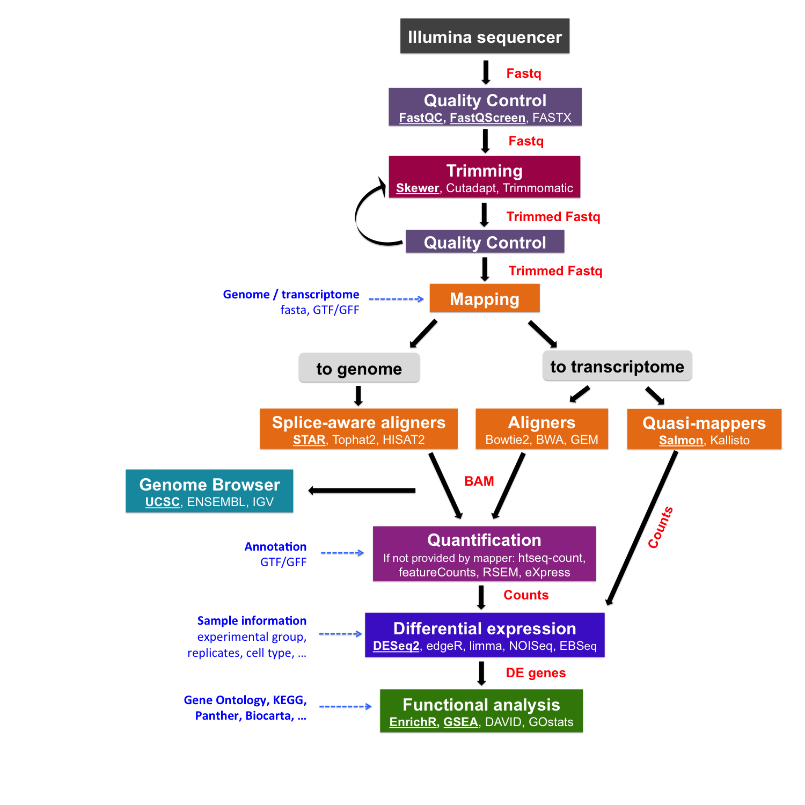
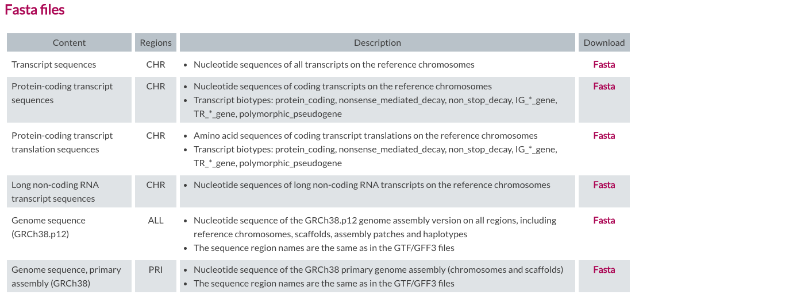
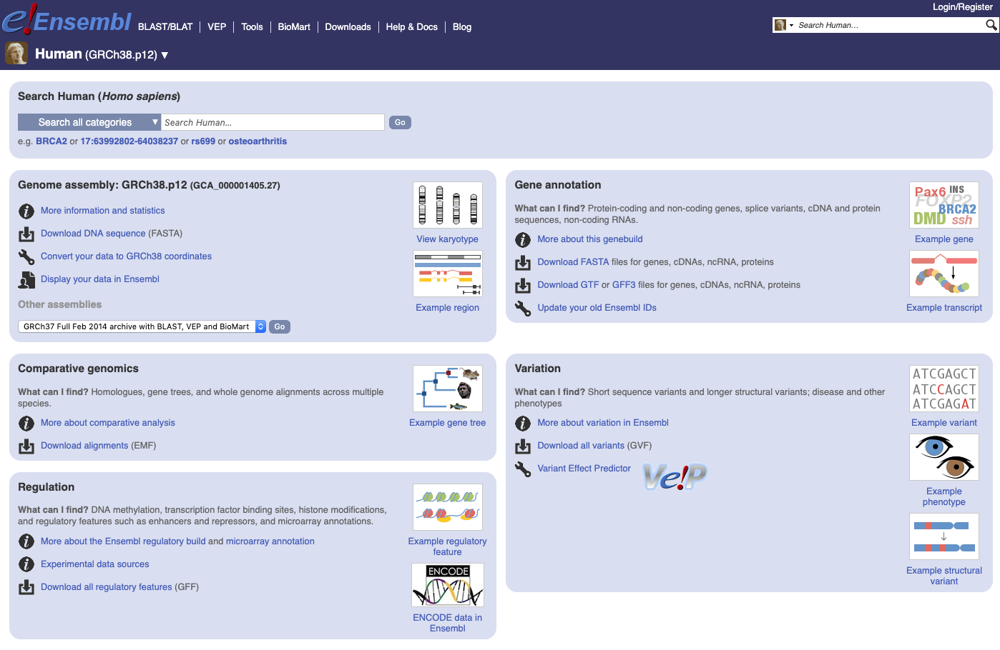
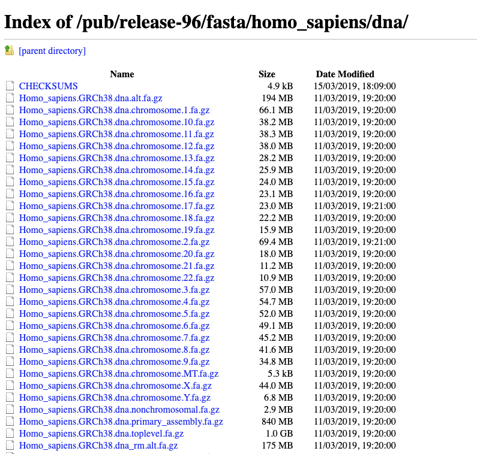
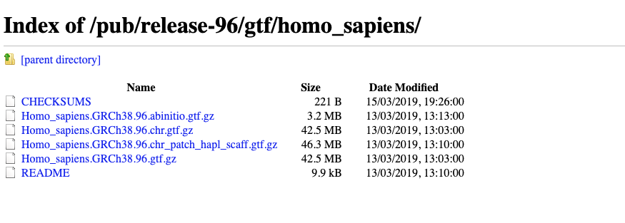

# Read mapping to a reference genome/transcriptome



Once sequencing reads are pre-processed and their quality is ensured, we can proceed mapping them to a reference genome or transcriptome. 

|Mapping of short reads|
| :---:  |
||
|from Wikipedia|

<br/>

But first, before doing the mapping, we need to retrieve information about a reference genome or transcriptome from a public database. The program that map reads to a genome or transcriptome, called an aligner, needs to be provided with two pieces of data, a FASTA file of the genome/transcriptome sequence (a file with an extension **.fa**) and a GTF/GFF file with annotation (a file with an extension **.gtf** or **.gff**).


## Public resources on genome/transcriptome sequences and annotations

* [GENCODE](https://www.gencodegenes.org/) contains an accurate annotation of the human and mouse genes derived either using manual curation, computational analysis or targeted experimental approaches. GENCODE also contains information on functional elements, such as protein-coding loci with alternatively splices variants, non-coding loci and pseudogenes.
* [Ensembl](https://www.ensembl.org/index.html) contains both automatically generated and manually curated annotations. They host different genomes and also comparative genomics data and variants. [Ensembl genomes](http://ensemblgenomes.org/) extends the genomic information across different taxonomic groups: bacteria, fungi, metazoa, plants, protists. Ensembl integrates also a genome browser.
* [UCSC Genome Browser](https://genome.ucsc.edu/) hosts information about different genomes and a genome browser. It integrates the Gencode information as additional tracks. 

Let's consider how to access data in GENCODE and Ensembl for performing mapping to the human genome.

In GENCODE, we will be using the version [**v29**](https://www.gencodegenes.org/human/release_29.html) of the human genome. We will need two files, one is a GTF file for **Comprehensive gene annotation (CHR)** and the other is a FASTA file for **Genome sequence, primary assembly (GRCh38)**. Transcript sequences are also available in case you want to use the transcriptome as a reference. To download files, you can use wget command in the command line, specifying a URL for each file.

|GENCODE website|
| :---:  |
||
||

<br/>

In [Ensembl](https://www.ensembl.org/index.html), select the genome, for example, [the latest for human](https://www.ensembl.org/Homo_sapiens/Info/Index) and then click to **Download FASTA** and then **[dna](ftp://ftp.ensembl.org/pub/release-96/fasta/homo_sapiens/dna/)** and  select **Homo_sapiens.GRCh38.dna_rm.primary_assembly.fa.gz** in case you don't want to look at haplotypes and patches. Note, this access might work differently in different Internet browsers and on different OS (e.g., on Mac, it works only in Chrome).
And clicking on **Download GTF** download **[Homo_sapiens.GRCh38.96.chr.gtf.gz](ftp://ftp.ensembl.org/pub/release-96/gtf/homo_sapiens/Homo_sapiens.GRCh38.96.chr.gtf.gz)**.

|Ensembl website|
| :---:  |
||
||
||

<br/>

## FASTA and GTF/GFF data formats
To speed up the mapping process, we downloaded FASTA and GTF files for human v29 from GENCODE and processed these files by selected data related only to Chromosome 10. Let's examine these files.

```{bash}
wget https://public-docs.crg.es/biocore/projects/training/RNAseq_2019/annotations.tar
tar -xf annotations.tar
```

The genome is generally represented as a FASTA file (.fa file) with the header indicated by the "**>**":

```{bash}
zcat annotations/Homo_sapiens.GRCh38.dna.chromosome.10.fa.gz| head -n 5

>chr10 dna:chromosome chromosome:GRCh38:10:1:133797422:1 REF
NNNNNNNNNNNNNNNNNNNNNNNNNNNNNNNNNNNNNNNNNNNNNNNNNNNNNNNNNNNN
NNNNNNNNNNNNNNNNNNNNNNNNNNNNNNNNNNNNNNNNNNNNNNNNNNNNNNNNNNNN
NNNNNNNNNNNNNNNNNNNNNNNNNNNNNNNNNNNNNNNNNNNNNNNNNNNNNNNNNNNN
NNNNNNNNNNNNNNNNNNNNNNNNNNNNNNNNNNNNNNNNNNNNNNNNNNNNNNNNNNNN
```

The size of the chromosome (in bp) is already reported in the header, but we can check it as follows:

```{bash}
zcat annotations/Homo_sapiens.GRCh38.dna.chromosome.10.fa.gz | grep -v ">" | tr -d '\n' | wc -m  

133797422
```

The annotation is stored in **G**eneral **T**ransfer **F**ormat (**GTF**) format (which is an extension of the older **[GFF format](https://genome.ucsc.edu/FAQ/FAQformat.html#format3)**): a tabular format with one line per genome feature, each one containing 9 columns of data. In general it has a header indicated by the first character **"#"** and one row per feature composed in 9 columns:

| Column number | Column name | Details |
| ----: | :---- | :---- |
| 1 | seqname | name of the chromosome or scaffold; chromosome names can be given with or without the 'chr' prefix. |
| 2 | source | name of the program that generated this feature, or the data source (database or project name) |
| 3 | feature | feature type name, e.g. Gene, Variation, Similarity |
| 4 | start | Start position of the feature, with sequence numbering starting at 1. |
| 5 | end | End position of the feature, with sequence numbering starting at 1. |
| 6 | score | A floating point value. |
| 7 | strand | defined as + (forward) or - (reverse). |
| 8 | frame | One of '0', '1' or '2'. '0' indicates that the first base of the feature is the first base of a codon, '1' that the second base is the first base of a codon, and so on.. |
| 9 | attribute | A semicolon-separated list of tag-value pairs, providing additional information about each feature. |


```{bash}
zcat annotations/gencode.v29.annotation_chr10.gtf.gz | head -n 10

##description: evidence-based annotation of the human genome (GRCh38), version 29 (Ensembl 94)
##provider: GENCODE
##contact: gencode-help@ebi.ac.uk
##format: gtf
chr10	HAVANA	gene	14061	16544	.	-	.	gene_id "ENSG00000260370.1"; gene_type "lincRNA"; gene_name "AC215217.1"; level 2; havana_gene "OTTHUMG00000174801.2";
chr10	HAVANA	transcript	14061	14604	.	-	.	gene_id "ENSG00000260370.1"; transcript_id "ENST00000562162.1"; gene_type "lincRNA"; gene_name "AC215217.1"; transcript_type "lincRNA"; transcript_name "AC215217.1-201"; level 2; transcript_support_level "3"; tag "basic"; havana_gene "OTTHUMG00000174801.2"; havana_transcript "OTTHUMT00000427447.1";
chr10	HAVANA	exon	14497	14604	.	-	.	gene_id "ENSG00000260370.1"; transcript_id "ENST00000562162.1"; gene_type "lincRNA"; gene_name "AC215217.1"; transcript_type "lincRNA"; transcript_name "AC215217.1-201"; exon_number 1; exon_id "ENSE00002606019.1"; level 2; transcript_support_level "3"; tag "basic"; havana_gene "OTTHUMG00000174801.2"; havana_transcript "OTTHUMT00000427447.1";
chr10	HAVANA	exon	14061	14299	.	-	.	gene_id "ENSG00000260370.1"; transcript_id "ENST00000562162.1"; gene_type "lincRNA"; gene_name "AC215217.1"; transcript_type "lincRNA"; transcript_name "AC215217.1-201"; exon_number 2; exon_id "ENSE00002584618.1"; level 2; transcript_support_level "3"; tag "basic"; havana_gene "OTTHUMG00000174801.2"; havana_transcript "OTTHUMT00000427447.1";
chr10	HAVANA	transcript	14138	16544	.	-	.	gene_id "ENSG00000260370.1"; transcript_id "ENST00000566940.1"; gene_type "lincRNA"; gene_name "AC215217.1"; transcript_type "lincRNA"; transcript_name "AC215217.1-202"; level 2; transcript_support_level "3"; havana_gene "OTTHUMG00000174801.2"; havana_transcript "OTTHUMT00000430636.1";
chr10	HAVANA	exon	16502	16544	.	-	.	gene_id "ENSG00000260370.1"; transcript_id "ENST00000566940.1"; gene_type "lincRNA"; gene_name "AC215217.1"; transcript_type "lincRNA"; transcript_name "AC215217.1-202"; exon_number 1; exon_id "ENSE00002578035.1"; level 2; transcript_support_level "3"; havana_gene "OTTHUMG00000174801.2"; havana_transcript "OTTHUMT00000430636.1";
```

Let's check the 9th field:
```{bash}
zcat annotations/gencode.v29.annotation_chr10.gtf.gz | cut -f9 | head -2
```

Let's check how many genes are in the annotation file:

```{bash}
zcat annotations/gencode.v29.annotation_chr10.gtf.gz | grep -v "#" | awk '$3=="gene"' | wc -l 
2240
```

And get a final counts of every feature:

```{bash}
zcat annotations/gencode.v29.annotation_chr10.gtf.gz | grep -v "#" | cut -f3 | sort | uniq -c 

  29578 CDS
  46414 exon
   2240 gene
   2750 start_codon
   2693 stop_codon
   6894 transcript
   9274 UTR

```

<br/>


## Tools for read mapping

Once FASTA and GTF files for a reference genome/transcriptome are obtained, we need to choose an aligner to perform the mapping and before doing the mapping to calculate an index for the reference genome that a chosen algorithm will use. Like the index at the end of a book, an index of a large DNA sequence allows one to rapidly find shorter sequences embedded within it. Different tools use different approaches at genome/transcriptome indexing.
<br/>

### Fast aligners to a reference transcriptome
These tools can be used for aligning short reads to a trancriptome reference, because if a genome is used these tools would not map reads to splicing junctions; that is, they are not splice-aware aligners. They can be much faster than traditional aligners like [**Blast**](https://blast.ncbi.nlm.nih.gov/Blast.cgi) but less sensitive and may have limitations about the read size. 

* [**Bowtie**](http://bowtie-bio.sourceforge.net/index.shtml) is an ultrafast, memory-efficient short read aligner geared toward quickly aligning large sets of short DNA sequences (reads) to large genomes/transcriptomes. Bowtie uses a Burrows-Wheeler index. 
* [**Bowtie2**](http://bowtie-bio.sourceforge.net/bowtie2/index.shtml) is an ultrafast and memory-efficient tool for aligning sequencing reads to long reference sequences. It is particularly good at aligning reads of length 50 up to 100s or 1,000s to relatively long (e.g. mammalian) genomes. Bowtie 2 indexes the transcriptome with an FM Index. 
* [**BWA**](http://bio-bwa.sourceforge.net/) is a software package for mapping low-divergent sequences against a large reference genome, such as the human genome. BWA indexes the genome with an FM Index.
* [**GEM**](https://github.com/smarco/gem3-mapper) is a high-performance mapping tool for aligning sequenced reads against large reference genomes. In particular, it is designed to obtain best results when mapping sequences up to 1K bases long. GEM3 indexes the reference genome using a custom FM-Index design and performs an adaptive gapped search based on the characteristics of the input and the user settings. 
<br/>

### Splice-aware aligners to a reference genome
These aligners are able to map to the splicing junctions described in the annotation and even to detect novel ones. Some of them can detect gene fusions and SNPs and also RNA editing. For some of these tools, the downstream analysis requires the assignation of the aligned reads to a given gene/transcript.

* [**Tophat**](https://ccb.jhu.edu/software/tophat/index.shtml) is a fast splice junction mapper for RNA-Seq reads. It aligns RNA-Seq reads to mammalian-sized genomes using the ultra high-throughput short read aligner Bowtie, and then analyzes the mapping results to identify splice junctions between exons.
* [**HISAT2**](http://ccb.jhu.edu/software/hisat2/index.shtml) is a fast and sensitive alignment program for mapping next-generation sequencing reads (both DNA and RNA) to a population of human genomes (as well as to a single reference genome). The indexing scheme is called a Hierarchical Graph FM index (HGFM). 
* [**STAR**](https://github.com/alexdobin/STAR) is an ultrafast universal RNA-seq aligner. It uses sequential maximum mappable seed search in uncompressed suffix arrays followed by seed clustering and stitching procedure. It is also able to search for gene fusions.
<br/>

### Quasi-mappers to a reference transcriptome
These tools are way faster than the previous ones because they don't need to report the resulting alignments (BAM/SAM files) but only  associate a read to a given transcript for quantification. They don't discover novel transcript variants (or splicing events) or detect variations, etc.

* [**Sailfish**](http://www.cs.cmu.edu/~ckingsf/software/sailfish/) replaces read mapping with intelligent k-mer indexing and counting, thus allowing fast quantification of isoform abundance (for example, the authors claim that it takes about 15 minutes for a set of 150 million reads).
* [**Salmon**](https://salmon.readthedocs.io/en/latest/index.html) is an advanced version of Sailfish, by the same authors, tool for wicked-fast transcript quantification from RNA-seq data. It requires a set of target transcripts to quantify and a K-mer parameter to make the index (i.e. minimum acceptable alignment). 
* [**Kallisto**](https://pachterlab.github.io/kallisto/) is a program for quantifying abundances of transcripts from bulk and single-cell RNA-Seq data. It is based on the novel idea of pseudoalignment for rapidly determining the compatibility of reads with targets, without the need for alignment.


