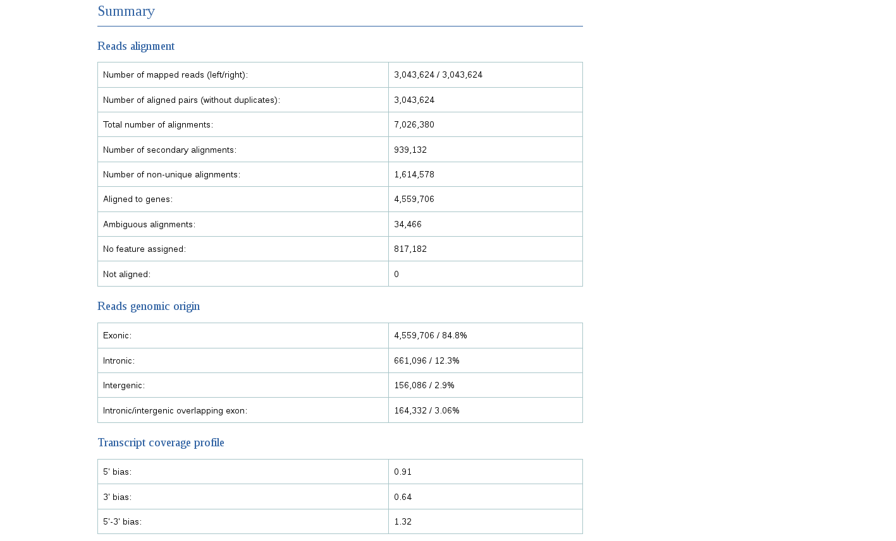
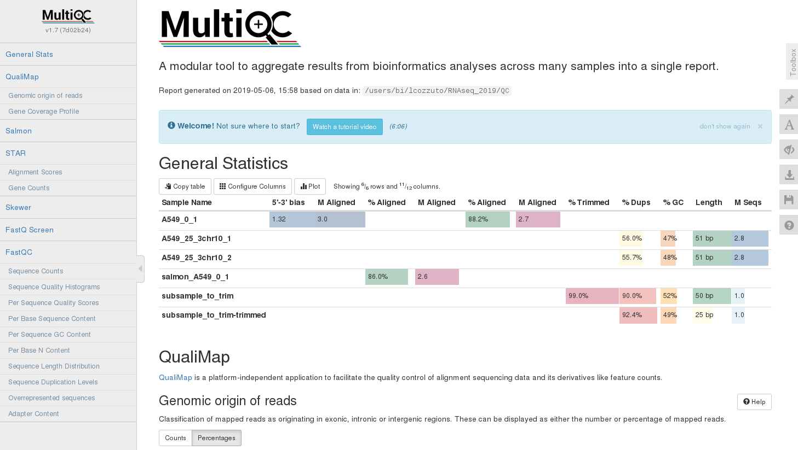

# Alignment: practical

## Creating indexes
We will make indexes using two different programs **STAR** and **Salmon**. The former will need both genome in fasta format and annotation in GTF. The latter instead needs transcripts sequences in a fasta file.

We can check the size of the files needed by the tools:

```{bash}
ls -alht annotations
total 136M
drwxr-xr-x 9 lcozzuto Bioinformatics_Unit 1.6K Apr 30 17:37 ..
drwxr-xr-x 2 lcozzuto Bioinformatics_Unit  253 Apr 30 17:37 .
-rw-r--r-- 1 lcozzuto Bioinformatics_Unit  63M Apr 30 16:56 gencode.v29.transcripts.fa.gz
-rw-r--r-- 1 lcozzuto Bioinformatics_Unit  39M Apr 17 16:25 Homo_sapiens.GRCh38.dna.chromosome.10.fa.gz
-rw-r--r-- 1 lcozzuto Bioinformatics_Unit 1.5M Apr 17 16:08 gencode.v29.annotation_chr10.gtf.gz
```

As a good practice is better to keep our files zipped as much as possible, you won't waste storage that is a precious resource when dealing with these analysis. You can see how much storage is wasted when using unzipped files:

**PLEASE DO NOT UNZIP ALSO THE FILE gencode.v29.transcripts.fa!! THE FOLLOWING IS AN EXAMPLE!!**

```{bash}
for i in *.gz; do gunzip $i; done

ls -alht
total 617M
drwxr-xr-x  2 lcozzuto Bioinformatics_Unit  244 Apr 30 17:49 .
drwxr-xr-x 10 lcozzuto Bioinformatics_Unit 1.7K Apr 30 17:49 ..
-rw-r--r--  1 lcozzuto Bioinformatics_Unit 130M Apr 30 17:48 Homo_sapiens.GRCh38.dna.chromosome.10.fa
-rw-r--r--  1 lcozzuto Bioinformatics_Unit 331M Apr 30 17:48 gencode.v29.transcripts.fa
-rw-r--r--  1 lcozzuto Bioinformatics_Unit  43M Apr 30 17:48 gencode.v29.annotation_chr10.gtf
```
Basically you are using 80% more space. Some of the tools cannot handle directly zipped files as an input (like the indexing step of **STAR**), so you can unzip them, use them and remove the uncompressed version.

To indexing the genome with **STAR** we need to provide also the parameter **sjdbOverhang** that is needed for detecting possible splicing sites. It is generally the minimum read size minus 1 and tells **STAR** which is the maximum possible stretch of sequence that can be found on one side of the spicing site. In our case that every reads is 51 bases long we can accept maximum 50 bases on one side and one base on the other (so the value for this parameter is **50**).

This step will require some minutes:

```{bash}
mkdir indexes
mkdir indexes/chr10
$RUN STAR --runMode genomeGenerate --genomeDir indexes/chr10 \
            --genomeFastaFiles annotations/Homo_sapiens.GRCh38.dna.chromosome.10.fa \
            --sjdbGTFfile annotations/gencode.v29.annotation_chr10.gtf \
            --sjdbOverhang 50 --outFileNamePrefix chr10

Apr 30 18:21:00 ..... started STAR run
Apr 30 18:21:00 ... starting to generate Genome files
Apr 30 18:21:05 ... starting to sort Suffix Array. This may take a long time...
Apr 30 18:21:06 ... sorting Suffix Array chunks and saving them to disk...
Apr 30 18:25:18 ... loading chunks from disk, packing SA...
Apr 30 18:25:42 ... finished generating suffix array
Apr 30 18:25:42 ... generating Suffix Array index
Apr 30 18:26:37 ... completed Suffix Array index
Apr 30 18:26:37 ..... processing annotations GTF
Apr 30 18:26:38 ..... inserting junctions into the genome indices
Apr 30 18:27:08 ... writing Genome to disk ...
Apr 30 18:27:09 ... writing Suffix Array to disk ...
Apr 30 18:27:16 ... writing SAindex to disk
Apr 30 18:27:24 ..... finished successfully

```

**Salmon** does not need any decompression of the input so we can index by using this command:

```{bash}
$RUN salmon index -t annotations/gencode.v29.transcripts.fa.gz -i indexes/transcripts

Version Info: This is the most recent version of salmon.
index ["transcripts"] did not previously exist  . . . creating it
[2019-04-30 18:12:59.272] [jLog] [info] building index
[2019-04-30 18:12:59.275] [jointLog] [info] [Step 1 of 4] : counting k-mers

[....]
[2019-04-30 18:18:07.251] [jLog] [info] done building index
```


## Aligning
For aligning with **STAR** we need to specify the path of the files (reads and index folder) and if the reads are compressed or not (**--readFilesCommand zcat**). Then we can also specify the kind of outptut we want, in this case we choose **BAM** format with alignment sorted by coordinates. We also indicated that we want to output gene counts too (**--quantMode GeneCounts**) that will be useful for differential analysis.

```{bash}
mkdir alignments

$RUN STAR --genomeDir indexes/chr10 \
      --readFilesIn resources/A549_0_1chr10_1.fastq.gz resources/A549_0_1chr10_2.fastq.gz \
      --readFilesCommand zcat \
      --outSAMtype BAM SortedByCoordinate \
      --quantMode GeneCounts \
      --outFileNamePrefix alignments/A549_0_1
      
Apr 30 18:50:13 ..... started STAR run
Apr 30 18:50:13 ..... loading genome
Apr 30 18:50:52 ..... started mapping
Apr 30 18:54:41 ..... started sorting BAM
Apr 30 18:55:30 ..... finished successfully
```

We cannot inspect directly the output file since the **BAM** format is a compressed version of the [**SAM**](https://samtools.github.io/hts-specs/SAMv1.pdf) (that is plain text). We can convert BAM to SAM by using [**samtools**](http://samtools.sourceforge.net/). Note that we use the parameter **-h** to show also the header that is hidden by default. 

```{bash}
$RUN samtools view -h alignments/A549_0_1Aligned.sortedByCoord.out.bam |head -n 10
@HD	VN:1.4	SO:coordinate
@SQ	SN:chr10	LN:133797422
@PG	ID:STAR	PN:STAR	VN:2.7.0f	CL:STAR   --genomeDir indexes/chr10   --readFilesIn resources/A549_0_1chr10_1.fastq.gz   resources/A549_0_1chr10_2.fastq.gz      --readFilesCommand zcat      --outFileNamePrefix alignments/A549_0_1   --outSAMtype BAM   SortedByCoordinate      --quantMode GeneCounts   
@CO	user command line: STAR --genomeDir indexes/chr10 --readFilesIn resources/A549_0_1chr10_1.fastq.gz resources/A549_0_1chr10_2.fastq.gz --readFilesCommand zcat --outSAMtype BAM SortedByCoordinate --quantMode GeneCounts --outFileNamePrefix alignments/A549_0_1
D00137:453:HLFY2BCXY:2:1115:10428:98737	419	chr10	35442	3	13M174562N32M6S	=	236864	201473	AGCTGTTATTGAACAAGAAGGGATTGGTTGCCAGGAGATGAGATTAGCATT	@DDD?<1D1CGEE11<C@GHIIH?@E?G@CHH?FH@0GH@C<<<@1DFCHH	NH:i:2	HI:i:2	AS:i:74	nM:i:9
D00137:453:HLFY2BCXY:2:2208:10640:12788	419	chr10	37161	0	51M	=	37323	213	CCAATATTCAACATTCTTAAAGAAAAGAATGTTCAACCCAGAATTTCATAT	DABDDFHHIIIHCFHEHIEEHHHFFEHHIIH@GHHIIIIIIIIHIIHIIIH	NH:i:5	HI:i:5	AS:i:98	nM:i:1
D00137:453:HLFY2BCXY:2:2208:10640:12788	419	chr10	37161	0	51M	=	37323	213	CCAATATTCAACATTCTTAAAGAAAAGAATGTTCAACCCAGAATTTCATAT	DABDDFHHIIIHCFHEHIEEHHHFFEHHIIH@GHHIIIIIIIIHIIHIIIH	NH:i:5	HI:i:5	AS:i:98	nM:i:1
D00137:453:HLFY2BCXY:2:2208:10640:12788	339	chr10	37323	0	51M	=	37161	-213	GCACTAAACATGGAAAGGAACAACCGGTACCAGCCACTGCAAAATCATGCC	CHIHEIIHHHHHIIIHHGFCIIIHIIHIIHIIHGHIIGHIHHIIHHDDADD	NH:i:5	HI:i:5	AS:i:98	nM:i:1
D00137:453:HLFY2BCXY:2:2208:10640:12788	339	chr10	37323	0	51M	=	37161	-213	GCACTAAACATGGAAAGGAACAACCGGTACCAGCCACTGCAAAATCATGCC	CHIHEIIHHHHHIIIHHGFCIIIHIIHIIHIIHGHIIGHIHHIIHHDDADD	NH:i:5	HI:i:5	AS:i:98	nM:i:1
D00137:453:HLFY2BCXY:1:1214:7640:70489	419	chr10	37872	3	51M	=	37978	156	TGGGAGACTTTAACACCCCACTGTCAACATTAGACAGCTCAACAAGACAGA	DDDDDHDHIIIIIIIIIIIIIIHIIFHGIIIIIIIIIIIIGHIIIIIIIHI	NH:i:2	HI:i:1	AS:i:99	nM:i:0
```

The first part indicated by the first character **@** in each row is the header:

| Symbol|  |  |   
| :----: | :---- | :---- |
| **@HD** header line	| **VN:1.4** version of the SAM format|	**SO:coordinate** sorting order|
| **@SQ** reference sequence dictionary 	| **SN:chr10** sequence name|	**LN:133797422** sequence length|
| **@PG** program used|	**ID:STAR** **PN:STAR**	**VN:2.7.0f** version| **CL:STAR   --genomeDir indexes/chr10   --readFilesIn resources/A549_0_1chr10_1.fastq.gz   resources/A549_0_1chr10_2.fastq.gz      --readFilesCommand zcat      --outFileNamePrefix alignments/A549_0_1   --outSAMtype BAM   SortedByCoordinate      --quantMode GeneCounts** command line|
|**@CO** One-line text comment||**user command line: STAR --genomeDir indexes/chr10 --readFilesIn resources/A549_0_1chr10_1.fastq.gz resources/A549_0_1chr10_2.fastq.gz --readFilesCommand zcat --outSAMtype BAM SortedByCoordinate --quantMode GeneCounts --outFileNamePrefix alignments/A549_0_1**|

The rest is the proper alignment. 

| Field|Value |   
| :----: | :---- |
|Query name 	|D00137:453:HLFY2BCXY:2:1115:10428:98737|
|FLAG 	|419 * |
|Reference name 	|chr10|
|Leftmost mapping position 	|35442|
|Mapping quality 	|3 *(p=0.5)* |
|CIGAR string 	|13M174562N32M6S *13 bases equal to the reference (M), 174562 not mapping = 1 insertion (N) 32 mapping (M) 6 soft clipped (S)*|
|Reference name for mate read |	= *same chromosome*|
|Position of the mate| 	236864|
|Template length| 	201473|
|Sequence |AGCTGTTATTGAACAAGAAGGGATTGGTTGCCAGGAGATGAGATTAGCATT|
|Quality	|@DDD?<1D1CGEE11<C@GHIIH?@E?G@CHH?FH@0GH@C<<<@1DFCHH|

\* the flag 419 means: read paired, read mapped in proper pair, mate on the reverse strand, second in pair, not primary alignment. You can use this useful website for the translation of this value in plain English (http://blog.biochen.com/FlagExplain.html).

Extra fields are often present and are different among aligner tools (https://samtools.github.io/hts-specs/SAMtags.pdf). In our case we have:

| Field|Meaning |   
| :----: | :---- |
|NH:i:2|number of mapping to the reference|
|HI:i:2|which aligmnent is the reported one (in this case is the second one)|	
|AS:i:74|Alignment score calculate by the aligner|
|nM:i:9|number of difference with the reference*|

\* *Note that historically this has been ill-defined and both data and tools exist that disagree with this
definition.*

## File conversion and alignment QC

Let's now convert BAM to SAM:

```{bash}
$RUN samtools view -h alignments/A549_0_1Aligned.sortedByCoord.out.bam > alignments/A549_0_1.sam

ls -alht alignments/A549_0_1*[sb]am
-rw-r--r-- 1 lcozzuto Bioinformatics_Unit 1.5G May  2 18:34 A549_0_1.sam
-rw-r--r-- 1 lcozzuto Bioinformatics_Unit 320M Apr 30 18:55 A549_0_1Aligned.sortedByCoord.out.bam
```

We can see that the SAM alignment is 5 times bigger than the sam one. A more efficient way to store the alignment is to use the [**CRAM format**](https://samtools.github.io/hts-specs/CRAMv3.pdf). For converting a **bam** to **cram** we need to have unzipped and indexed version of our genome.

```{bash}
$RUN samtools faidx annotations/Homo_sapiens.GRCh38.dna.chromosome.10.fa

$RUN samtools view -C alignments/A549_0_1Aligned.sortedByCoord.out.bam -T annotations/Homo_sapiens.GRCh38.dna.chromosome.10.fa > alignments/A549_0_1.cram

ls -alht A549_0_1*.*am
-rw-r--r-- 1 lcozzuto Bioinformatics_Unit 1.5G May  2 18:59 A549_0_1.sam
-rw-r--r-- 1 lcozzuto Bioinformatics_Unit 167M May  2 18:58 A549_0_1.cram
-rw-r--r-- 1 lcozzuto Bioinformatics_Unit 320M Apr 30 18:55 A549_0_1Aligned.sortedByCoord.out.bam
```

We saved in this way 50% more space than using the **bam** format. Let's remove the sam format.
```{bash}
rm alignments/*.sam 
```


Gene counts are reported within the file **PREFIX**ReadsPerGene.out.tab. It is a tab separated text with information about 

| | | | |   
| :----: | :----: | :----: |  :----: |
|gene id| read counts per gene (no strand) | read counts per gene (forward)|read counts per gene (reverse)| 
|N_unmapped|	26098|	26098|	26098|
|...|	...|	...|	...|
|ENSG00000261456.5|	13|	0|	13|

This is quite useful in case we don't know which kit was used for the sequencing step. At the beginning we also have number of unmapped reads, of reads that map to more than one position 

```{bash}
more alignments/A549_0_1ReadsPerGene.out.tab

N_unmapped	26098	26098	26098
N_multimapping	337723	337723	337723
N_noFeature	211089	2547710	246034
N_ambiguous	151810	4514	32331
ENSG00000260370.1	0	0	0
ENSG00000237297.1	0	0	0
ENSG00000261456.5	13	0	13
ENSG00000232420.2	0	0	0
ENSG00000015171.19	6874	131	6743
ENSG00000276662.1	6	6	0
ENSG00000212331.1	0	0	0
ENSG00000151240.16	1652	5	1664
...
```

We can count the number of reads mapping to each strand by using a simple awk script:

```{bash}
grep -v "N_" alignments/A549_0_1ReadsPerGene.out.tab | awk '{unst+=$2;forw+=$3;rev+=$4}END{print unst,forw,rev}'

2343002 153677 2427536
```
So we can confirm that the protocol used is sequencing the reverse complement of input mRNAs.

We can check the quality of the resulting alignment running the tool [**Qualimap**](http://qualimap.bioinfo.cipf.es/) specifying the kind of analysis (**rnaseq**), the presence of paired end reads within the bam file (**-pe**) and the strand of the library (**-p strand-specific-reverse**). 

```{bash}
$RUN qualimap rnaseq -pe -bam alignments/A549_0_1Aligned.sortedByCoord.out.bam \
	-gtf annotations/gencode.v29.annotation_chr10.gtf \
	-outdir QC -p strand-specific-reverse
  
Java memory size is set to 1200M
Launching application...

OpenJDK 64-Bit Server VM warning: ignoring option MaxPermSize=1024m; support was removed in 8.0
QualiMap v.2.2.1
Built on 2016-10-03 18:14
....  
```

We can check the final report again with a browser like firefox:

```{bash}
firefox QC/qualimapReport.html
```


The report gives many useful information like the total number of mapped reads, the amount of reads mapping to exons, introns or intergenics and the bias towards one of the end of the mRNA (that can give information about RNA integrity or protocol used). 



Looking at the gene coverage we see a bias towards 5' that is compatible with the kind of stranded protocol used (it is beacuse fo reverse trancsriptase).


Finally we can check that most of our reads map to the exonic part, with little o no contamination of total RNA.


For aligning with **Salmon** we need to specify the strandess of the library (**Fragment Library Types**). In brief you have to specify three letters:

**The first:**

|Symbol |Meaning | Reads|  
| :---: | :----: |:----: |
|I|inward|-> ... <- |
|O|outward|<- ... ->|
|M|matching|> ... ->|

**The second:**

|Symbol |Meaning |
| :---: | :----: |
|S|stranded|
|U|unstranded|

**The third:**

|Symbol |Meaning |
| :---: | :----: |
|F|read 1 (or single-end read) comes from the forward strand|
|R|read 1 (or single-end read) comes from the reverse strand|

In our case we have **Inward**, **Stranded** and **Reverse**. Moreover if we want to assign the reads to the genes too we need to provide a GTF file with correlation between transcripts and genes (otpion **-g**).

```{bash}
$RUN salmon quant -i indexes/transcripts -l ISR \
    -1 resources/A549_0_1chr10_1.fastq.gz \
    -2 resources/A549_0_1chr10_2.fastq.gz \
    -o alignments/salmon_A549_0_1 \
    -g annotations/gencode.v29.annotation_chr10.gtf \
    --seqBias \
    --validateMappings 

Version Info: This is the most recent version of salmon.
### salmon (mapping-based) v0.13.1
### [ program ] => salmon 
### [ command ] => quant 
....
```

We can check the results inside the folder 

```{bash}
ls alignments/salmon_A549_0_1/

aux_info  cmd_info.json  lib_format_counts.json  libParams  logs  quant.genes.sf  quant.sf
```

And in particular the file **quant.genes.sf**, that is a tabular file with the following information:


|Column |Meaning |   
| :----: | :---- |
|Name| Gene name|
|Length| Gene length|
|EffectiveLength| Effective length after considering biases|
|TPM|Transcripts Per Million|
|NumReads|Estimated number of reads considering both univocally and multimapping reads|

```{bash}
head -n 5 alignments/salmon_A549_0_1/quant.genes.sf 

Name	Length	EffectiveLength	TPM	NumReads
ENSG00000285803.1	1152	1116.21	7.96961	15.764
ENSG00000285712.1	1590	1545.58	2.19064	6
ENSG00000285824.1	1120	860.855	6.91601	10.551
ENSG00000285884.1	790	515.683	3.28285	3

head -n 5 alignments/salmon_A549_0_1/quant.sf 
Name	Length	EffectiveLength	TPM	NumReads
ENST00000016171.5	2356	1970.742	659.861626	2304.468
ENST00000020673.5	4183	5925.497	0.000000	0.000
ENST00000173785.4	925	868.802	0.000000	0.000
ENST00000181796.6	3785	3216.057	0.000000	0.000
```
We will use this information for calculating differential expression (DE) analysis. 

## Combining reports
At this point we can summarize the work done by usiong the tool [**multiqc**](https://multiqc.info/). First we link our mapping results to QC.

```{bash}
cd QC/
ln -s ../alignments/* .
```

Then we join the different analyses:

```{bash}
$RUN multiqc .
[INFO   ]         multiqc : This is MultiQC v1.7 (7d02b24)
[INFO   ]         multiqc : Template    : default
[INFO   ]         multiqc : Searching 'QC/'
Searching 70 files..  [####################################]  100% 
...

firefox multiqc_report.html
```

Here the result:



