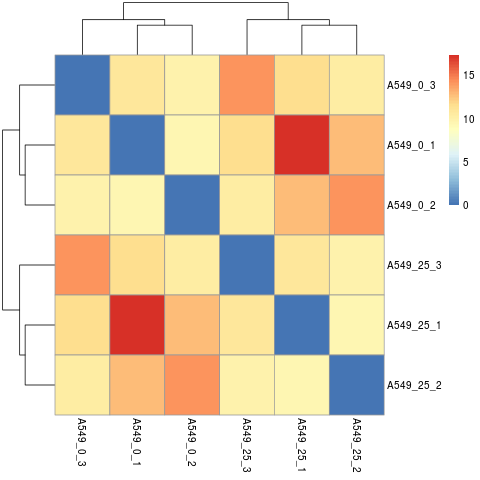
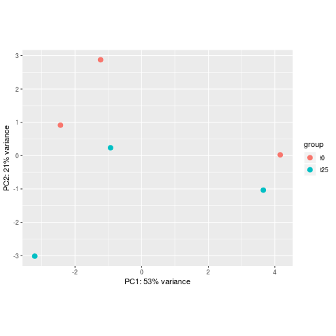
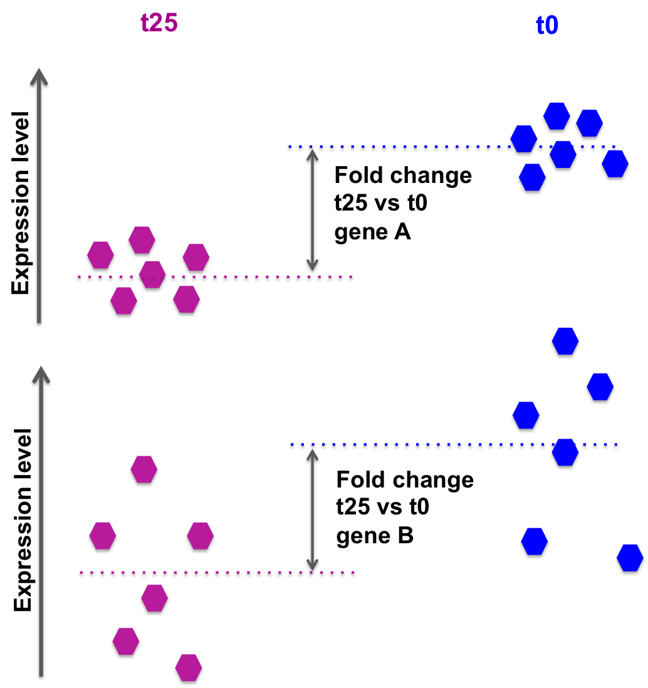

# Differential expression analysis


The goal of differential expression analysis is to perform statistical analysis to try and discover **changes in expression levels** of defined features (genes, transcripts, exons) between experimental groups with **replicated samples**.<br>

## Popular tools

Most of the popular tools for differential expression analysis are available as **R / Bioconductor** packages. <br>
Bioconductor is an R project and repository that provides a set of packages and methods for omics data analysis.<br>

The best performing tools for differential expression analysis tend to be:
* [DESeq2](https://bioconductor.org/packages/release/bioc/html/DESeq2.html)
* [edgeR](https://bioconductor.org/packages/release/bioc/html/edgeR.html)
* [limma (voom)](https://bioconductor.org/packages/release/bioc/html/limma.html)

See [Schurch et al, 2015; arXiv:1505.02017](https://arxiv.org/abs/1505.02017) and [the Biostars thread about the main differences between the methods](https://www.biostars.org/p/284775/).
<br><br>
In this tutorial, we will give you an overview of the **DESeq2** pipeline to find differentially expressed **genes** between two conditions.

## DESeq2

[DESeq2](https://bioconductor.org/packages/release/bioc/html/DESeq2.html) is an R/Bioconductor implemented method to detect differentially expressed features.
<br>
It uses the negative binomial generalized linear models.
<br>
DESeq2 (as edgeR) is based on the hypothesis that **most genes are not differentially expressed**.
<br><br>
This DESeq2 tutorial is inspired by the [RNA-seq workflow](http://master.bioconductor.org/packages/release/workflows/vignettes/rnaseqGene/inst/doc/rnaseqGene.html) developped by the authors of the tool, and by the [differential gene expression course](https://hbctraining.github.io/DGE_workshop/lessons/04_DGE_DESeq2_analysis.html) from the [Harvard Chan Bioinformatics Core](http://bioinformatics.sph.harvard.edu/).
<br><br>

### DESeq2 steps:

* Modeling raw counts for each gene:
  * Estimate size factors (accounts for differences in library size).
  * Estimate dispersions.
  * GLM (Generalized Linear Model) fit for each gene.
* Testing for differential expression (Wald test).
<br> 
<br>
For additional information regarding the tool and the algorithm, please refer to the [paper](https://www.ncbi.nlm.nih.gov/pmc/articles/PMC4302049/) and the user-friendly package [vignette](http://bioconductor.org/packages/devel/bioc/vignettes/DESeq2/inst/doc/DESeq2.html).

### Tutorial on basic DESeq2 usage for differential analysis of gene expression

* In this tutorial, we will use the counts calculated from the mapping on **all chromosomes** (in the two last days we practiced QC and mapping for data of only one chromosome but here we consider all chromosomes), for the 6 samples previously selected from **ENCODE**:
  * A549 treated 0 minute with Dexamethasone, in triplicates: A549_0_1, A549_0_2, A549_0_3.
  * A549 treated 25 minutes with Dexamethasone, in triplicates: A549_25_1, A549_25_2, A549_25_3.

*Dexamethasone is a synthetic adrenal corticosteroid with potent anti-inflammatory properties. In addition to binding to specific nuclear steroid receptors, dexamethasone also interferes with NF-kB activation and apoptotic pathways. This agent lacks the salt-retaining properties of other related adrenal hormones. [Source](https://pubchem.ncbi.nlm.nih.gov/compound/Dexamethasone).*
<br>
Get the count data for the full data set, output of both STAR and Salmon:

```{bash}
# Go to the home directory
cd ~

# Get the folder containing all the data
wget https://biocorecrg.github.io/RNAseq_course_2019/precomp_res/full_data.tar.gz

# Gunzip
tar -zxvf full_data.tar.gz

# Remove full_data.tar.gz once extraction is completed
rm full_data.tar.gz
```

**Exercise**
* Explore count formats for both **STAR** and **Salmon**: what information do you get in each ?
  * STAR: ReadsPerGene.out.tab extension.
  * Salmon: quant.sf files.
* How many rows are there in ~/full_data/counts_star/A549_0_1ReadsPerGene.out.tab and ~/full_data/counts_salmon/A549_0_1/quant.sf ? How do you explain the difference ?


### Raw count matrices

**DESeq2** takes as an input raw (non normalized) counts, in various forms:
* Option 1: a matrix for all sample
* Option 2: one file per sample

#### Prepare data from STAR

##### **Option 1**: a <b>matrix of integer values</b> (the value at the i-th row and j-th column tells how many reads have been assigned to gene i in sample j), such as:

| gene | A549_0_1chr10 | A549_0_2chr10 | A549_0_3chr10 | A549_25_1chr10 | A549_25_2chr10 | A549_25_3chr10 |
| :--- | :---: | :---: | :---: | :---: | :---: | :---: |
| ENSG00000260370.1 | 0 | 0 | 1 | 0 | 1 | 1 |
| ENSG00000237297.1 | 10 | 8 | 10 | 12 | 5 | 2 |
| ENSG00000261456.5 | 210 | 320 | 291 | 300 | 267 | 222 |
| ENSG00000232420.2 | 3 | 2 | 0 | 1 | 2 | 6 |

Let's prepare the matrix for our 6 samples, from the **STAR** output.
<br><br>
__REMINDER regarding the STAR output__
<br>
The **ReadsPerGene.out.tab** output files of STAR (from option --quantMode GeneCounts) contain 4 columns that correspond to different counts per gene calculated **according to the protocol's strandedness** (see [Mapping with STAR pratical](https://biocorecrg.github.io/RNAseq_course_2019/alnpractical.html)):
* column 1: gene ID
* column 2: counts for unstranded RNA-seq.
* column 3: counts for the 1st read strand aligned with RNA
* column 4: counts for the 2nd read strand aligned with RNA (the most common protocol nowadays)

The protocol used to prepare the libraries for the A549 ENCODE samples is **reverse stranded**, so we need to extract the 4th column of each of the "ReadsPerGene" files, along with the column containing the <b>gene names</b>.
<br>
<br>
Create a folder for the deseq2 analysis in the **full_data**:

```{bash}
mkdir -p ~/full_data/deseq2
```

* Create a matrix of expression:

```{bash}
cd ~/full_data/counts_star

# retrieve the 4th column of each "ReadsPerGene.out.tab" file + the first column that contains the gene IDs
paste A549_*ReadsPerGene.out.tab | grep -v "_" | awk '{printf "%s\t", $1}{for (i=4;i<=NF;i+=4) printf "%s\t", $i; printf "\n" }' > tmp

# add header: "gene_name" + the name of each of the counts file
sed -e "1igene_name\t$(ls A549_*ReadsPerGene.out.tab | tr '\n' '\t' | sed 's/ReadsPerGene.out.tab//g')" tmp | cut -f1-7 > ../deseq2/raw_counts_A549_matrix.txt

# another way can be the following one
ls *.tab | awk '{ORS=" "; print "gene name "$0}END{print "\n"}'| sed 's/ReadsPerGene.out.tab//g' > ../deseq2/raw_counts_A549_matrix.txt; cat tmp >> ../deseq2/raw_counts_A549_matrix.txt

# remove temporary file
rm tmp
```

##### **Option 2**: one file per sample, each file containing the raw counts of all genes:

File **A549_0_1chr10_counts.txt**:

| ENSG00000260370.1 | 0 |
| ENSG00000237297.1 | 10 |
| ENSG00000261456.5 | 210 |

File **A549_0_2chr10_counts.txt**:

| ENSG00000260370.1 | 0 |
| ENSG00000237297.1 | 8 |
| ENSG00000261456.5 | 320 |

and so on...
<br><br>
**Exercise**
* Prepare the 6 files needed for our analysis, from the STAR output, and save them in the <b>counts_4thcol</b> directory:
  

* Create the sub-directory **counts_4thcol** inside the deseq2 directory:
```{bash}
mkdir -p ~/full_data/deseq2/counts_4thcol
```

* Loop around the 6 **ReadsPerGene.out.tab** files and extract the gene ID (1rst column) and the correct counts (4th column).

```{bash}
cd ~/full_data/counts_star

for i in *ReadsPerGene.out.tab
do echo $i
# retrieve the first (gene name) and fourth column (raw reads)
cut -f1,4 $i | grep -v "_" > ~/full_data/deseq2/counts_4thcol/`basename $i ReadsPerGene.out.tab`_counts.txt
done
```

<br>

#### Prepare data from Salmon

DESeq2 needs an annotation file to import **summarize all transcripts** data from the per-transcript count data into a per-gene count data.
<br>
Prepare the annotation file needed to import the **Salmon** counts: a two-column data frame linking transcript id (column 1) to gene id (column 2). Process from the **GTF file**:<br>

```{bash}
cd ~/full_data/deseq2

# Download annotation for all chromosomes
wget ftp://ftp.ebi.ac.uk/pub/databases/gencode/Gencode_human/release_29/gencode.v29.annotation.gtf.gz

# first column is the transcript ID, second column is the gene ID, third column is the gene symbol
zcat gencode.v29.annotation.gtf.gz | awk -F "\t" 'BEGIN{OFS="\t"}{if($3=="transcript"){split($9, a, "\""); print a[4],a[2],a[8]}}' > tx2gene.gencode.v29.csv

```

#### Sample sheet

Additionally, DESeq2 needs a <b>sample sheet</b> that describes the samples characteristics: treatment, knock-out / wild type, replicates, time points, etc. in the form:

| SampleName | FileName | Time | Dexamethasone |
| :---: | :---: | :---: | :---: |
| A549_0_1 | A549_0_1_counts.txt | t0 | 100nM |
| A549_0_2 | A549_0_2_counts.txt |  t0 | 100nM |
| A549_0_3 | A549_0_3_counts.txt | t0 | 100nM |
| A549_25_1 | A549_25_1_counts.txt | t25 | 100nM |
| A549_25_2 | A549_25_2_counts.txt | t25 | 100nM |
| A549_25_3 | A549_25_3_counts.txt | t25 | 100nM |

<br>
The first column is the sample name, the second column the file name of the count file generated by STAR (after selection of the appropriate column as we just did), and the remaining columns are description of the samples, some of which will be used in the statistical design.
<br><br>
The design indicates how to model the samples: in the model we need to specify what we want to **measure** and what we want to **control**.
<br>
<br>
<b>Exercise</b>
* Prepare this file (tab-separated columns) in a text editor: save it as **sample_sheet_A549.txt in the deseq2 directory**: you can do it "manually" using a text editor, or you can try using the command line.
<br>


```{bash}
# A not so elegant solution:

cat <(echo -e "SampleName\tFileName\tTime\tDexamethasone") <(paste <(ls counts_4thcol | cut -d"_" -f1-3) <(ls counts_4thcol) <(ls counts_4thcol | cut -d"_" -f2 | awk '{print "t"$0}') <(printf '100nM\n%.0s' {1..6})) > sample_sheet_A549.txt

```


*Note that the same sample sheet will be used for both **the STAR and the Salmon** DESeq2 analysis.*


#### Analysis

The analysis is done in R ! <br>

Start an R interactive session:

```{bash}
# type R (capital letter) in the terminal
$RUN R
```

Note that in the R code boxes below **\#** is followed by comments, i.e. words not interpreted by R.

* Go to the **deseq2** working directory and load the DESeq2 package (loading a package in R allows to use specific sets of functions developped as part of this package).

```{bash}
# setwd = set working directory; equivalent to the Linux "cd".
# the R equivalent to the Linux pwd is getwd() = get working directory.
setwd("~/full_data/deseq2")

# load package DESeq2 (all functions)
library(DESeq2)
```

#### Load raw counts into DESeq objects

* Read in the sample table that we prepared:

```{r}
# read in the sample sheet
	# header = TRUE: the first row is the "header", i.e. it contains the column names.
	# sep = "\t": the columns/fields are separated with tabs.
sampletable <- read.table("sample_sheet_A549.txt", header=T, sep="\t")

# add the sample names as row names (it is needed for some of the DESeq functions)
rownames(sampletable) <- sampletable$SampleName

# display the first 6 rows
head(sampletable)

# check the number of rows and the number of columns
nrow(sampletable) # if this is not 6, please raise your hand !
ncol(sampletable) # if this is not 4, also raise your hand !
```

* Load the count data from **STAR** into an **DESeq** object:

```{r}
# Option 1 that reads in a matrix (we will not do it here):

	# first read in the matrix
count_matrix <- read.delim("raw_counts_A549_matrix.txt", header=T, sep="\t", row.names=1)

	# then create the DESeq object
		# countData is the matrix containing the counts
		# sampletable is the sample sheet / metadata we created
		# design is how we wish to model the data: what we want to measure here is the difference between the treatment times
se_star_matrix <- DESeqDataSetFromMatrix(countData = count_matrix,
                                  colData = sampletable,
                                  design = ~ Time)

# Option 2 that compiles one file per sample:
	# sampleTable is the sample sheet / metadata we created
	# directory is the path to the directory where the counts are stored (one file per sample)
	# design is how we wish to model the data: what we want to measure here is the difference between the treat
ment times
se_star <- DESeqDataSetFromHTSeqCount(sampleTable = sampletable,
                        directory = "counts_4thcol",
                        design = ~ Time)
```

* Load the count data from **SALMON** into an **DESeq** object:

```{r}
# Go to the deseq2 directory
setwd("~/full_data/deseq2")

# Load the tximport package that we use to import Salmon counts
library(tximport)

# List the quantification files from Salmon: one quant.sf file per sample
	# dir is list all files in "~/full_data/counts_salmon" and in any directories inside, that have the pattern "quant.sf". full.names = TRUE means that we want to keep the whole paths
files <- dir("~/full_data/counts_salmon", recursive=TRUE, pattern="quant.sf", full.names=TRUE)
	# files is a vector of file paths. we will name each element of this vector with a simplified corresponding sample name
names(files) <- dir("~/full_data/counts_salmon/")

# Read in the two-column data.frame linking transcript id (column 1) to gene id (column 2)
tx2gene <- read.table("tx2gene.gencode.v29.csv", 
		sep="\t",
		header=F)

# tximport can import data from Salmon, Kallisto, Sailfish, RSEM, Stringtie
# here we summarize the transcript-level counts to gene-level counts
txi <- tximport(files, 
		type = "salmon", 
		tx2gene = tx2gene)

# check the names of the "slots" of the txi object
names(txi)

# display the first rows of the counts per gene information
head(txi$counts)

# Create a DESeq2 object based on Salmon per-gene counts
se_salmon <- DESeqDataSetFromTximport(txi,
			colData = sampletable, 
			design = ~ Time)

```
* From that step on, you can proceed __exactly the same way__ with se_star, se_star_matrix and se_salmon !
* We will focus the rest of the analysis on the **se_star**.


#### Filtering

* Remove lowly expressed genes: we want to remove genes that have no or very little expression. It will allow us to proceed with the statistical analysis using less genes. Working with less genes increases the **statistical power**.
  * We choose to keep only those genes that have **more than 10 summed raw counts across the 6 samples**: this is not very stringent. You can refer to that [paper](https://f1000research.com/articles/5-1438/v2) for suggestions on how to filter out genes with low counts.
  * Let's filter:

```{r}
# Number of genes before filtering:
nrow(se_star)

# Filter
se_star <- se_star[rowSums(counts(se_star)) > 10, ]


# Number of genes left after low-count filtering:
nrow(se_star)
```

#### Fit statistical model

```{r}
se_star2 <- DESeq(se_star)
```

* Save the normalized counts for further usage (functional analysis, tomorrow...)

```{bash}
# compute normalized counts (log2 transformed); + 1 is a count added to avoid errors during the log2 transformation: log2(0) gives an infinite number, but log2(1) is 0.
norm_counts <- log2(counts(se_star2, normalized=T)+1)

# add the gene symbols
norm_counts_symbols <- merge(unique(tx2gene[,2:3]), data.frame(ID=rownames(norm_counts), norm_counts), by=1, all=F)

# write normalized counts to text file
write.table(norm_counts_symbols, "normalized_counts.txt", quote=F, col.names=T, row.names=F, sep="\t")
```

**Exercise**
* What are the normalized counts corresponding to genes "ENSG00000157654.17" and "ENSG00000130821.15" in each sample ?
* How do they differ ? What can you tell about them ?

#### Visualization

* Transform raw counts to be able to visualize the data

```{r}
# Use the rlog transformation for visualization (adviced by the DESeq2 authors).
rld <- rlog(se_star2)
```

* Samples correlation

Calculate the sample-to-sample distances:

```{r}
# load libraries pheatmap to create the heatmap plot
library(pheatmap)

# calculate between-sample distance matrix
sampleDistMatrix <- as.matrix(dist(t(assay(rld))))

# create figure in PNG format
png("sample_distance_heatmap_star.png")
  pheatmap(sampleDistMatrix)
  # close PNG file after writing figure in it
dev.off() 
```



**Exercise**
* Do samples cluster how you would expect ?
* How do samples cluster ?
* What could be the issue ?
<br><br>
Here we see that the samples cluster by replicates (A549_0_1 with A549_25_1, A549_0_2 with A549_25_2, A549_0_3 with A549_25_3) rather than by experimental groups: **batch effect** or **not enough effect of the Dexamethasone treatment** ?
<br>
> In order to **control** for the batch effect, we could introduce it in the statistical design: **design = ~ batch + Time**. You can try it as a homework (and check the [DESeq2 vignette](https://bioconductor.org/packages/release/bioc/vignettes/DESeq2/inst/doc/DESeq2.html#quick-start) for more details)!

* Principal Component Analysis

Reduction of dimensionality to be able to retrieve main differences between samples.

```{r}
png("PCA_star.png")
plotPCA(object = rld,
		intgroup = "Time")
dev.off()
```



The horizontal axis (PC1 = Principal Component 1) represents the highest variation between the samples.

#### Differential expression analysis

```{r}
# check results names: depends on what was modeled. Here it was the "Time"
resultsNames(se_star2)

# extract results for t25 vs t0
	# contrast: the column from the metadata that is used for the grouping of the samples (Time), then the baseline (t0) and the group compared to the baseline (t25) -> results will be as "t25 vs t0"
de <- results(object = se_star2, 
		name="Time_t25_vs_t0")
```
To generate more accurate log2 foldchange estimates, DESeq2 allows (and recommends) the **shrinkage of the LFC** estimates toward zero when the information for a gene is low, which could include:<br>
- Low counts<br>
- High dispersion values<br>

```{r}
# processing the same results as above but including the log2FoldChange shrinkage
        # useful for visualization and gene ranking
de_shrink <- lfcShrink(dds = se_star2,
                 coef="Time_t25_vs_t0",
		 type="apeglm")

# check first rows of both results
head(de)
head(de_shrink)
```

#### DESeq2 output

* **log2 fold change**:  
A positive fold change indicates an increase of expression while a negative fold change indicates a decrease in expression for a given comparison.<br>
This value is reported in a **logarithmic scale (base 2)**: for example, a log2 fold change of 1.5 in the "t25 vs t0 comparison" means that the expression of that gene is increased, in the t25 relative to the t0, by a multiplicative factor of 2^1.5 ≈ 2.82.
* **pvalue**:
Wald test p-value: Indicates whether the gene analysed is likely to be differentially expressed in that comparison. **The lower the more significant**.
* **padj**:
Bonferroni-Hochberg adjusted p-values (FDR): **the lower the more significant**. More robust that the regular p-value because it controls for the occurrence of **false positives**.
* **baseMean**:
Mean of normalized counts for all samples.
* **lfcSE**:
Standard error of the log2FoldChange.
* **stat**:
Wald statistic: the log2FoldChange divided by its standard error.


```{r}
# check the data for a highly expressed gene
de[rownames(de)=="ENSG00000128016.5",]
de_shrink[rownames(de_shrink)=="ENSG00000128016.5",]

# add the more comprehensive gene symbols to de_shrink
de_symbols <- merge(unique(tx2gene[,2:3]), data.frame(ID=rownames(de_shrink), de_shrink), by=1, all=F)

# write differential expression analysis result to a text file
write.table(de_symbols, "deseq2_results.txt", quote=F, col.names=T, row.names=F, sep="\t")
```

**Exercise**
* What are the log2FoldChange and padj values of genes "ENSG00000128016.5" and "ENSG00000130821.15" ? What can you tell about those ?
* What about the **padj** of those genes ?
* Check the expression of those genes in each sample (in **normalized_counts.txt**).


#### Gene selection

* padj (p-value corrected for multiple testing)
* log2FC (log2 Fold Change)

<br>
the log2FoldChange gives a **quantitative** information about the expression changes, but does not give an information on the **within-group variability**, hence the reliability of the information:
<br><br> 
In the picture below, fold changes for gene A and for gene B between t25 and t0 are the same, however the variability between the replicated samples in gene B is higher, so the result for gene A will be more reliable (i.e. the p-value will be smaller).



DESeq2 also takes into account the library size, sufficient coverage of a gene, ...
<br>

We need to take into account the p-value or, better **the adjusted p-value** (padj).
<br><br>
Setting a p-value threshold of 0.05 means that there is a **5% chance that the observed result is a false positive**.<br>
For thousands of simultaneous tests (as in RNA-seq, there are thousands of genes tested at the same time), 5% can result in a large number of false positives.
<br><br>
The Benjamini-Hochberg procedure controls the False Discovery Rate (FDR) (it is one of many methods to adjust p-values for multiple tetsing).
<br>
A FDR adjusted p-value of 0.05 implies that 5% of **significant tests according to the "raw" p-value** will result in false positives.
<br>

* We select our list of differentially expressed genes betwen t25 and t0 based on padj < 0.05 and log2FC > 0.5 or log2FC < -0.5 (However, note that *selecting by log2FoldChange is not required if the selection is done using the padj*).

```{bash}
cd ~/full_data/deseq2

# column 4 is the log2FoldChange, column 7 is the adjusted p-value (padj)
	# keep all columns
awk '($7 < 0.05 && $4 > 0.5) || ($7 < 0.05 && $4 < -0.5) {print}' deseq2_results.txt > deseq2_results_padj0.05_log2fc0.5.txt

# extract only gene IDs (column 1)
cut -f1 deseq2_results_padj0.05_log2fc0.5.txt > deseq2_results_padj0.05_log2fc0.5_IDs.txt

# extract only gene symbols (column 2)
cut -f2 deseq2_results_padj0.05_log2fc0.5.txt > deseq2_results_padj0.05_log2fc0.5_symbols.txt
```
<br>

**Exercise**
* How many genes are found differentially expressed if you change the log2FoldChange threshold to 0.8 / -0.8 ? What if you remove the log2FoldChange threshold completely ?

**Homework**

Do the same using the **Salmon counts** (object *se_salmon*): how many genes are found differentially expressed when using the Salmon counts ?<br> 
How do results overlap between STAR and Salmon ?


