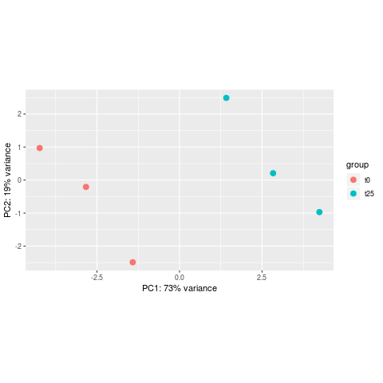
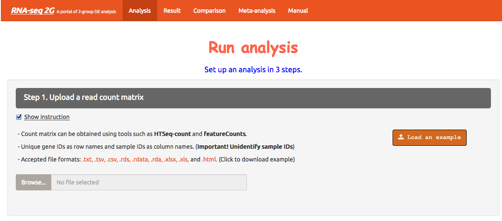

# Differential expression analysis


The goal of differential expression analysis is to perform statistical analysis to try and discover **changes in expression levels** of defined features (genes, transcripts, exons) between experimental groups with **replicated samples**.<br>

## Popular tools

Most popular tools for differential expression analysis are available as **R / Bioconductor** packages. <br>
Bioconductor is an R project and repository that provides a set of packages and methods for omics data analysis.<br>
The best performing tools tend to be:
* [DESeq2](https://bioconductor.org/packages/release/bioc/html/DESeq2.html)
* [edgeR](https://bioconductor.org/packages/release/bioc/html/edgeR.html)
* [limma (voom)](https://bioconductor.org/packages/release/bioc/html/limma.html)

See [Schurch et al, 2015; arXiv:1505.02017](https://arxiv.org/abs/1505.02017).
<br><br>
In this tutorial, we will give you an overview of the **DESeq2** pipeline to find differentially expressed **genes** between two conditions.

## DESeq2

[DESeq2](https://bioconductor.org/packages/release/bioc/html/DESeq2.html) is an R/Bioconductor implemented method to detect differentially expressed features.
<br>
It uses the negative binomial generalized linear models.
<br>
This DESeq2 tutorial is widely inspired from the [RNA-seq workflow](http://master.bioconductor.org/packages/release/workflows/vignettes/rnaseqGene/inst/doc/rnaseqGene.html) developped by the authors, and from the [differential gene expression course](https://hbctraining.github.io/DGE_workshop/lessons/04_DGE_DESeq2_analysis.html) from the [Harvard Chan Bioinformatics Core](http://bioinformatics.sph.harvard.edu/)
<br><br>
DESeq2 steps:
* Modeling raw counts for each gene:
  * Estimate size factors
  * Estimate gene-wise dispersions
  * Fit curve to gene-wise dispersion estimates
  * Shrink gene-wise dispersion estimates
  * GLM (Generalized Linear Model) fit for each gene
* Shrinking of log2FoldChanges
* Testing for differential expression

In this tutorial, we will use the counts calculated from the mapping on **all chromosomes**:
* Folder **full_data**
* svn export https://github.com/biocorecrg/RNAseq_course_2019/trunk/full_data

## Raw count matrices

DESeq2 takes as an input raw (non normalized) counts, in various forms:

### Prepare data from STAR

#### **Option 1**: a <b>matrix of integer values</b> (the value at the i-th row and j-th column tells how many reads have been assigned to gene i in sample j), such as:

| gene | A549_0_1chr10 | A549_0_2chr10 | A549_0_3chr10 | A549_25_1chr10 | A549_25_2chr10 | A549_25_3chr10 |
| :--- | :---: | :---: | :---: | :---: | :---: | :---: |
| ENSG00000260370.1 | 0 | 0 | 1 | 0 | 1 | 1 |
| ENSG00000237297.1 | 10 | 8 | 10 | 12 | 5 | 2 |
| ENSG00000261456.5 | 210 | 320 | 291 | 300 | 267 | 222 |
| ENSG00000232420.2 | 3 | 2 | 0 | 1 | 2 | 6 |

Prepare the matrix for our 6 samples, from the **STAR** output.
<br>
The **ReadsPerGene.out.tab** output files of STAR (from option --quantMode GeneCounts) contain 4 columns that correspond to different counts / read overlap **according to the protocol's strandedness** (see Module 1):
* column 1: gene ID
* column 2: counts for unstranded RNA-seq.
* column 3: counts for the 1st read strand aligned with RNA (htseq-count option -s yes)
* column 4: counts for the 2nd read strand aligned with RNA (htseq-count option -s reverse): the most common protocol.

The protocol used to prepare the libraries for the A549 ENCODE samples is **reverse stranded**, so we need to extract the 4th column of each of the "ReadsPerGene" files, along with the column containing the <b>gene names</b>.
<br>
<br>
Create a folder for the deseq2 analysis

```{bash}
mkdir deseq2
```

```{bash}
cd alignments_star

# retrieve the 4th column of each "ReadsPerGene.out.tab" file + the first column that contains the gene IDs
paste A549_*ReadsPerGene.out.tab | grep -v "_" | awk '{printf "%s\t", $1}{for (i=4;i<=NF;i+=4) printf "%s\t", $i; printf "\n" }' > tmp

# add header: "gene_name" + the name of each of the counts file
sed -e "1igene_name\t$(ls A549_*ReadsPerGene.out.tab | tr '\n' '\t' | sed 's/ReadsPerGene.out.tab//g')" tmp | cut -f1-7 > ../deseq2/raw_counts_A549_matrix.txt

# remove temporary file
rm tmp
```

#### **Option 2**: one file per sample, each file containing the raw counts of all genes:

File **A549_0_1chr10_counts.txt**:

| ENSG00000260370.1 | 0 |
| ENSG00000237297.1 | 10 |
| ENSG00000261456.5 | 210 |

File **A549_0_2chr10_counts.txt**:

| ENSG00000260370.1 | 0 |
| ENSG00000237297.1 | 8 |
| ENSG00000261456.5 | 320 |

and so on...
<br>
**Exercise**
<br>
Prepare the 6 files needed for our analysis, from the STAR output, and save them in the <b>counts_star</b> directory.

<br>
Create directory **counts_star** in the deseq2 directory:

```{bash}
cd ~/deseq2
mkdir counts_star
```

Loop around the 6 **ReadsPerGene.out.tab** files and extract the gene ID (1rst column) and the correct counts (4th column).

```{bash}
cd ~/alignments_star

for i in alignments_star/*ReadsPerGene.out.tab
do echo $i
# retrieve the first (gene name) and fourth column (raw reads)
cut -f1,4 $i | grep -v "_" > ~/deseq2/counts_star/`basename $i ReadsPerGene.out.tab`_counts.txt
done
```

### Prepare data from Salmon

Prepare the annotation file needed to import the **Salmon** counts: a two-column data frame linking transcript id (column 1) to gene id (column 2). Process from the **GTF file**:<br>

```{bash}
# first column is the transcript ID, second column is the gene ID, third column is the gene symbol
awk -F "\t" 'BEGIN{OFS="\t"}{if($3=="transcript"){split($9, a, "\""); print a[4],a[2],a[8]}}' gencode.v29.annotation.gtf > tx2gene.gencode.v29.csv

```

### Sample sheet

Additionally, DESeq2 needs a <b>sample sheet</b> that describes the samples characteristics: treatment, knock-out / wild type, replicates, time points, etc. in the form:

| SampleName | FileName | Time | Dexamethasone |
| :---: | :---: | :---: | :---: |
| A549_0_1 | A549_0_1_counts.txt | t0 | 100nM |
| A549_0_2 |A549_0_2_counts.txt |  t0 | 100nM |
| A549_0_3 | A549_0_3_counts.txt | t0 | 100nM |
| A549_25_1 | A549_25_1_counts.txt | t25 | 100nM |
| A549_25_2 | A549_25_2_counts.txt | t25 | 100nM |
| A549_25_3 | A549_25_3_counts.txt | t25 | 100nM |

<br>
The first column is the sample name, the second column the file name of the count file generated by htseq-count, and the remaining columns are sample metadata which will be stored in ‘colData’.
<br>
<br>
<b>Exercise</b>
<br>
Prepare this file (tab-separated columns) in a text editor: save it as **sample_sheet_A549.txt in the deseq2 directory**.
<br>
The same sample sheet will be used for both **the STAR and the Salmon** DESeq2 analysis.


### Analysis

The analysis is done in R ! <br>

Start an R interactive session:

```{bash}
# type R (capital letter) in the terminal
R
```

* Go to our working directory and load the DESeq2 package

```{bash}
# setwd = set working directory
setwd("~/deseq2")

# load package DESeq2 (all functions)
library(DESeq2)
```

* Read in the sample table that we prepared:

```{r}
# header = TRUE: the first row is the "header", i.e. it contains the column names.
# sep = "\t": the columns/fields are separated with tabs.
sampletable <- read.table("sample_sheet_A549.txt", header=T, sep="\t")
rownames(sampletable) <- sampletable$SampleName

# display the first 6 rows
head(sampletable)

# check the number of rows and the number of columns
nrow(sampletable)
ncol(sampletable)
```

* Load count data from **STAR** into an **DESeq** object:

```{r}
# Option that compiles one file per sample
se_star <- DESeqDataSetFromHTSeqCount(sampleTable = sampletable,
                        directory = "counts_star",
                        design = ~ Time)

# Option that reads in a matrix (we will not do it here)
countdata <- read.delim("raw_counts_A549_matrix.txt", header=T, sep="\t", row.names=1)

# create DESeq2 object
se_star_matrix <- DESeqDataSetFromMatrix(countData = countdata,
                                  colData = sampletable,
                                  design = ~ Time)
```

* Load count data from **SALMON** into an **DESeq** object:

```{r}
# Go to the deseq2 directory
setwd("~/deseq2")

# Load tximport package that we will use to import Salmon counts
library(tximport)

# List the quantification files from Salmon: one quant.sf file per sample
files <- dir("~/alignments_salmon", recursive=TRUE, pattern="quant.sf", full.names=TRUE)
names(files) <- dir("~/alignments_salmon/")

# Read in the two-column data.frame linking transcript id (column 1) to gene id (column 2)
tx2gene <- read.table("tx2gene.gencode.v29.csv", 
		sep="\t",
		header=F)

# Read in the sample table (in case it is not already loaded)
sampletable <- read.table("sample_sheet_A549.txt", header=T, sep="\t")
rownames(sampletable) <- sampletable$SampleName

# tximport can import data from Salmon, Kallisto, Sailfish, RSEM, Stringtie
# here we summarize the transcripts counts per gene
txi <- tximport(files, 
		type = "salmon", 
		tx2gene = tx2gene)
# check the names of the "slots" of the txi object
names(txi)

# display the first rows of the counts per gene information
head(txi$counts)

# Create a DESeq2 object based on Salmon per-gene counts
se_salmon <- DESeqDataSetFromTximport(txi,
			colData = sampletable, 
			design = ~ Time)

```

* We will focus the rest of the analysis on the **se_star**: you can proceed exactly the same way with either **se_star_matrix** or **se_salmon** !

* Remove lowly expressed genes: keep only those genes that have more than 10 summed raw counts across the 6 samples

```{r}
# Number of genes before filtering:
nrow(se_star)

# Filter
se_star <- se_star[rowSums(counts(se_star)) > 10, ]

# Number of genes left after low-count filtering:
nrow(se_star)
```


* Run model

```{r}
# 
se_star2 <- DESeq(se_star)

```

* Transform raw counts to be able to visualize the data

```{r}
# Use the rlog transformation for visualization, as adviced by the DESeq2 author
rld <- rlog(se_star2)
```

* Samples correlation

Calculate the sample-to-sample distances:

```{r}
# load libraries pheatmap to create the heatmap plot
library(pheatmap)

# calculate between-sample distance matrix
sampleDistMatrix <- as.matrix(dist(t(assay(rld))))

png("sample_distance_heatmap_star.png")
pheatmap(sampleDistMatrix)
dev.off()

```


* Principal Component Analysis

Reduction of dimensionality to be able to retrieve main differences between samples.

```{r}
png("PCA_star.png")
plotPCA(object = rld,
		intgroup = "Time")
dev.off()
```



* Running the differential expression analysis

```{r}
# t25 vs t0 vs WT
de <- results(object = se_star2, 
		contrast = c("Time", "t0", "t25"))

# check first rows
head(de)

# add the more comprehensive gene symbols
de_symbols <- merge(unique(tx2gene[,2:3]), data.frame(ID=rownames(de), de), by=1, all=F)

# write differential expression analysis result to text file
write.table(de_symbols, "deseq2_results.txt", quote=F, col.names=T, row.names=F, sep="\t")
```

* Save the normalized counts

```{bash}
# compute normalized counts
norm_counts <- log2(counts(se_star2, normalized=T)+1)

# add the gene symbols
norm_counts_symbols <- merge(unique(tx2gene[,2:3]), data.frame(ID=rownames(norm_counts), norm_counts), by=1, all=F)

# write normalized counts to text file
write.table(norm_counts_symbols, "normalized_counts.txt", quote=F, col.names=T, row.names=F, sep="\t")
```


* DESeq2 output explained

To generate more accurate log2 foldchange estimates, DESeq2 allows for the **shrinkage of the LFC** estimates toward zero when the information for a gene is low, which could include:
  * Low counts
  * High dispersion values

* **log2 fold change** 
A positive fold change indicates an increase of expression while a negative fold change indicates a decrease in expression for a given comparison.<br>
This value is reported in a **logarithmic scale (base 2)**: for example, a log2 fold change of 1.5 in the "Ko vs Wt comparison" means that the expression of that gene is increased, in the Ko relative to the Wt, by a multiplicative factor of 2^1.5 ≈ 2.82.
* **pvalue**
Wald test p-value: Indicates whether the gene analysed is likely to be differentially expressed in that comparison. **The lower the more significant**.
* **padj**
Bonferroni-Hochberg adjusted p-values (FDR): **the lower the more significant**. More robust that the regular p-value because it controls for the occurrence of **false positives**.
* **baseMean**
Mean of normalized counts for all samples.
* **lfcSE**
Standard error of the log2FoldChange.
* **stat**
Wald statistic: the log2FoldChange divided by its standard error.


## Gene selection

* padj (p-value corrected for multiple testing)
* log2FC (log2 Fold Change)

<br>
the log2FoldChange only does not give an information on the **within-group variability**:


We need to take into account the p-value or, better **the adjusted p-value** (padj).
<br>
Setting a p-value threshold of 0.05 means that there is a **5% chance that the observed result is a false positive**. For thousands of simultaneous tests (as in RNA-seq), 5% can result in a large number of false positives.	
<br>
An False Discovery Rate adjusted p-value of 0.05 implies that 5% of **significant tests** will result in false positives.
<br>

* We select our list of differentially expressed genes betwen t25 and t0 based on padj < 0.05 and log2FC > 0.5 or log2FC < -0.5

```{bash}
# column 4 is the log2FoldChange, column 8 is the adjusted p-value (padj)
# keep all columns
awk '($8 < 0.05 && $4 > 0.5) || ($8 < 0.05 && $4 < -0.5) {print}' deseq2_results.txt > deseq2_results_padj0.05_log2fc0.5.txt

# extract only gene IDs (column 1)
cut -f1 deseq2_results_padj0.05_log2fc0.5.txt > deseq2_results_padj0.05_log2fc0.5_IDs.txt

# extract only gene symbols (column 2)
cut -f2 deseq2_results_padj0.05_log2fc0.5.txt > deseq2_results_padj0.05_log2fc0.5_symbols.txt
```


### Online tool

This [online tool](http://52.90.192.24:3838/rnaseq2g/) provides a way to process differential expression analysis using some of the popular tools in the field (among which DESeq2, edgeR, limma), starting from raw counts, via a user Interface.




* Prepare the matrix of raw counts

The first column contains, in our case, the gene names.<br>
The remaining columns contain the expression (raw counts) of each gene in each sample (one column per sample).<br>
We will use the previously prepared **raw_counts_A549_matrix.txt**.

* Prepare the sample sheet

Sample names must match column names in matrix.<br>
Add one column that corresponds to the experimental groups the samples belong to.<br>
We will use the previously prepared **sample_sheet_A549.txt**.


* Choose the control group name and the case group name

__In our case__<br>
Control: t0<br>
Case: t25<br>

* Choose which samples belong to which experimental group

__In our case__<br>
Control samples: A549_0_1chr10, A549_0_2chr10, A549_0_3chr10<br>
Case samples: A549_25_1chr10, A549_25_2chr10, A549_25_3chr10<br>

* Choose DE method(s):

Let's try to run the analysis using both **DESeq2** and **edgeR**.

* Submit DE analysis

* Go to "Results" tab


