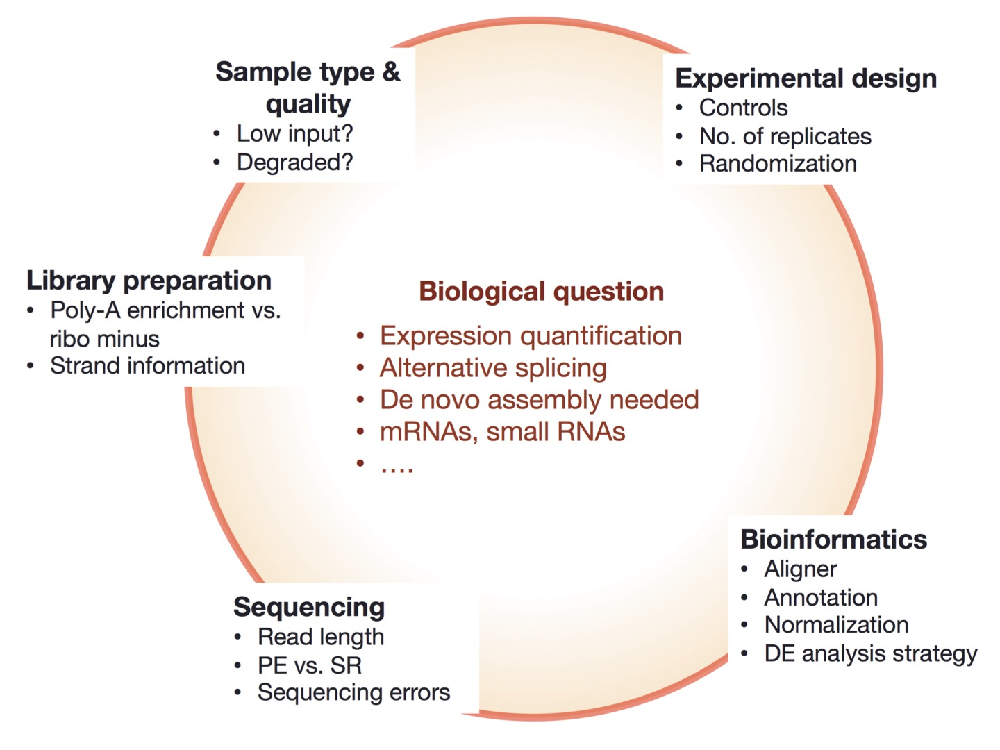

# Experimental design

| Things to consider|
| :---:  |
||
|from [https://galaxyproject.org/tutorials/rb_rnaseq/](https://galaxyproject.org/tutorials/rb_rnaseq/)|

 

**HOMEWORK (until tomorrow)**

* Read and do an exercise from [https://github.com/hbctraining/rnaseq_overview/blob/master/lessons/experimental_planning_considerations.md](https://github.com/hbctraining/rnaseq_overview/blob/master/lessons/experimental_planning_considerations.md).
* Read [https://rawgit.com/bioinformatics-core-shared-training/experimental-design/master/ExperimentalDesignManual.pdf](https://rawgit.com/bioinformatics-core-shared-training/experimental-design/master/ExperimentalDesignManual.pdf).

 

