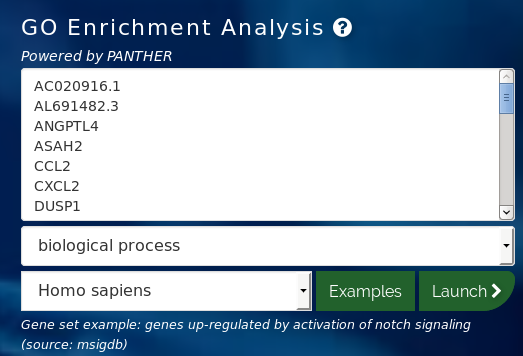

# Functional analysis

## Resources

### Gene Ontology


The [Gene Ontology (GO)](http://geneontology.org/) describes our knowledge of the biological domain with respect to three aspects:

| GO domains / root terms | Description |
| :----: | :----: |
| Molecular Function | Molecular-level activities performed by gene products. e.g. **catalysis**, **binding**. |
| Biological Process | Larger processes accomplished by multiple molecular activities. e.g. **apoptosis**, **DNA repair**. |
| Cellular Component | The locations where a gene product performs a function. e.g. **cell membrane**, **ribosome**. |

Example of GO annotation: the gene product "cytochrome c" can be described by the **molecular function** *oxidoreductase activity*, the **biological process** *oxidative phosphorylation*, and the **cellular component** *mitochondrial matrix*.
<br>
The structure of GO can be described as a graph: each GO term is a **node**, each **edge** represents the relationships between the nodes. For example:


### KEGG pathways

The [Kyoto Encyclopedia of Genes and Genomes (KEGG)](https://www.genome.jp/kegg/) is a database for understanding high-level functions and utilities of the biological system. <br>

It provides comprehensible manually-drawn pathways representing biological processes or disease-specific pathways.<br>
Example of the [*Homo sapiens* melanoma pathway](https://www.genome.jp/dbget-bin/www_bget?hsa05218):


### Molecular Signatures Database (MSigDB)


The [Molecular Signatures Database (MSigDB)](http://software.broadinstitute.org/gsea/msigdb/index.jsp) is a collection of 17810 annotated gene sets (in May 2019) created to be used with the GSEA software. <br>

It is divided into [8 major collections](http://software.broadinstitute.org/gsea/msigdb/collections.jsp) (that include the previously explained GOs and KEGG pathways):


## Enrichment analysis based on gene selection

* Gene Universe: in our example: all genes present in our annotation.
* List of genes selected from the universe: our selection of genes, give the criteria we previously used: padj < 0.05, &#124;log2FoldChange&#124; >= 0.5.

### GO / Panther tool

The [main page of GO] provides a tool to test the enrichment of gene ontologies or Panther/Reactome pathways in pre-selected gene list.




* Prepare ENSEMBL IDs gene list and **universe**
```{bash}
# Extract all gene IDs used in our analysis and convert from Gencode (e.g ENSG00000057657.16) to ENSEMBL (e.g. ENSG00000057657) IDs
cut -f1 deseq2_results.txt | sed '1d' | sed 's/\..//g' > deseq2_universe_ensemblIDs.txt

# Convert from Gencode to ENSEMBL IDs from selected gene list
sed 's/\..//g' deseq2_results_padj0.05_log2fc0.5_IDs.txt > deseq2_results_padj0.05_log2fc0.5_ensemblIDs.txt
```
* Load the universe gene list as **Reference list** in the tool. *Change -> Browse -> (select deseq2_universe_ensemblIDs.txt) -> Upload list*
* *Launch analysis*

* Try the same analysis using the **gene symbols** instead of ENSEMBL IDs
```{bash}
# Get universe with gene symbols (we already have the gene selection in deseq2_results_padj0.05_log2fc0.5_symbols.txt)
cut -f2 deseq2_results.txt | sed '1d' > deseq2_universe_symbols.txt
```


### enrichR

http://amp.pharm.mssm.edu/Enrichr/


## Enrichment based on ranked lists of genes using GSEA

### GSEA (Gene Set Enrichment Analysis)


[GSEA](http://software.broadinstitute.org/gsea/) is available as a Java-based tool.

#### Algorithm

GSEA doesn't require a threshold: the whole set of genes is considered.


GSEA checks whether a particular gene set (for example, a gene ontology) is **randomly distributed** across a list of **ranked genes**.
<br>
The algorithm consists of 3 key elements:

1. **Calculation of the Enrichment Score**
The Enrichment Score (ES) reflects the degree to which a gene set is overrepresented at the extremes (top or bottom) of the entire ranked gene list.
2. **Estimation of Significance Level of ES** 
The statistical significant (nominal p-value) of the **Enrichment Score (ES)** is estimated by using an empirical phenotype-based permutation test procedure. The **Normalized Enrichment Score (NES)** is obtained by normalizing the ES for each gene set to account for the size of the set.
3. **Adjustment for Multiple Hypothesis Testing**
Calculation of the FDR ti control the proportion of falses positives.


See the [GSEA Paper](https://www.ncbi.nlm.nih.gov/pubmed/16199517) for more details on the algorithm.

The main GSEA algorithm requires 3 inputs:
* Gene expression data
* Phenotype labels
* Gene sets

#### Gene expression data in TXT format

The input should be normalized read counts filtered out for low counts (-> we created it in the DESeq2 tutorial -> *normalized_counts.txt* !).
<br>
The first column contains the gene ID (HUGO symbols for *Homo sapiens*).<br>
The second column contains any description or symbol, and will be ignoreed by the algorithm.<br>
The remaining columns contains normalized expressions: one column per sample.

| NAME | DESCRIPTION | A549_0_1 | A549_0_2 | A549_0_3 | A549_25_1 | A549_25_2 | A549_25_3 |
| DKK1 | NA| 0 | 0 | 0 | 0 | 0 | 0 |
| HGT | NA | 0 | 0 | 0 | 0 | 0 | 0 |

<b>Exercise</b>
<br>
GSEA will work by default with the gene symbols: add the gene symbol as a first column to *normalized_counts.txt*.
Remember the file *tx2gene.gencode.v29_symbols.csv* that maps the **gene IDs to the gene symbols**.

```{bash}
join -1 2 -2 1 <(sort -k1,1 tx2gene.gencode.v29_symbols.csv) <(sort -k1,1 normalized_counts.txt)

```


#### Phenotype labels in CLS format

A phenotype label file defines phenotype labels (experimental groups) and assigns those labels to the samples in the corresponding expression data file.


Let's create it for our experiment:

| 6 | 2 | 1 |  |  |  |
| # | t0 | t25 |  |  |  |
| t0 | t0 | t0 | t25 | t25 | t25 |

**NOTE**: the first label used is assigned to the first class named on the second line; the second unique label is assigned to the second class named; and so on. 
<br> 
So the phenotype file could also be:

| 6 | 2 | 1 |  |  |  |
| # | t0 | t25 |  |  |  |
| 0 | 0 | 0 | 1 | 1 | 1 |

The first label **t0** in the second line is associated to the first label **0** on the third line.


#### Gene sets


As GSEA was created and optimized for microarray data, the authors make the [following suggestions](https://software.broadinstitute.org/cancer/software/gsea/wiki/index.php/RNA-Seq_Data_and_Ensembl_CHIP_files) for RNA-seq:

*"The GSEA algorithm ranks the features listed in a GCT file.* (normalized expression values) *It provides a number of alternative statistics that can be used for feature ranking. But in all cases (or at least in the cases where the dataset represents expression profiles for differing categorical phenotypes) the ranking statistics capture some measure of genes' differential expression between a pair of categorical phenotypes. The GSEA team has yet to determine whether these ranking statistics, originally selected for their effectiveness when used with expression data derived from DNA Microarray experiments, are appropriate for use with expression data derived from RNA-seq experiments. As an alternative to standard GSEA, analysis of data derived from RNA-seq experiments may also be conducted through the*  ***GSEAPreranked tool."***


**Enrichment score**

Reflects the degree to which a set is overrepresented at the extremes (top or bottom) of the entire ranked list.


#### Run GSEA

GSEA is Java-based. Launch it from a terminal window:

```{bash}
java -Xmx1024m -jar gsea-3.0.jar 
```


------------
### Hypergeometric test

Null hypothesis: the list of DEGs is randomly found in the GO.
<br>
Alternative hypothesis: the list of DEGs is over- or under- represented in the GO.
<br>Universe: all genes in experiment.<br>
Successes: DEGs genes in experiment.<br>
All GO: all genes in GO term.<br>
Successes in GO: DEGs genes in GO.<br>
<br>
Example:<br>
20,000 genes annotated in the organism. 60 of them are associated with the ontology "programmed cell death".
<br>300 genes in total in our DGE results selection. 20 of them are associated with the ontology "programmed cell death"<br>
What is the probability that their is an over-representation of the "programmed cell death" ontology in our experiment?
<br>
Universe: 20000<br>
Successes: 300<br>
All GO: 60<br>
Successes in GO: 20<br>
??
phyper(overlap -1, list1, popsize-list1, list2))
phyper(19, 300, 20000-300, 60)
???


#### clusterProfiler

https://hbctraining.github.io/DGE_workshop/lessons/09_functional_analysis.html


#### GOSeq

https://bioconductor.org/packages/release/bioc/vignettes/goseq/inst/doc/goseq.pdf

#### GOstats

https://www.bioconductor.org/packages/release/bioc/vignettes/GOstats/inst/doc/GOstatsHyperG.pdf

#### topGO

https://bioconductor.org/packages/release/bioc/vignettes/topGO/inst/doc/topGO.pdf

```{r}
library("topGO")
library("org.Hs.eg.db")

     ## GO to Symbol mappings (only the BP ontology is used)
     xx <- annFUN.org("BP", mapping = "org.Hs.eg.db", ID = "entrez") # or symbol, ensembl, ...

     allGenes <- unique(unlist(xx)) # retrieve all genes

     myInterestedGenes <- sample(allGenes, 500)

     geneList <- factor(as.integer(allGenes 

     names(geneList) <- allGenes
     
     GOdata <- new("topGOdata",
                   ontology = "BP",
                   allGenes = geneList,
                   nodeSize = 5,
                   annot = annFUN.org, 
                   mapping = "org.Hs.eg.db",
                   ID = "entrez") 
```


