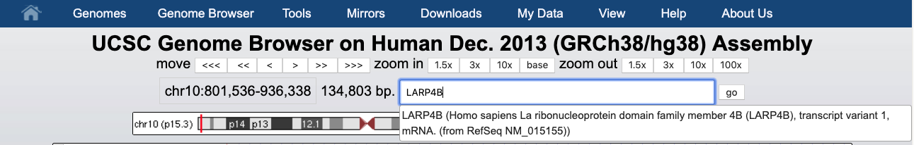
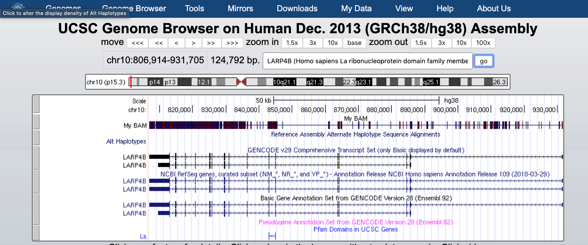
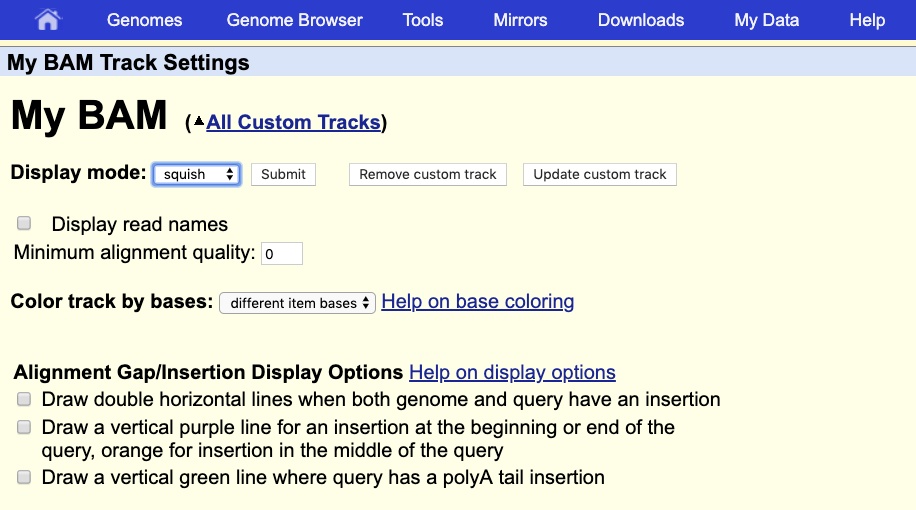
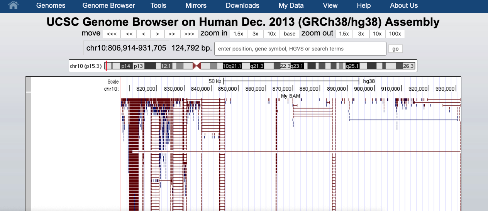
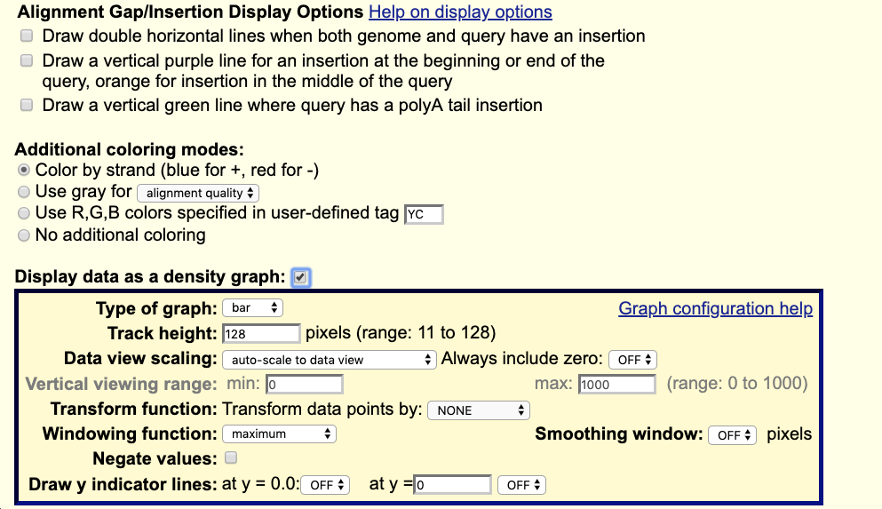
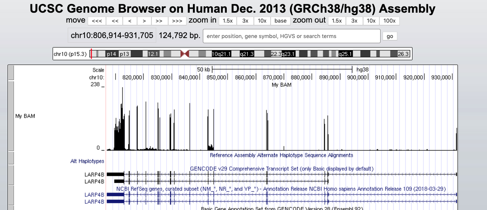

# Genome Browser
Read alignments (in the BAM. CRAM BigWig formats) can be displayed in a genome browser, which a program allowing users to browse, search, retrieve and analyze genomic sequences and annotation data using a graphical interface.

There are two kinds of genome browsers:
* Web-based genome browsers:
  * [UCSC Genome Broswer](https://genome-euro.ucsc.edu/cgi-bin/hgGateway?redirect=manual&source=genome.ucsc.edu)
  * [Ensembl Genome Browser](https://www.ensembl.org/index.html)
  * [NCBI Genome Data Viewer](https://www.ncbi.nlm.nih.gov/genome/gdv/)

* Desktop applications (some can also be used for generatig a web-based genome browser):
  * [JBrowse](https://jbrowse.org/)
  * [GBrowse](http://gmod.org/wiki/GBrowse_2.0_HOWTO)
  * [IGV](https://software.broadinstitute.org/software/igv/)
  
Small size data can be directly uploaded to the genome browser, while large files are normally placed on a web-server that is accessible to the browser. To explore BAM and CRAM files produced by the STAR mapper, we first need to sort and index the files. In our case, sorting can be skipped as we already produced BAM files sorted by coordinates. The indexing step:

```{bash}
$RUN samtools index alignments/A549_0_1Aligned.sortedByCoord.out.bam
$RUN samtools index alignments/A549_0_1.cram       

ls alignments

A549_0_1Aligned.sortedByCoord.out.bam      A549_0_1.cram.crai     A549_0_1Log.progress.out      A549_0_1_STARtmp
A549_0_1Aligned.sortedByCoord.out.bam.bai  A549_0_1Log.final.out  A549_0_1ReadsPerGene.out.tab  salmon_A549_0_1
A549_0_1.cram                              A549_0_1Log.out        A549_0_1SJ.out.tab

```
<br/>

## UCSC Genome Browser
**IMPORTANT!** Be careuful with the chromosome name conventions since different genome browsers name chromosomes differently. Thus UCSC names chromosomes **chr1**, **chr2**,...**chrM**; while Ensembl, **1**, **2**, ... **MT**. When you map reads to a genome with a given convention you cannot directly display BAM/CRAM files in the genome browser with a different convention.
GENCODE, from which we downloaded a human genome, uses the UCSC convention, we therefore can directly display our BAM/CRAM files in the UCSC Genome Browser. 

First, you need to upload your sorted bam (or cram) file **together with an index (.bai or .crai file)** to a http server that is accessible from the Internet. We already made our files accessible at this address:

```{bash}
https://public-docs.crg.es/biocore/projects/training/RNAseq_2019/
```

Using the mouseright click copy this URL address.  

Now go to the [UCSC genome browser website](https://genome-euro.ucsc.edu/cgi-bin/hgGateway?redirect=manual&source=genome.ucsc.edu).


Choose human genome version hg38 (that corresponds to the GENCODE annotation we used). Click **GO**. 


At the bottom of the image click **ADD CUSTOM TRACK** 


and provide information describing the loading data:
* **track type** indicates the kind of file: **bam** (same is used for uploading .cram)
* **name** of data 
* **bigDataUrl** the URL where the BAM or CRAM file is located 

```{bash}
track type=bam name="My BAM" bigDataUrl=https://public-docs.crg.es/biocore/projects/training/RNAseq_2019/A549_0_1Aligned.sortedByCoord.out.bam
```

Click "Submit".


This indicates that everything went ok and we can now display the data. Of course our data are restricted to chromosome 10 so we have to display that chromosome. For example, let's select the gene **LARP4B**.



And we can display it. 


The default view can be changed by clicking on the grey bar on the left of the "My BAM" track. You can open a window with different settings; for example, you can change the **Display mode** to **Squish**.



This will change how data are displayed. We can now see single reads aligned to the forward and reverse DNA strands (blue is to **+strand** and red, to **-strand**).  You can also see that many reads are broken; that is, they are mapped to splice junctions.



We can also display only the coverage by selecting in "My BAM Track Settings" **Display data as a density graph** and  **Display mode: full**. 



These expression signal plots can be helpful to compare different samples (in this case, make sure to set comparable scales on the Y-axes). 



<br/>
