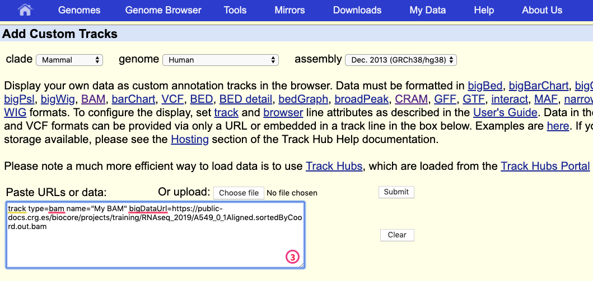

# Genome Browser
Aligned data can be displaied within a genome browser: a program that allows users to browse, search, retrieve and analyze genomic sequences and annotation data using a graphical interface.

We can distinguish two kind of genome browsers:
* Web-based genome browsers:
  * [UCSC genome broswer](https://genome-euro.ucsc.edu/cgi-bin/hgGateway?redirect=manual&source=genome.ucsc.edu)
  * [Ensembl genome browser](https://www.ensembl.org/index.html)
  * [NCBI genome data wiever](https://www.ncbi.nlm.nih.gov/genome/gdv/)

* Desktop applications (some can also be used for generatig a web-based genome browser):
  * [Jbrowse](https://jbrowse.org/)
  * [Gbrowse](http://gmod.org/wiki/GBrowse_2.0_HOWTO)
  * [IGV](https://software.broadinstitute.org/software/igv/)
  
Little amount of data can be directly uploaded to the genome browser, while big amount are normally placed within a web-server that is accessible to the browser for fast retrieval of the data. For allowing it we first need to sort and index our data. Since the bam and cram files are already sorted we can skip this step.

```{bash}
$RUN samtools index alignments/A549_0_1Aligned.sortedByCoord.out.bam
$RUN samtools index alignments/A549_0_1.cram       

ls alignments

A549_0_1Aligned.sortedByCoord.out.bam      A549_0_1.cram.crai     A549_0_1Log.progress.out      A549_0_1_STARtmp
A549_0_1Aligned.sortedByCoord.out.bam.bai  A549_0_1Log.final.out  A549_0_1ReadsPerGene.out.tab  salmon_A549_0_1
A549_0_1.cram                              A549_0_1Log.out        A549_0_1SJ.out.tab

```
## UCSC genome browser
We should be careuful with the chromosome name conventions since different genome browser can name the chromosome differently. For instance UCSC names the chromosomes **chr1**, **chr2**,...**chrM** while Ensembl **1**, **2**, ... **MT**. In case you align / map to a genome with a given convention you cannot direclty display in the other genome browser.
Gencode is using the UCSC convention so since we map to that reference we will show the data on the UCSC genome browser. 

Fist of all you should upload your sorted bam (or cram) files together with the indexes to a http server that is accessible from the internet. We already make our files accessible at this address:

```{bash}
https://public-docs.crg.es/biocore/projects/training/RNAseq_2019/
```
We can use the right click to copy the URL address to be uploaded to the genome browser.

We can use any browser to access the [UCSC genome browser website](https://genome-euro.ucsc.edu/cgi-bin/hgGateway?redirect=manual&source=genome.ucsc.edu)


We then choose human genome version hg38 (the one corresponding to our gencode annotation). Then we click go and display a random portion of the genome. 


Every track that is displayed is an annotation stored in their database. We can add our custom one by clicking on **ADD CUSTOM TRACK**. 



Then we type this information that is descriptive of the data we are loading:
* **track type** indicates the kind of file: **BAM** (that is indicating also **CRAM**)
* **name** that is any description to our data 
* **bigDataUrl** that indicates the URL (or weblink) where the file can be accessed. 

```{bash}
track type=bam name="My BAM" bigDataUrl=https://public-docs.crg.es/biocore/projects/training/RNAseq_2019/A549_0_1Aligned.sortedByCoord.out.bam
```


This indicates us that everything went ok and we can now display the data. Of course our data are restricted to the chromosome 10 so we have to display that chromosome.


