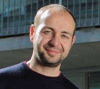

# Biocore's RNAseq course 2019

## Dates, time & location

Dates:

| Day  | Date  | Time  |
| :---:  | :---  | ---:  |
| 1 | Tuesday 13th of May 2019|9:30-13:30|
| 2 | Thursday 14th of May 2019|9:30-13:30| 
| 3 | Thursday 15th of May 2019|14:00-17:00| 
| 4 | Thursday 16th of May 2019|14:00-17:00| 
| 5 | Thursday 27th of May 2019|9:30-13:00| 

Location:
Carrer del Dr. Aiguader, 88, 08003 Barcelona.
CRG Training center, PRBB building ground floor. 

<iframe src="https://www.google.com/maps/embed?pb=!1m14!1m8!1m3!1d11973.94726186489!2d2.1942455!3d41.3852331!3m2!1i1024!2i768!4f13.1!3m3!1m2!1s0x0%3A0x81e449abea5aae0e!2sPRBB+Parc+de+Recerca+Biom%C3%A8dica+de+Barcelona!5e0!3m2!1sit!2ses!4v1551808726678" width="500" height="500" align="middle" frameborder="0" style="border:0" allowfullscreen></iframe>

## Instructors

|[Luca Cozzuto](mailto:luca.cozzuto@crg.eu)| [Julia Ponomarenko](mailto:julia.ponomarenko@crg.eu)  | [Sarah Bonnin](mailto:sarah.bonnin@crg.eu) |
| :---:  | :---:  | :---:  |
| | | | 

from the CRG [Bioinformatics core facility](https://biocore.crg.eu/) (office 460, 4th floor hotel side)

Material available at https://biocorecrg.github.io/RNAseq_course_2019/

##  Learning objectives
At the end of the course, the participants will be able to:
*	Understand the steps from raw reads to expression counts, differential expression and interpretation of gene lists using enrichment analysis
*	Define a good experimental design, including experimental design, sequencing design, and quality control steps)
*	Perform quality assessment of RNA-seq data, raw and processed
*	Understand file formats commonly used in RNA-seq data analysis
*	Gain an overview on common software tools for RNA-seq data analysis and their limitations
*	Run RNA-seq pipeline to perform differential expression analysis

##  Course Program
*	Day 1: Download raw data, quality control of data
*	Day 2: Read mapping to reference genome
*	Day 3: Differential expression analysis
*	Day 4: Genome browser, gene ontology enrichment analysis
*	Day 5: Troubleshooting of a mini-project

## Prerequisites
Basic experience of command line Linux

