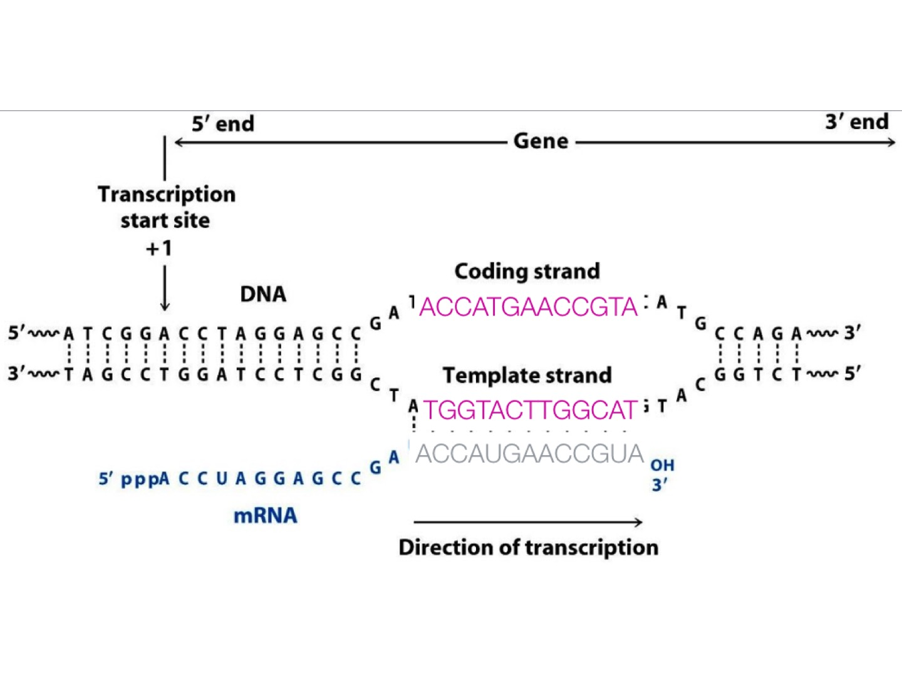
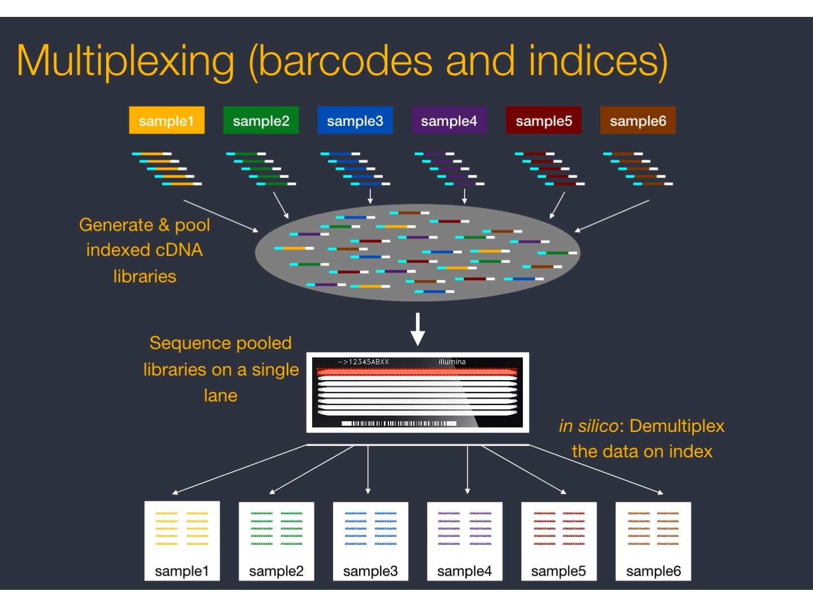

# Library preparation

* **mRNA purification**. 

mRNA is isolated using a polyT adapter that binds to the polyA tail of RNA. In the result, non poly-adenylated transcripts - rRNA, tRNA, long ncRNAs, miRNA, histone mRNA, degraded RNA, bacterial transcripts, and many viral transcripts  - are excluded from the reaction (washed away). 

* **RNA quantification, quality control and fragmentation**

* **RNA is converted to cDNA**

mRNA that is targeted in RNA-Seq experiments has polarity 5' to 3'. While it can be transcribed from either DNA strand. But for mRNA, it is always called sense RNA. 

Because mRNA is one-stranded, during a typical RNA-Seq experiment the information about DNA strands is lost after both strands of cDNA are synthesized. There is however a number of methods for making stranded RNA-Seq libraries that preserve the RNA strand information and allow detection of genes transcribed in both 5' and 3' direction. (For detail, see [https://galaxyproject.org/tutorials/rb_rnaseq/](https://galaxyproject.org/tutorials/rb_rnaseq/))

One of such methods is implemented in the Illumina's TruSeq Stranded mRNA protocol that uses the introduction of dUTP instead of dTTP during the amplification. The incorporation of dUTP in the second strand synthesis quenches the second strand during amplification, because the polymerase used in the assay is not incorporated past this nucleotide.  
In the result (in other protocols it can be different), Read 1 (forward) is mapped to the antisense DNA strand (this is also true for single-end reads), while Read 2 (reverse), to the sense DNA strand.

|Read mapping in a stranded vs. unstranded sequencing|
| :---:  |
||
|from [https://galaxyproject.org/tutorials/rb_rnaseq/](https://galaxyproject.org/tutorials/rb_rnaseq/)|

 

* **cDNA multiplexing** 

Fragmented cDNA is indexed with a hexamer or octamer barcode (so that cDNA from different samples can be pooled into a single lane for multiplexed sequencing).

|cDNA multiplexing|
| :---:  |
||
|from [https://github.com/hbctraining/rnaseq_overview](https://github.com/hbctraining/rnaseq_overview)|

* **cDNA amplification**

 

* **cDNA library quality control and fragment selection** 

 

* **Sequencing**

 

The output of RNA-seq is then demultiplexed yielding either one fastq-file per sample (for single-end reads protocol) or two fastq-files per sample (for paired-end reads protocol).

 

