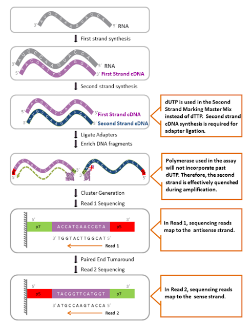

# Library preparation

* **mRNA purification**. mRNA is isolated using a polyT adapter that binds to the polyA tail of RNA. In the result, non poly-adenylated transcripts - rRNA, tRNA, long ncRNAs, miRNA, histone mRNA, degraded RNA, bacterial transcripts, and many viral trascripts - are excluded from the reaction (washed away). 

* **RNA quantification, quality control and fragmentation**

* **RNA is converted to cDNA**

During a typical RNAseq experiment the information about DNA strands is lost after both strands of cDNA are synthesized. There is however a number of methods for making stranded RNAseq libraries that preserve the strand information. (see for detail, [https://galaxyproject.org/tutorials/rb_rnaseq/](https://galaxyproject.org/tutorials/rb_rnaseq/))

One of such methods (shown below) is implemented in the Illumina's TruSeq Stranded mRNA protocol that uses the introduction of dUTP instead of dTTP during the amplification. The incorporation of dUTP in the second strand synthesis quenches the second strand during amplification, because the polymerase used in the assay is not incorporated past this nucleotide.  
Stranded protocol allows detection of antisense molecules or genes in both 5' and 3' direction. 

