# Module 1
## Introduction: What is RNA-Seq? 

|RNA molecule|
| :---:  |
||
|from Wikipedia|


RNA sequencing, aka RNA-Seq, is a technique that allows to detect and quantify RNA molecules within biological samples by using next-generation sequencing (NGS). This technology is used to analyze RNA by revealing
* RNA/gene/transcript expression;
* alternatively spliced transcripts;
* gene fusion and SNPs;
* post-translational modification.

Other technologies for assessing RNA expression are Northern Blot [1], real-time PCR [2] and hybridization-based  microarrays [3].


RNA-Seq can be performed using
* total RNA (in this case the content of ribosomal RNA is about 80%);
* rRNA depleted RNA (after removing ribosomal RNA);
* mRNA transcripts (by performing polyA enrichment of RNA); 
* small RNA, such as miRNA, tRNA (by selecting the size of RNA molecules; e.g., < 100 nt);
* RNA molecules transcribed at a specific time (ribosomal profiling);
* specific RNA molecules (via hybridization with probes complementary to desired transcripts).


Depending on the technology and the protocol, RNA-Seq can produce
* single-end short reads (50-450 nt), which are useful for gene expression quantification (mainly **Illumina**, but also **Ion Torrent** and **BGISEQ**);
* paired-end reads (2 x 50-250 nt), which are useful for detecting splicing events and refinement of transcriptome annotation;
* single long reads (**PACBio** or **Nanopore**), which are used for the de novo identification of new transcripts and improving transcriptome assembly. 


## mRNA-Seq protocol (Illumina)


|RNASeq protocol|
| :---:  |
|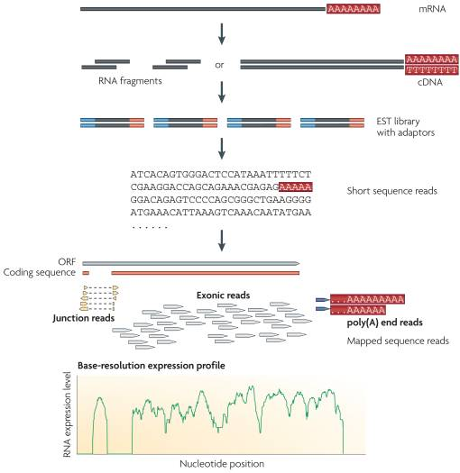|
|from Wang et al 2009 [4]|

### Library preparation

* **mRNA purification.** mRNA is isolated using a polyT adapter that binds to the polyA tail of RNA. In the result, non poly-adenylated transcripts - rRNA, tRNA, long ncRNAs, miRNA, histone mRNA, degraded RNA, bacterial transcripts, and many viral trascripts - are excluded from the reaction (washed away). 

* **RNA quantification, quality control and fragmentation**


* **RNA is converted to cDNA**


During a typical RNAseq experiment the information about DNA strands is lost after both strands of cDNA are synthesized. There is however a number of methods for making stranded RNAseq libraries that preserve the strand information. (see for detail, https://galaxyproject.org/tutorials/rb_rnaseq/)

One of such methods (shown below) is implemented in the Illumina's TruSeq Stranded mRNA protocol that uses the introduction of dUTP instead of dTTP during the amplification. The incorporation of dUTP in the second strand synthesis quenches the second strand during amplification, because the polymerase used in the assay is not incorporated past this nucleotide.  
Stranded protocol allows detection of antisense molecules or genes in both 5' and 3' direction. 


Note that in a stranded protocol shown here (in other protocols it can be different), Read 1 is mapped to the antisense strand (this is also true for single-end reads), while Read 2, to the sense strand.


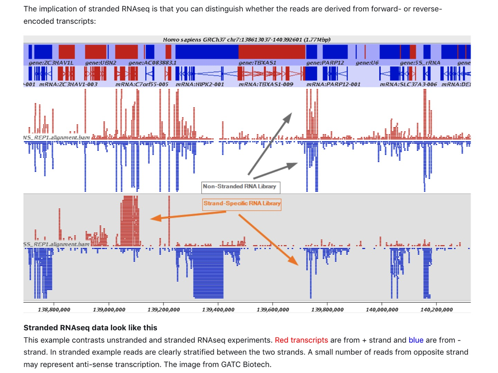


* **cDNA multiplexing** Fragmented cDNA is indexed with a hexamer or octamer barcode (so that cDNA from different samples can be pooled into a single lane for multiplexed sequencing).

||
|from https://hbctraining.github.io/GCC-BOSC-2018/slides/library_prep.pdf|

* **cDNA amplification** 

, amplified by PCR and sequenced. The output of RNA-seq is then demultiplexed yielding either one fastq-file per sample (for single-end protocol) or two fastq-files per sample (for paired-end protocol).


At the 3' end of the first strand sequence an extra "A" base is added to avoid "blunt ends" that can be randomly merged generating chimaeras. The products are then purified and enriched with PCR to create the final cDNA library. 

<br/><br/>

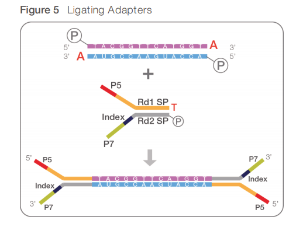


### FASTQ-format for sequencing reads

Short (and long) sequencing reads coming from the sequencers are stored in **FASTQ** format.
This format contains the information about sequence and the quality of each base, which encodes the probability that the corresponding base call is incorrect.


The format contains four rows per sequencing read:
* a header containing **@** as the first character
* the sequence content
* a **spacer**
* the quality encoded using ASCII characters.


* The Q score of 10 (symbol '+') corresponds to the probability that the base call is incorrect of 0.1.
* The Q score of 20 (symbol '5') corresponds to the probability that the base call is incorrect of 0.01.
* The Q score of 30 (symbol '?') corresponds to the probability that the base call is incorrect of 0.001.
* The Q score of 40 (symbol 'I') corresponds to the probability that the base call is incorrect of 0.0001 .


### RNA-seq data repositories


The major repositories for gene expression data:
* [**GEO**](https://www.ncbi.nlm.nih.gov/geo/) 
* [**Array-express**](https://www.ebi.ac.uk/arrayexpress/)
* [**ENCODE**] (https://www.encodeproject.org)

These repositoroes are linked to the repositories of NGS raw data:
* [**SRA**](https://www.ncbi.nlm.nih.gov/sra) (Sequence Read Archive) 
* [**ENA**](https://www.ebi.ac.uk/ena) (European Nucleotide Archive) 
* [**DDBJ-DRA**](https://www.ddbj.nig.ac.jp/dra/index-e.html) 

</br>

**EXERCISE**
</br>Let's explore one of the GEO records; that is https://www.ncbi.nlm.nih.gov/geo/query/acc.cgi?acc=GSE126535 
</br>Which platform and protocol were used for sequencing?
</br>What was sequenced?
</br>How many samples were sequenced?
</br></br>

**NOTE: You will need to download data from SRA for a homework project!**
</br>To download raw data from **SRA**, it is possible to use **fastq-dump program** from [**SRA toolkit**](https://trace.ncbi.nlm.nih.gov/Traces/sra/sra.cgi?view=toolkit_doc) or download from the NCBI ftp website using wget. For detail, see https://www.ncbi.nlm.nih.gov/books/NBK158899/#SRA_download.when_to_use_a_command_line.
</br>To download data, use a SRA identifier and to specify whether reads are single or paired-end, otherwise paired ends will be downloaded as a single interleaved file. For example, we can download fastq-files for any sample with a SRA ID and can specify whether they are paired- or single-end with the option --split-files in fastq-dump. Fastq-dump adds SRA ID to each read in the file, to avoid it, use option --origfmt. --gzip compresses fastq files. This will download fastq file(s) for one sample (for example, using SRR identifier SRR8571764 from the exercise above; it is slow - it might take up to 30 -40 minutes):

```{bash}
fastq-dump --gzip --origfmt --split-files SRA-IDENTIFIER
```

To download all samples for a specific GEO experiment, use the SRA study identifier (e.g., for the GEO experiemnt considered above, it is SRP185848) and follow the following steps:
* First, download a list of SRR identifiers for all samples in the study by going to the NCBI SRA page for this study https://www.ncbi.nlm.nih.gov/sra?LinkName=bioproject_sra_all&from_uid=522280 and clicking on the right top "Send" --> "File" --> "Accession List" --> "Save to file". That will give you the text file with all SRR identifiers for this study; save it for example as "sra_ids.txt". 
* Second, run the following command:

```{bash}

fastq-dump --gzip --origfmt --split-files $(<sra_ids.txt)

```


</br></br>
Another source of high quality data on gene expression in human and mouse is [The Encyclopedia of DNA Elements (ENCODE)](https://www.encodeproject.org/). Using ENCODE portal it is possible to access data produced by members of the ENCODE Consortium and use them for further analysis.

</br>For the purpose of this course, we downloaded the following ENCODE data:

1. [Homo sapiens A549 treated with 100 nM dexamethasone for 0 minutes](https://www.encodeproject.org/experiments/ENCSR937WIG/)
2. [Homo sapiens A549 treated with 100 nM dexamethasone for 25 minutes](https://www.encodeproject.org/experiments/ENCSR525HSH/)

|Encode website|
| :---:  |
|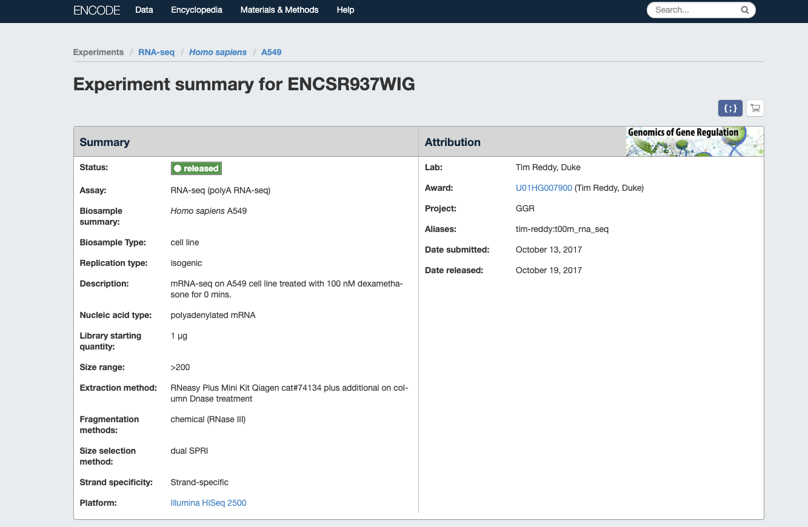|
|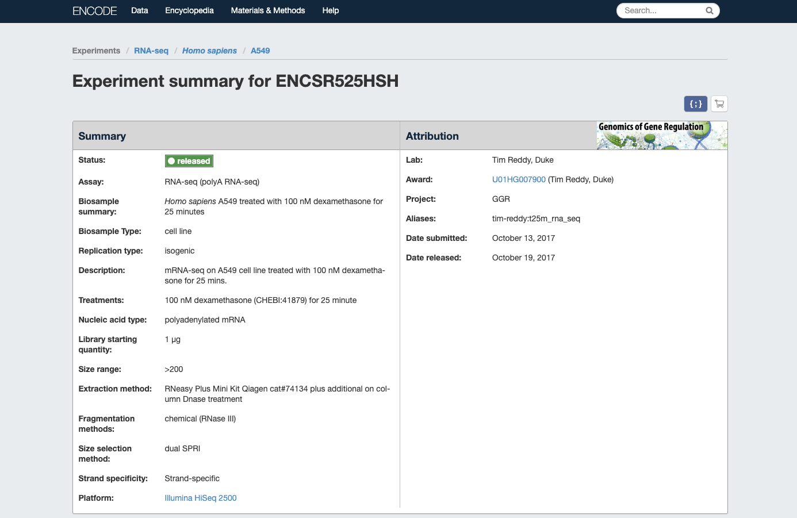|

</br>
Since to download all fastq-files for this experiemnt takes a lot of time and to restrict the analysis computation time, we selected reads that are mapping only to the chromosome 10. Please run the following commands to obtain these files: 

```{bash}
wget https://public-docs.crg.es/biocore/projects/training/RNAseq_2019/resources.tar

tar -vxf resources.tar 

resources/
resources/A549_0_3chr10_1.fastq.gz
resources/A549_25_3chr10_2.fastq.gz
resources/A549_25_1chr10_1.fastq.gz
resources/A549_25_3chr10_1.fastq.gz
resources/A549_0_3chr10_2.fastq.gz
resources/A549_0_1chr10_1.fastq.gz
resources/A549_0_1chr10_2.fastq.gz
resources/A549_25_2chr10_1.fastq.gz
resources/A549_25_1chr10_2.fastq.gz
resources/A549_0_2chr10_1.fastq.gz
resources/A549_0_2chr10_2.fastq.gz
resources/A549_25_2chr10_2.fastq.gz

```

Let's inspect these files, count the number of reads and check the read length:

```{bash}
zcat resources/A549_25_3chr10_2.fastq.gz |more 

@D00137:455:HLFL3BCXY:1:1111:7527:60273/2
GACAAACCCACAGCCAATATCATACTGAATGGGCAAAAACTGGAAGCATTC
+
ADDDDIIFHHIIIIIIIIIIHHHHIIIIHIIHHGIIIGIIIHHIIHHGHHH
@D00137:455:HLFL3BCXY:1:1111:3751:48736/2
CTATGGTGACCTGAACCACCTGGTGTCTGCTACCATGAGTGGGGTCACCAC
+
DDDDDIIIIIIIHIIHIIIIIIIIIIIIIHIIIIIIIIIIIIIHIIIIIIG
@D00137:455:HLFL3BCXY:2:1214:18935:42305/2
CTATGGTGACCTGAACCACCTGGTGTCTGCTACCATGAGTGGGGTCACCAC
+
DDDDDIIIHIIIIIIIIIIIIIIIIIIIIIIHIIIIIGHIIHIIIIIIIII
...

zcat resources/A549_25_3chr10_2.fastq.gz | awk '{num++} END{print num/4}'

2808343
....

zcat resources/A549_25_3chr10_2.fastq.gz | head -n 4 | tail -n 1 | awk '{print length($0)}'

51
```
</br>

**EXERCISE**
* Count the number of reads and check the read length for the second paired read for the sample called A549_25_3chr10.
* Count the number of reads for all fastq files (use for-loop).

</br>


### QC of sequencing reads
To assess the quality of sequencing data, we will use **FastQC**[5] and **Fastq Screen**[6]. 

FastQC calculates statistics about the composition and the quality of raw sequences, while Fasts Screen looks for possible contaminations. 

```{bash}
fastqc resources/A549_25_3chr10_*.fastq.gz

Started analysis of A549_25_3chr10_1.fastq.gz
Approx 5% complete for A549_25_3chr10_1.fastq.gz
Approx 10% complete for A549_25_3chr10_1.fastq.gz
Approx 15% complete for A549_25_3chr10_1.fastq.gz
Approx 20% complete for A549_25_3chr10_1.fastq.gz
...
Approx 85% complete for A549_25_3chr10_2.fastq.gz
Approx 90% complete for A549_25_3chr10_2.fastq.gz
Approx 95% complete for A549_25_3chr10_2.fastq.gz
Analysis complete for A549_25_3chr10_2.fastq.gz
```

We can display the results with a browser; e.g., Firefox, for each file individually or all with one command:
```{bash}
firefox resources/A549_25_3chr10_1_fastqc.html

firefox resources/*.html
```

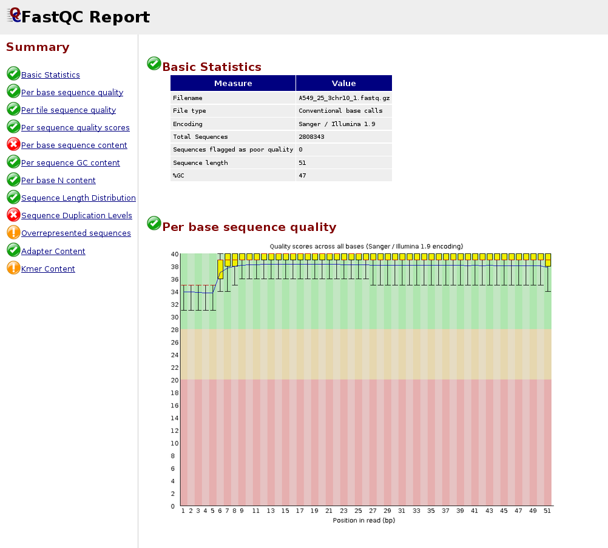


Here we provide an example of a **bad dataset**. As you can see the average quality drops towards the 3'-end.

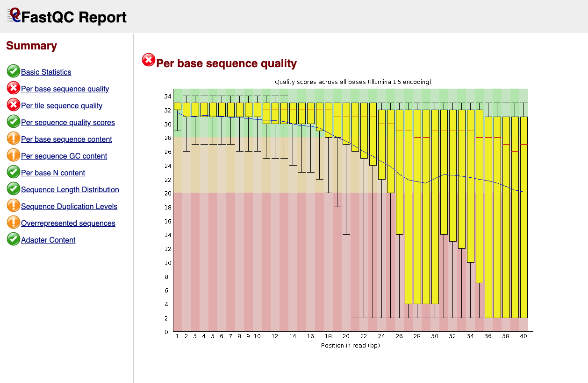


Fastq_screen requires a number of databases to be installed for aligning a subset of your reads. You can download some pre-generated ones by using the following command (DO NOT LUNCH IT NOW!!!):

```{bash}
fastq_screen --get_genomes
``` 

This will download 11 genomes (arabidopsis, drosophila, E. coli, human, lambda, mouse, mitochondria, phiX, rat, worm and yeast) and 3 collection of sequences (adapters, vectors, rRNA) indexed with bowtie2. This step is quite slow so we are not going to launch it now.

To execute fastq_screen: 

```{bash}
fastq_screen --conf fastq_screen.conf A549_0_1_1.fastq.gz 
Using fastq_screen v0.13.0
Reading configuration from 'fastq_screen.conf'
Aligner (--aligner) not specified, but Bowtie2 path and index files found: mapping with Bowtie2
Adding database Human
Adding database Mouse
Adding database Rat
Adding database Drosophila
Adding database Worm
Adding database Yeast
Adding database Arabidopsis
Adding database Ecoli
Adding database rRNA
Adding database MT
Adding database PhiX
Adding database Lambda
Adding database Vectors
Adding database Adapters
Using 7 threads for searches
Option --subset set to 100000 reads
Processing A549_0_1_1.fastq.gz
Counting sequences in A549_0_1_1.fastq.gz
Making reduced sequence file with ratio 711:1
...
```

</br>Here you have an example of the result. In brief you tested a sub-sample of your reads aligning to different databases. In this way you can detect contaminations, failure of ribosomal depletion etc.  

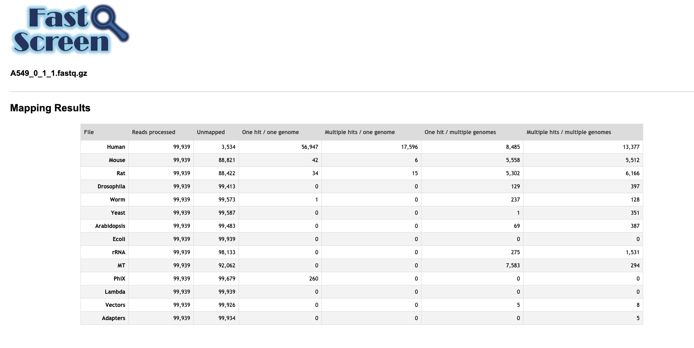
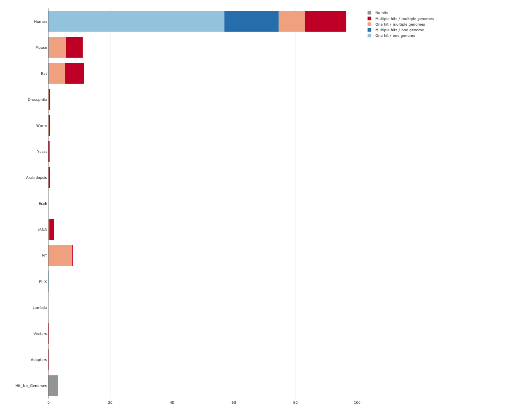


## Trimming reads for quality, removing adapters and filtering low-quality reads
In case when data contain low quality reads or adapter(s) it is advisable to filter and trim reads before mapping them to the genome or transcriptome. 

As shown before, both the presence of low quality reads and adapters are reported in the **fastqc** output. 

Adapters are usually expected in small RNA-seq because the molecules are tipically shorter than 24 bp while the reads are longer. Here is an example of a fastq file for small RNA-seq.


```{bash}
fastqc subsample_to_trim.fq.gz

Started analysis of subsample_to_trim.fq.gz
Approx 5% complete for subsample_to_trim.fq.gz
Approx 10% complete for subsample_to_trim.fq.gz
Approx 15% complete for subsample_to_trim.fq.gz
Approx 20% complete for subsample_to_trim.fq.gz
Approx 25% complete for subsample_to_trim.fq.gz
...
```


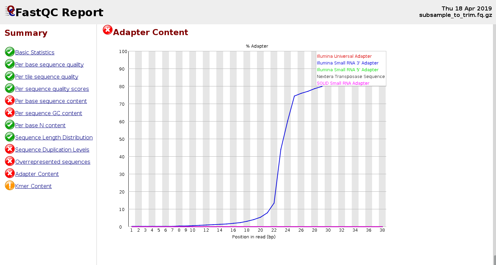


There are many tools for trimming reads and removing adapters, such as ...

**EXERCISE**
Where to find out the sequence of the adapter to trim off?


Here we show the usage of **skewer[7]** providing indicating the Illumina small RNA 3' adapter.  

```{bash}
skewer subsample_to_trim.fq.gz -x TGGAATTCTCGGGTGCCAAGG

.--. .-.
: .--': :.-.
`. `. : `'.' .--. .-..-..-. .--. .--.
_`, :: . `.' '_.': `; `; :' '_.': ..'
`.__.':_;:_;`.__.'`.__.__.'`.__.':_;
skewer v0.2.2 [April 4, 2016]
Parameters used:
-- 3' end adapter sequence (-x):	TGGAATTCTCGGGTGCCAAGG
-- maximum error ratio allowed (-r):	0.100
-- maximum indel error ratio allowed (-d):	0.030
-- minimum read length allowed after trimming (-l):	18
-- file format (-f):		Sanger/Illumina 1.8+ FASTQ (auto detected)
-- minimum overlap length for adapter detection (-k):	3
Thu Apr 18 17:51:18 2019 >> started
|=================================================>| (100.00%)
Thu Apr 18 17:51:25 2019 >> done (6.789s)
1000000 reads processed; of these:
  30171 ( 3.02%) short reads filtered out after trimming by size control
   2220 ( 0.22%) empty reads filtered out after trimming by size control
 967609 (96.76%) reads available; of these:
 958360 (99.04%) trimmed reads available after processing
   9249 ( 0.96%) untrimmed reads available after processing
log has been saved to "subsample_to_trim.fq-trimmed.log".
```

We can look at the read distribution after the trimming of the adapter by inspecting the log-file or relaunching FastQC.

```{bash}
fastqc subsample_to_trim.fq-trimmed.fastq  

Started analysis of subsample_to_trim.fq-trimmed.fastq
Approx 5% complete for subsample_to_trim.fq-trimmed.fastq
Approx 10% complete for subsample_to_trim.fq-trimmed.fastq
Approx 15% complete for subsample_to_trim.fq-trimmed.fastq
Approx 20% complete for subsample_to_trim.fq-trimmed.fastq
Approx 25% complete for subsample_to_trim.fq-trimmed.fastq
...

```
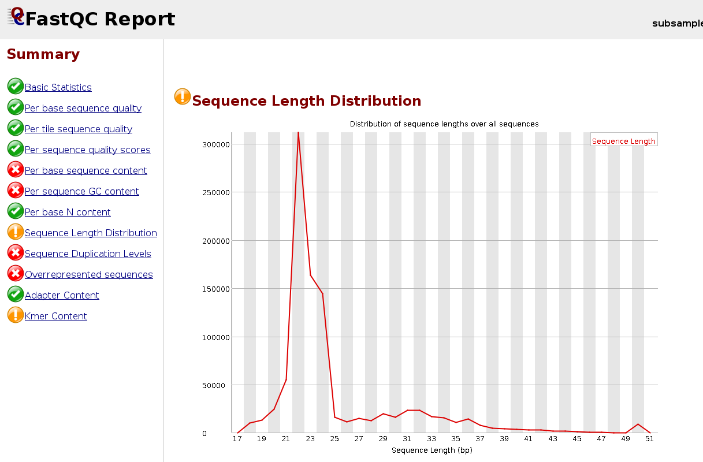


**EXERCISE**
Let's explore the tool **skewer[7]** in more detail using "skewer --help" command.
* Which parameter indicates the minimum read length allowed after trimming? And what is its default value?
* Which parameter indicates the threshold on the average read quality to be filtered out?
* Using skewer filter out reads in "subsample_to_trim.fq-trimmed.fastq" that have average quality below ??? and trim them on 3' end until the base quality is reached ???. How many reads were filtered out and how many remained?


--------------------
## References:

1. https://en.wikipedia.org/wiki/Northern_blot
2. https://en.wikipedia.org/wiki/Real-time_polymerase_chain_reaction
3. https://en.wikipedia.org/wiki/DNA_microarray
4. [Wang Z, Gerstein M, Snyder M. RNA-Seq: a revolutionary tool for transcriptomics. Nat Rev Genet. 2009 Jan;10(1):57-63. doi: 10.1038/nrg2484.](https://www.nature.com/articles/nrg2484)
5. [Andrews S. (2010). FastQC: a quality control tool for high throughput sequence data](http://www.bioinformatics.babraham.ac.uk/projects/fastqc)
6. [Wingett SW, Andrews S. FastQ Screen: A tool for multi-genome mapping and quality control. Version 2. F1000Res. 2018 Aug 24](https://www.ncbi.nlm.nih.gov/pmc/articles/pmid/30254741/)
7. [Jiang H, Lei R, Ding SW, Zhu S. Skewer: a fast and accurate adapter trimmer for next-generation sequencing paired-end reads. BMC Bioinformatics. 2014 Jun 12;15:182](https://bmcbioinformatics.biomedcentral.com/articles/10.1186/1471-2105-15-182)
