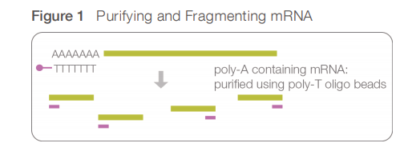
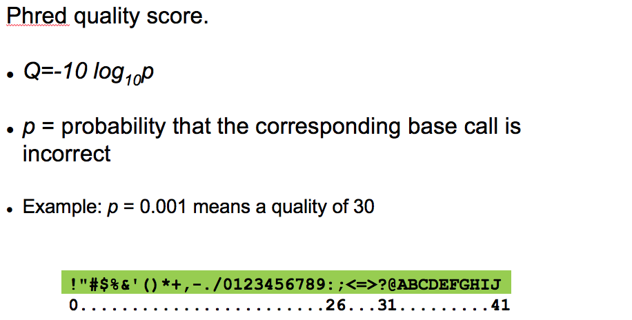
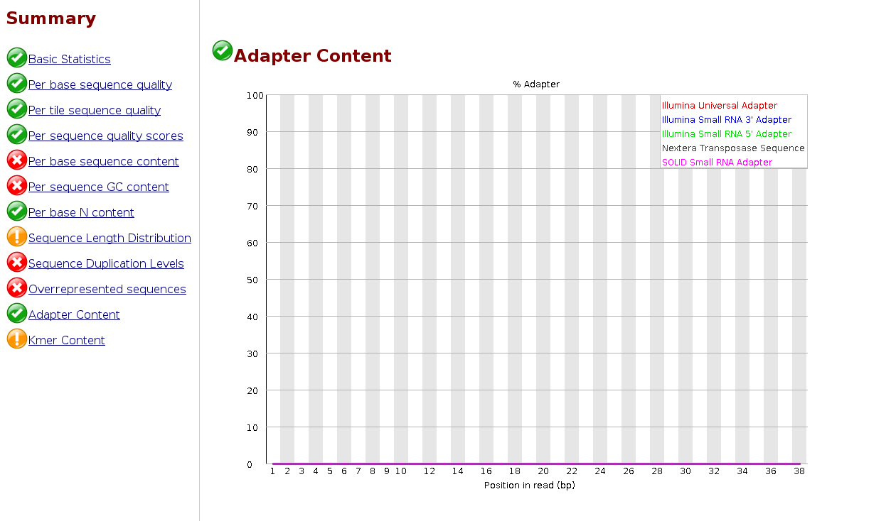

# Module 1
## Introduction: what is RNA-Seq? 

|RNA molecule|
| :---:  |
||
|from Wikipedia|


RNA sequencing is a technique that allows to detect and quantify RNA molecules within biological samples by using next-generation sequencing (NGS). In few words this technology is used to analyze the transcriptome by revealing:
* gene expression
* alternative spliced transcripts 
* gene fusion and SNPs
* RNA editing

Other experiments used for assessing the RNA expression are Northern Blot [1], Real time PCR [2] and hybridization-based  microarray [3].

RNA-Seq can be performed on:
* Only messenger RNAs by performing polyA enrichment. 
* total RNA, after a step of ribosomal depletion.
* small RNAs, selecting the size of RNA molecule (usually < 100 nt)
* Only RNA molecules that are being transcribed in that moment (ribosomal profiling).

Depending on the kind of sequencing the RNAseq can produce:
* Single short reads: particularly used for gene quantification (mainly **Illumina**, but also **Ion Torrent** and **BGISEQ**)
* Paired end reads: useful for splicing detection and annotation refinement
* Stranded or unstranded: the former allows detection of antisense molecules or genes on both directions, the latter is sometimes needed when very little amount of RNA is available. 
* Single long reads (**PACBio** or **Nanopore**): used for de novo identification of new transcripts / improving transcriptome. 

## mRNA sequencing (Illumina)
RNA is extracted and then converted to cDNA by using a polyT adapter that binds the polyA tail. In this way non poly-adenylated transcripts like rRNA, tRNA and the majority of long ncRNAs are excluded from the reaction. 
cDNA molecules are then fragmented and eventually amplified by PCR and then sequenced.
Short reads are then mapped to the reference genome / transcriptome and assigned to a gene / transcript. 
The number of reads per gene / transcript is finally used as a proxy of the expression of that gene / transcript.


|RNASeq protocol|
| :---:  |
||
|from Wang et al 2009 [4]|

<br/>
To achieve to sequence only one of the two DNA strand the **Illumina's TruSeq Stranded mRNA** protocol requires the introduction of dUTP instead of dTTP during the amplification. In this way that filament is NOT amplified / sequenced. 
<br/>



<br/>
At the end of the sequence an extra "A" is added at the 3' end to minimize the amount of chimaeras generated by the concatenations of blunt ends. 
<br/><br/>


<br/>

### Input data: fastq sequences

Short (and long) reads coming from the sequencers are stored in **Fastq** format.
This format contains both the information about sequence and the quality of that particular base (i.e. the probability that that base reading was true or not).


The format contains four rows for sequence with:
* a header containing **@** as the first character
* the sequence content
* a **spacer**
* the quality encoded using ASCII characters.



Currently most of the journals require the submissions of NGS raw data in a public repository upon publishing.

The major repositories are:
* [**SRA**](https://www.ncbi.nlm.nih.gov/sra) (Sequence Read Archive) from US
* [**ENA**](https://www.ebi.ac.uk/ena) (European Nucleotide Archive) 
* [**DDBJ-DRA**](https://www.ddbj.nig.ac.jp/dra/index-e.html) from Japan.

They are interconnected and mirror the data among them and contain links to other databases that store the gene expression  such as [**GEO**](https://www.ncbi.nlm.nih.gov/geo/) and [**Array-express**](https://www.ebi.ac.uk/arrayexpress/).

To download raw data from **SRA** it is mandatory to use **fastq-dump program** from [**SRA toolkit**](https://trace.ncbi.nlm.nih.gov/Traces/sra/sra.cgi?view=toolkit_doc). You just need a SRA identifier and to specify whether your data are single or paired ends, otherwise paired ends will be downloaded a single interleaved file.   

```{bash}
fastq-dump --gzip --split-files SRR-IDENTIFIER
```

since this is a very slow step we downsampled the initial reads to the ones only mapping to the chromosome 10 of the human genome. You already have the files at this link:

```{bash}
wget https://public-docs.crg.es/biocore/projects/training/RNAseq_2019/resources.tar

tar -vxf resources.tar 

resources/
resources/A549_0_3chr10_1.fastq.gz
resources/A549_25_3chr10_2.fastq.gz
resources/A549_25_1chr10_1.fastq.gz
resources/A549_25_3chr10_1.fastq.gz
resources/A549_0_3chr10_2.fastq.gz
resources/A549_0_1chr10_1.fastq.gz
resources/A549_0_1chr10_2.fastq.gz
resources/A549_25_2chr10_1.fastq.gz
resources/A549_25_1chr10_2.fastq.gz
resources/A549_0_2chr10_1.fastq.gz
resources/A549_0_2chr10_2.fastq.gz
resources/A549_25_2chr10_2.fastq.gz

```

You can inspect them, count their numbers or check the read size by using simple linux commands:

```{bash}
zcat resources/A549_25_3chr10_2.fastq.gz |more 

@D00137:455:HLFL3BCXY:1:1111:7527:60273/2
GACAAACCCACAGCCAATATCATACTGAATGGGCAAAAACTGGAAGCATTC
+
ADDDDIIFHHIIIIIIIIIIHHHHIIIIHIIHHGIIIGIIIHHIIHHGHHH
@D00137:455:HLFL3BCXY:1:1111:3751:48736/2
CTATGGTGACCTGAACCACCTGGTGTCTGCTACCATGAGTGGGGTCACCAC
+
DDDDDIIIIIIIHIIHIIIIIIIIIIIIIHIIIIIIIIIIIIIHIIIIIIG
@D00137:455:HLFL3BCXY:2:1214:18935:42305/2
CTATGGTGACCTGAACCACCTGGTGTCTGCTACCATGAGTGGGGTCACCAC
+
DDDDDIIIHIIIIIIIIIIIIIIIIIIIIIIHIIIIIGHIIHIIIIIIIII
...

zcat resources/A549_25_3chr10_2.fastq.gz  |awk '{num++}END{print num/4}'

2808343
....

zcat resources/A549_25_3chr10_2.fastq.gz |head -n 4| tail -n 1| awk '{print length($0)}'

51
```

### QC of input data
To assess the quality of our input data we can use two tools: **FastQC**[5] and **Fastq Screen**[6]. 

The former gives us a number of statistics about the composition and the quality of the raw sequences while the latter looks for possible contaminations. 

```{bash}
fastqc resources/A549_25_3chr10_*.fastq.gz

Started analysis of A549_25_3chr10_1.fastq.gz
Approx 5% complete for A549_25_3chr10_1.fastq.gz
Approx 10% complete for A549_25_3chr10_1.fastq.gz
Approx 15% complete for A549_25_3chr10_1.fastq.gz
Approx 20% complete for A549_25_3chr10_1.fastq.gz
...
Approx 85% complete for A549_25_3chr10_2.fastq.gz
Approx 90% complete for A549_25_3chr10_2.fastq.gz
Approx 95% complete for A549_25_3chr10_2.fastq.gz
Analysis complete for A549_25_3chr10_2.fastq.gz
```

We can display the results with a browser like Firefox
```{bash}
firefox resources/A549_25_3chr10_1_fastqc.html

...

firefox resources/A549_25_3chr10_2_fastqc.html
```


Here we provide an example of a **bad dataset**. As you can see the average quality drops towards the 3 prime.


Fastq_screen requires a number of databases to be installed for aligning a subset of your reads. You can download some pre-generated ones by using the following command:

```{bash}
fastq_screen --get_genomes
``` 

This will download 11 genomes (arabidopsis, drosophila, E coli, human, lambda, mouse, mitochondria, phiX, rat, worm and yeast) and 3 collection of sequences (adapters, vectors, rRNA) indexed with bowtie2. This step is quite slow so we are not going to launch it now.

Here the command line to execute fastq_screen: 

```{bash}
fastq_screen --conf fastq_screen.conf A549_0_1_1.fastq.gz 
Using fastq_screen v0.13.0
Reading configuration from 'fastq_screen.conf'
Aligner (--aligner) not specified, but Bowtie2 path and index files found: mapping with Bowtie2
Adding database Human
Adding database Mouse
Adding database Rat
Adding database Drosophila
Adding database Worm
Adding database Yeast
Adding database Arabidopsis
Adding database Ecoli
Adding database rRNA
Adding database MT
Adding database PhiX
Adding database Lambda
Adding database Vectors
Adding database Adapters
Using 7 threads for searches
Option --subset set to 100000 reads
Processing A549_0_1_1.fastq.gz
Counting sequences in A549_0_1_1.fastq.gz
Making reduced sequence file with ratio 711:1
...
```

Here you have an example of the result. In brief you tested a sub-sample of your reads aligning to different databases. In this way you can detect contaminations, failure of ribosomal depletion etc.  


## Trimming of reads.
In case your dataset contains low quality reads and / or you sequenced also some adapters you might want to filter and trim your reads before performing the alignment. 
As shown before both the presence of low quality reads and adapters is reported in the **fastqc** ouptut. 
A typical case in which you do expect to have adapters is when you perform small RNAs sequencing. In that case your molecules are tipically shorter than 24 bps and the rest will be the Illumina's adapter.


```{bash}
fastqc subsample_to_trim.fq.gz

Started analysis of subsample_to_trim.fq.gz
Approx 5% complete for subsample_to_trim.fq.gz
Approx 10% complete for subsample_to_trim.fq.gz
Approx 15% complete for subsample_to_trim.fq.gz
Approx 20% complete for subsample_to_trim.fq.gz
Approx 25% complete for subsample_to_trim.fq.gz
...
```


We can remove the adapter using a number of tools. Here we show **skewer[7]** indicating the Illumina small RNA 3' adapter.  

```{bash}
skewer subsample_to_trim.fq.gz -x TGGAATTCTCGGGTGCCAAGG

.--. .-.
: .--': :.-.
`. `. : `'.' .--. .-..-..-. .--. .--.
_`, :: . `.' '_.': `; `; :' '_.': ..'
`.__.':_;:_;`.__.'`.__.__.'`.__.':_;
skewer v0.2.2 [April 4, 2016]
Parameters used:
-- 3' end adapter sequence (-x):	TGGAATTCTCGGGTGCCAAGG
-- maximum error ratio allowed (-r):	0.100
-- maximum indel error ratio allowed (-d):	0.030
-- minimum read length allowed after trimming (-l):	18
-- file format (-f):		Sanger/Illumina 1.8+ FASTQ (auto detected)
-- minimum overlap length for adapter detection (-k):	3
Thu Apr 18 17:51:18 2019 >> started
|=================================================>| (100.00%)
Thu Apr 18 17:51:25 2019 >> done (6.789s)
1000000 reads processed; of these:
  30171 ( 3.02%) short reads filtered out after trimming by size control
   2220 ( 0.22%) empty reads filtered out after trimming by size control
 967609 (96.76%) reads available; of these:
 958360 (99.04%) trimmed reads available after processing
   9249 ( 0.96%) untrimmed reads available after processing
log has been saved to "subsample_to_trim.fq-trimmed.log".
```

We can have a look at the read distribution after the trimming by inspecting the log or relaunching fastqc.

```{bash}
fastqc subsample_to_trim.fq-trimmed.fastq  

Started analysis of subsample_to_trim.fq-trimmed.fastq
Approx 5% complete for subsample_to_trim.fq-trimmed.fastq
Approx 10% complete for subsample_to_trim.fq-trimmed.fastq
Approx 15% complete for subsample_to_trim.fq-trimmed.fastq
Approx 20% complete for subsample_to_trim.fq-trimmed.fastq
Approx 25% complete for subsample_to_trim.fq-trimmed.fastq
...

```




--------------------
## References:

1. https://en.wikipedia.org/wiki/Northern_blot
2. https://en.wikipedia.org/wiki/Real-time_polymerase_chain_reaction
3. https://en.wikipedia.org/wiki/DNA_microarray
4. [Wang Z, Gerstein M, Snyder M. RNA-Seq: a revolutionary tool for transcriptomics. Nat Rev Genet. 2009 Jan;10(1):57-63. doi: 10.1038/nrg2484.](https://www.nature.com/articles/nrg2484)
5. [Andrews S. (2010). FastQC: a quality control tool for high throughput sequence data](http://www.bioinformatics.babraham.ac.uk/projects/fastqc)
6. [Wingett SW, Andrews S. FastQ Screen: A tool for multi-genome mapping and quality control. Version 2. F1000Res. 2018 Aug 24](https://www.ncbi.nlm.nih.gov/pmc/articles/pmid/30254741/)
7. [Jiang H, Lei R, Ding SW, Zhu S. Skewer: a fast and accurate adapter trimmer for next-generation sequencing paired-end reads. BMC Bioinformatics. 2014 Jun 12;15:182](https://bmcbioinformatics.biomedcentral.com/articles/10.1186/1471-2105-15-182)
