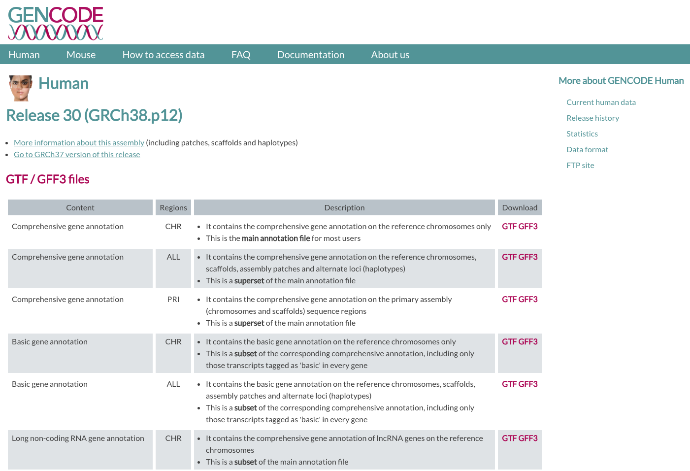
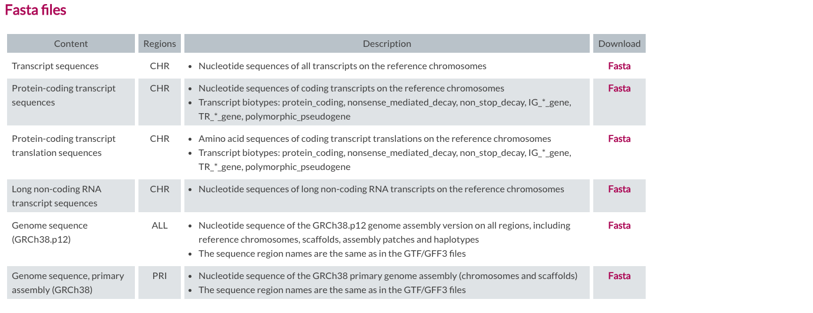
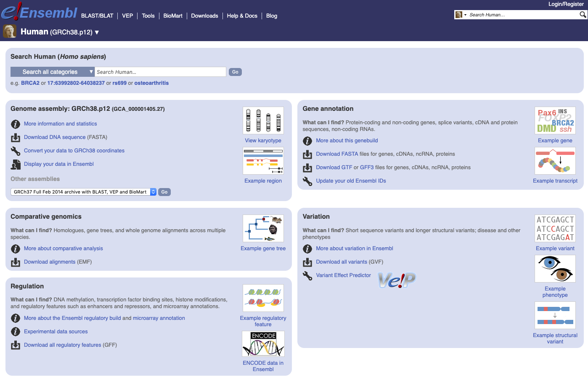
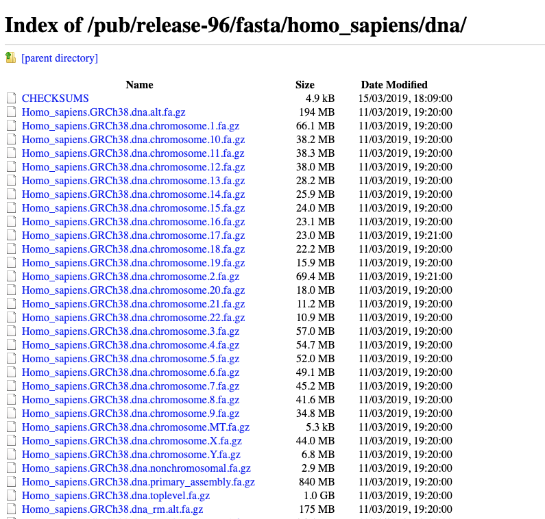
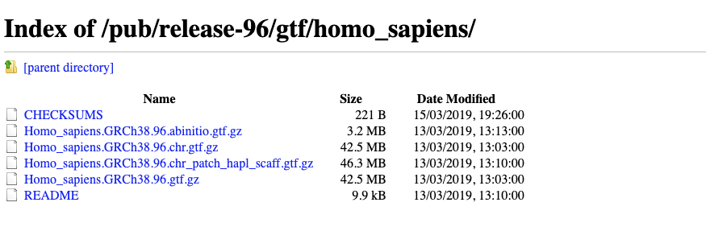

# Module 2

## Read alignment to reference transcriptome

|Mapping of short reads|
| :---:  |
||
|from Wikipedia|

Once we tested the quality of our input reads we can proceed with the alignment to the reference transcriptome. So first of all we need to retrieve this information from one of the public databases that host genomic data. 

### Public resources:

1. [Gencode](https://www.gencodegenes.org/) contains a very accurate annotation for Human and Mouse. It contains also functional elements such as protein-coding loci with alternatively splices variants, non-coding loci and pseudogenes and the annotations are carried out by  manual curation, computational analysis and targeted experimental approaches.
2. [Ensembl](https://www.ensembl.org/index.html) contains both automatically generated and manually curated annotations. They host different genomes and also comparative genomics data and variants. [Ensembl genomes](http://ensemblgenomes.org/) extends the genomic information across different taxonomic groups: bacteria, fungi, metazoa, plants, protists. Ensembl integrates also a genome browser.
3. [UCSC Genome Browser](https://genome.ucsc.edu/) hosts information about different genomes and a genome browser. They integrates the Gencode information as additional tracks. 

As an example we will show how to access the data for Gencode and Ensembl:

In Gencode we can retrieve the gene annotations in the first link (Comprehensive gene annotation, chr) and the genome where is indicated **Genome sequence, primary assembly (GRCh38)**. Transcript sequence is also available in case you want to use the transcriptome as a reference. The data we are going to use are from version [**v29**](https://www.gencodegenes.org/human/release_29.html)

|Gencode website|
| :---:  |
||
||

In Ensembl you can get the information after choosing the genome and clicking on **Download DNA sequence (FASTA)** and then **Homo_sapiens.GRCh38.dna_rm.primary_assembly.fa.gz** if you don't want to look at haplotypes and patches and instead **Homo_sapiens.GRCh38.dna_rm.toplevel.fa.gz** if you want to include them.

|Ensembl website|
| :---:  |
||
||
||


### Data formats
We can download an example of a single chromosome and the corresponding annotation from Gencode here:

```{bash}
wget https://public-docs.crg.es/biocore/projects/training/RNAseq_2019/annotations.tar
tar -xf annotations.tar
```

The genome is generally represented as a fasta file with the header indicated by the "**>**":

```{bash}
zcat annotations/Homo_sapiens.GRCh38.dna.chromosome.10.fa.gz| head -n 5
>chr10 dna:chromosome chromosome:GRCh38:10:1:133797422:1 REF
NNNNNNNNNNNNNNNNNNNNNNNNNNNNNNNNNNNNNNNNNNNNNNNNNNNNNNNNNNNN
NNNNNNNNNNNNNNNNNNNNNNNNNNNNNNNNNNNNNNNNNNNNNNNNNNNNNNNNNNNN
NNNNNNNNNNNNNNNNNNNNNNNNNNNNNNNNNNNNNNNNNNNNNNNNNNNNNNNNNNNN
NNNNNNNNNNNNNNNNNNNNNNNNNNNNNNNNNNNNNNNNNNNNNNNNNNNNNNNNNNNN
```

The size of the chromosome is already reported in the header, but if we want to check by ourself we can use a combination of linux commands:

```{bash}
zcat annotations/Homo_sapiens.GRCh38.dna.chromosome.10.fa.gz| grep -v ">"| tr -d '\n'|wc -m  
133797422
```

The annotation is stored in **G**eneral **T**ransfer **F**ormat (**GTF**) format: a tabular format with one line per feature, each one containing 9 columns of data. In general it has a header indicated by the first character **"#"** and one row per feature composed by 9 columns:

| Column number | Column name | Details |
| :----: | :----: | :----: |
| 1 | seqname | name of the chromosome or scaffold; chromosome names can be given with or without the 'chr' prefix. |
| 2 | source | name of the program that generated this feature, or the data source (database or project name) |
| 3 | feature | feature type name, e.g. Gene, Variation, Similarity |
| 4 | start | Start position of the feature, with sequence numbering starting at 1. |
| 5 | end | End position of the feature, with sequence numbering starting at 1. |
| 6 | score | A floating point value. |
| 7 | strand | defined as + (forward) or - (reverse). |
| 8 | frame | One of '0', '1' or '2'. '0' indicates that the first base of the feature is the first base of a codon, '1' that the second base is the first base of a codon, and so on.. |
| 9 | attribute | A semicolon-separated list of tag-value pairs, providing additional information about each feature. |


```{bash}
zcat annotations/gencode.v29.annotation_chr10.gtf.gz| head -n 10

##description: evidence-based annotation of the human genome (GRCh38), version 29 (Ensembl 94)
##provider: GENCODE
##contact: gencode-help@ebi.ac.uk
##format: gtf
chr10	HAVANA	gene	14061	16544	.	-	.	gene_id "ENSG00000260370.1"; gene_type "lincRNA"; gene_name "AC215217.1"; level 2; havana_gene "OTTHUMG00000174801.2";
chr10	HAVANA	transcript	14061	14604	.	-	.	gene_id "ENSG00000260370.1"; transcript_id "ENST00000562162.1"; gene_type "lincRNA"; gene_name "AC215217.1"; transcript_type "lincRNA"; transcript_name "AC215217.1-201"; level 2; transcript_support_level "3"; tag "basic"; havana_gene "OTTHUMG00000174801.2"; havana_transcript "OTTHUMT00000427447.1";
chr10	HAVANA	exon	14497	14604	.	-	.	gene_id "ENSG00000260370.1"; transcript_id "ENST00000562162.1"; gene_type "lincRNA"; gene_name "AC215217.1"; transcript_type "lincRNA"; transcript_name "AC215217.1-201"; exon_number 1; exon_id "ENSE00002606019.1"; level 2; transcript_support_level "3"; tag "basic"; havana_gene "OTTHUMG00000174801.2"; havana_transcript "OTTHUMT00000427447.1";
chr10	HAVANA	exon	14061	14299	.	-	.	gene_id "ENSG00000260370.1"; transcript_id "ENST00000562162.1"; gene_type "lincRNA"; gene_name "AC215217.1"; transcript_type "lincRNA"; transcript_name "AC215217.1-201"; exon_number 2; exon_id "ENSE00002584618.1"; level 2; transcript_support_level "3"; tag "basic"; havana_gene "OTTHUMG00000174801.2"; havana_transcript "OTTHUMT00000427447.1";
chr10	HAVANA	transcript	14138	16544	.	-	.	gene_id "ENSG00000260370.1"; transcript_id "ENST00000566940.1"; gene_type "lincRNA"; gene_name "AC215217.1"; transcript_type "lincRNA"; transcript_name "AC215217.1-202"; level 2; transcript_support_level "3"; havana_gene "OTTHUMG00000174801.2"; havana_transcript "OTTHUMT00000430636.1";
chr10	HAVANA	exon	16502	16544	.	-	.	gene_id "ENSG00000260370.1"; transcript_id "ENST00000566940.1"; gene_type "lincRNA"; gene_name "AC215217.1"; transcript_type "lincRNA"; transcript_name "AC215217.1-202"; exon_number 1; exon_id "ENSE00002578035.1"; level 2; transcript_support_level "3"; havana_gene "OTTHUMG00000174801.2"; havana_transcript "OTTHUMT00000430636.1";
```


We can check the number of genes within the annotation file:

```{bash}
zcat annotations/gencode.v29.annotation_chr10.gtf.gz| grep -v "#"| awk '$3=="gene"' | wc -l 
2240
```

And get a final counts of every feature:

```{bash}
zcat annotations/gencode.v29.annotation_chr10.gtf.gz| grep -v "#"| cut -f 3 | sort|uniq -c 

  29578 CDS
  46414 exon
   2240 gene
   2750 start_codon
   2693 stop_codon
   6894 transcript
   9274 UTR

```

### Aligners
In last 10 years several tools for mapping short reads to the reference have been developed. All of them requires to build an index of the reference genome / transcriptome using different algorithms. We can classify them in three groups:

#### Fast aligners
These tools can be used for aligning short reads to a trancriptome or genome reference, but in the latter case they cannot align in splicing junctions. They can be much faster than traditional aligners like [**Blast**](https://blast.ncbi.nlm.nih.gov/Blast.cgi) but less sensitive and may have limitations about the read size. 

1. [**Bowtie**](http://bowtie-bio.sourceforge.net/index.shtml) is an ultrafast, memory-efficient short read aligner geared toward quickly aligning large sets of short DNA sequences (reads) to large genomes. Bowtie indexes the genome with a Burrows-Wheeler index. 
2. [**Bowtie2**](http://bowtie-bio.sourceforge.net/bowtie2/index.shtml) is an ultrafast and memory-efficient tool for aligning sequencing reads to long reference sequences. It is particularly good at aligning reads of about 50 up to 100s or 1,000s of characters, and particularly good at aligning to relatively long (e.g. mammalian) genomes. Bowtie 2 indexes the genome with an FM Index. 
3. [**BWA**](http://bio-bwa.sourceforge.net/) is a software package for mapping low-divergent sequences against a large reference genome, such as the human genome. BWA indexes the genome with an FM Index.
4. [**GEM**](https://github.com/smarco/gem3-mapper) is a high-performance mapping tool for aligning sequenced reads against large reference genomes. In particular, it is designed to obtain best results when mapping sequences up to 1K bases long. GEM3 indexes the reference genome using a custom FM-Index design and performs an adaptive gapped search based on the characteristics of the input and the user settings. 

#### Splice-aware aligners 
These aligners are able to map to the splicing junctions described in the annotation and even to detect novel ones. Some of them can detect gene fusions and SNPs and RNA editing. Downstream anslysis will require for some of them the assignation of the aligned reads to a given gene / transcript.

1. [**Tophat**](https://ccb.jhu.edu/software/tophat/index.shtml) is a fast splice junction mapper for RNA-Seq reads. It aligns RNA-Seq reads to mammalian-sized genomes using the ultra high-throughput short read aligner Bowtie, and then analyzes the mapping results to identify splice junctions between exons.
2. [**Hisat2**](http://ccb.jhu.edu/software/hisat2/index.shtml) is a fast and sensitive alignment program for mapping next-generation sequencing reads (both DNA and RNA) to a population of human genomes (as well as to a single reference genome). The reference transcriptome is indexed using a Hierarchical Graph FM index (HGFM). 
3. [**STAR**](https://github.com/alexdobin/STAR) is an ultrafast universal RNA-seq aligner. It uses sequential maximum mappable seed search in uncompressed suffix arrays followed by seed clustering and stitching procedure. It is also able to search for gene fusions.

#### Quasi-mapping aligners 
These tools are way faster than the previous ones because they don't need to report the resulting alignments but only  associate a read to a given transcript for quantification. They don't discover novel transcript variants (or splicing events) or detect variations, etc.

1. [**Salmon**](https://salmon.readthedocs.io/en/latest/index.html) is a tool for wicked-fast transcript quantification from RNA-seq data. It requires a set of target transcripts to quantify and a K-mer parameter to make the index (i.e. minimum acceptable alignment). 
2. [**Kallisto**](https://pachterlab.github.io/kallisto/) is a program for quantifying abundances of transcripts from bulk and single-cell RNA-Seq data. It is based on the novel idea of pseudoalignment for rapidly determining the compatibility of reads with targets, without the need for alignment.


### Creating indexes
We will make indexes using two different programs **STAR** and **Salmon**. The former will need both genome in fasta format and annotation in GTF. The latter instead needs transcripts sequences in a fasta file.

We can check the size of the files needed by the tools:

```{bash}
ls -alht annotations
total 136M
drwxr-xr-x 9 lcozzuto Bioinformatics_Unit 1.6K Apr 30 17:37 ..
drwxr-xr-x 2 lcozzuto Bioinformatics_Unit  253 Apr 30 17:37 .
-rw-r--r-- 1 lcozzuto Bioinformatics_Unit  63M Apr 30 16:56 gencode.v29.transcripts.fa.gz
-rw-r--r-- 1 lcozzuto Bioinformatics_Unit  39M Apr 17 16:25 Homo_sapiens.GRCh38.dna.chromosome.10.fa.gz
-rw-r--r-- 1 lcozzuto Bioinformatics_Unit 1.5M Apr 17 16:08 gencode.v29.annotation_chr10.gtf.gz
```

As a good practice is better to keep our files zipped as much as possible, you won't waste storage that is a precious resource when dealing with these analysis. You can see how much storage is wasted when using unzipped files:

**PLEASE DO NOT UNZIP ALSO THE FILE gencode.v29.transcripts.fa!! THE FOLLOWING IS AN EXAMPLE!!**

```{bash}
for i in *.gz; do gunzip $i; done

ls -alht
total 617M
drwxr-xr-x  2 lcozzuto Bioinformatics_Unit  244 Apr 30 17:49 .
drwxr-xr-x 10 lcozzuto Bioinformatics_Unit 1.7K Apr 30 17:49 ..
-rw-r--r--  1 lcozzuto Bioinformatics_Unit 130M Apr 30 17:48 Homo_sapiens.GRCh38.dna.chromosome.10.fa
-rw-r--r--  1 lcozzuto Bioinformatics_Unit 331M Apr 30 17:48 gencode.v29.transcripts.fa
-rw-r--r--  1 lcozzuto Bioinformatics_Unit  43M Apr 30 17:48 gencode.v29.annotation_chr10.gtf
```
Basically you are using 80% more space. Some of the tools cannot handle directly zipped files as an input (like the indexing step of **STAR**), so you can unzip them, use them and remove the uncompressed version.

To indexing the genome with **STAR** we need to provide also the parameter **sjdbOverhang** that is needed for detecting possible splicing sites. It is generally the minimum read size minus 1 and tells **STAR** which is the maximum possible stretch of sequence that can be found on one side of the spicing site. In our case that every reads is 51 bases long we can accept maximum 50 bases on one side and one base on the other (so the value for this parameter is **50**).

This step will require some minutes:

```{bash}
mkdir indexes
mkdir indexes/chr10
$RUN STAR --runMode genomeGenerate --genomeDir indexes/chr10 \
            --genomeFastaFiles annotations/Homo_sapiens.GRCh38.dna.chromosome.10.fa \
            --sjdbGTFfile annotations/gencode.v29.annotation_chr10.gtf \
            --sjdbOverhang 50 --outFileNamePrefix chr10

Apr 30 18:21:00 ..... started STAR run
Apr 30 18:21:00 ... starting to generate Genome files
Apr 30 18:21:05 ... starting to sort Suffix Array. This may take a long time...
Apr 30 18:21:06 ... sorting Suffix Array chunks and saving them to disk...
Apr 30 18:25:18 ... loading chunks from disk, packing SA...
Apr 30 18:25:42 ... finished generating suffix array
Apr 30 18:25:42 ... generating Suffix Array index
Apr 30 18:26:37 ... completed Suffix Array index
Apr 30 18:26:37 ..... processing annotations GTF
Apr 30 18:26:38 ..... inserting junctions into the genome indices
Apr 30 18:27:08 ... writing Genome to disk ...
Apr 30 18:27:09 ... writing Suffix Array to disk ...
Apr 30 18:27:16 ... writing SAindex to disk
Apr 30 18:27:24 ..... finished successfully

```

**Salmon** does not need any decompression of the input so we can index by using this command:

```{bash}
$RUN salmon index --gencode -t annotations/gencode.v29.transcripts.fa.gz -i indexes/transcripts

Version Info: This is the most recent version of salmon.
index ["transcripts"] did not previously exist  . . . creating it
[2019-04-30 18:12:59.272] [jLog] [info] building index
[2019-04-30 18:12:59.275] [jointLog] [info] [Step 1 of 4] : counting k-mers

[....]

Elapsed time: 53.0026s
processed 316,000,000 positions[2019-04-30 18:17:34.139] [jointLog] [info] khash had 132,046,162 keys
[2019-04-30 18:17:34.143] [jointLog] [info] saving hash to disk . . . 
[2019-04-30 18:18:01.144] [jointLog] [info] done
Elapsed time: 27.0014s
[2019-04-30 18:18:07.251] [jLog] [info] done building index
```

As you can see we also added an extra paramters **--gencode** since we derived the data from that resource and has a particular header separator **"\|"**. 

### Aligning
For aligning with **STAR** we need to specify the path of the files (reads and index folder) and if the reads are compressed or not (**--readFilesCommand zcat**). Then we can also specify the kind of outptut we want, in this case we choose **BAM** format with alignment sorted by coordinates. We also indicated that we want to output gene counts too (**--quantMode GeneCounts**) that will be useful for differential analysis.

```{bash}
mkdir alignments

$RUN STAR --genomeDir indexes/chr10 \
      --readFilesIn resources/A549_0_1chr10_1.fastq.gz resources/A549_0_1chr10_2.fastq.gz \
      --readFilesCommand zcat \
      --outSAMtype BAM SortedByCoordinate \
      --quantMode GeneCounts \
      --outFileNamePrefix alignments/A549_0_1
      
Apr 30 18:50:13 ..... started STAR run
Apr 30 18:50:13 ..... loading genome
Apr 30 18:50:52 ..... started mapping
Apr 30 18:54:41 ..... started sorting BAM
Apr 30 18:55:30 ..... finished successfully
```

We cannot inspect directly the output file since the **BAM** format is a compressed version of the [**SAM**](https://samtools.github.io/hts-specs/SAMv1.pdf) (that is plain text). We can convert BAM to SAM by using [**samtools**](http://samtools.sourceforge.net/). Note that we use the parameter **-h** to show also the header that is hidden by default. 

```{bash}
$RUN samtools view -h alignments/A549_0_1Aligned.sortedByCoord.out.bam |head -n 10

@HD	VN:1.4	SO:coordinate
@SQ	SN:chr10	LN:133797422
@PG	ID:STAR	PN:STAR	VN:STAR_2.5.3a	CL:STAR   --genomeDir annotations/chr10   --readFilesIn resources/A549_0_1chr10_1.fastq.gz   resources/A549_0_1chr10_2.fastq.gz      --readFilesCommand zcat      --outFileNamePrefix A549_0_1   --outSAMtype BAM   SortedByCoordinate      --quantMode GeneCounts   
@CO	user command line: STAR --genomeDir annotations/chr10 --readFilesIn resources/A549_0_1chr10_1.fastq.gz resources/A549_0_1chr10_2.fastq.gz --readFilesCommand zcat --outSAMtype BAM SortedByCoordinate --quantMode GeneCounts --outFileNamePrefix A549_0_1
D00137:453:HLFY2BCXY:2:1115:10428:98737	419	chr10	35442	3	13M174562N32M6S	=	236864	201473	AGCTGTTATTGAACAAGAAGGGATTGGTTGCCAGGAGATGAGATTAGCATT	@DDD?<1D1CGEE11<C@GHIIH?@E?G@CHH?FH@0GH@C<<<@1DFCHH	NH:i:2	HI:i:2	AS:i:74	nM:i:9
D00137:453:HLFY2BCXY:2:2208:10640:12788	419	chr10	37161	0	51M	=	37323	213	CCAATATTCAACATTCTTAAAGAAAAGAATGTTCAACCCAGAATTTCATAT	DABDDFHHIIIHCFHEHIEEHHHFFEHHIIH@GHHIIIIIIIIHIIHIIIH	NH:i:5	HI:i:5	AS:i:98	nM:i:1
D00137:453:HLFY2BCXY:2:2208:10640:12788	419	chr10	37161	0	51M	=	37323	213	CCAATATTCAACATTCTTAAAGAAAAGAATGTTCAACCCAGAATTTCATAT	DABDDFHHIIIHCFHEHIEEHHHFFEHHIIH@GHHIIIIIIIIHIIHIIIH	NH:i:5	HI:i:5	AS:i:98	nM:i:1
D00137:453:HLFY2BCXY:2:2208:10640:12788	339	chr10	37323	0	51M	=	37161	-213	GCACTAAACATGGAAAGGAACAACCGGTACCAGCCACTGCAAAATCATGCC	CHIHEIIHHHHHIIIHHGFCIIIHIIHIIHIIHGHIIGHIHHIIHHDDADD	NH:i:5	HI:i:5	AS:i:98	nM:i:1
D00137:453:HLFY2BCXY:2:2208:10640:12788	339	chr10	37323	0	51M	=	37161	-213	GCACTAAACATGGAAAGGAACAACCGGTACCAGCCACTGCAAAATCATGCC	CHIHEIIHHHHHIIIHHGFCIIIHIIHIIHIIHGHIIGHIHHIIHHDDADD	NH:i:5	HI:i:5	AS:i:98	nM:i:1
D00137:453:HLFY2BCXY:1:1214:7640:70489	419	chr10	37872	3	51M	=	37978	156	TGGGAGACTTTAACACCCCACTGTCAACATTAGACAGCTCAACAAGACAGA	DDDDDHDHIIIIIIIIIIIIIIHIIFHGIIIIIIIIIIIIGHIIIIIIIHI	NH:i:2	HI:i:1	AS:i:99	nM:i:0
```

The first part indicated by the first character **@** in each row is the header:

| Symbol|  |  |   
| :---- | :---- | :---- |
| **@HD** header line	| **VN:1.4** version of the SAM format|	**SO:coordinate** sorting order|
| **@SQ** reference sequence dictionary 	| **SN:chr10** sequence name|	**LN:133797422** sequence length|
| **@PG** program used|	**ID:STAR** **PN:STAR**	**VN:STAR_2.5.3a** version| **CL:STAR   --genomeDir annotations/chr10   --readFilesIn resources/A549_0_1chr10_1.fastq.gz   resources/A549_0_1chr10_2.fastq.gz      --readFilesCommand zcat      --outFileNamePrefix A549_0_1   --outSAMtype BAM   SortedByCoordinate      --quantMode GeneCounts** command line|
|**@CO** One-line text comment||**user command line: STAR --genomeDir annotations/chr10 --readFilesIn resources/A549_0_1chr10_1.fastq.gz resources/A549_0_1chr10_2.fastq.gz --readFilesCommand zcat --outSAMtype BAM SortedByCoordinate --quantMode GeneCounts --outFileNamePrefix A549_0_1**|

The rest is the proper alignment. 

| Field|Value |   
| :---- | ----: |
|Query name 	|D00137:453:HLFY2BCXY:2:1115:10428:98737|
|FLAG 	|419 * |
|Reference name 	|chr10|
|Leftmost mapping position 	|35442|
|Mapping quality 	|3 *(p=0.5)* |
|CIGAR string 	|13M174562N32M6S *13 bases equal to the reference (M), 174562 not mapping = 1 insertion (N) 32 mapping (M) 6 soft clipped (S)*|
|Reference name for mate read |	= *same chromosome*|
|Position of the mate| 	236864|
|Template length| 	201473|
|Sequence |AGCTGTTATTGAACAAGAAGGGATTGGTTGCCAGGAGATGAGATTAGCATT|
|Quality	|@DDD?<1D1CGEE11<C@GHIIH?@E?G@CHH?FH@0GH@C<<<@1DFCHH|

\* the flag 419 means: read paired, read mapped in proper pair, mate on the reverse strand, second in pair, not primary alignment. You can use this useful website for the translation of this value in plain English (http://blog.biochen.com/FlagExplain.html).

Extra fields are often present and are different among aligner tools (https://samtools.github.io/hts-specs/SAMtags.pdf). In our case we have:

| Field|Meaning |   
| :---- | ----: |
|NH:i:2|number of mapping to the reference|
|HI:i:2|which aligmnent is the reported one (in this case is the second one)|	
|AS:i:74|Alignment score calculate by the aligner|
|nM:i:9|number of difference with the reference*|

\* *Note that historically this has been ill-defined and both data and tools exist that disagree with this
definition.*

Let's now convert BAM to SAM:

```{bash}
$RUN samtools view -h alignments/A549_0_1Aligned.sortedByCoord.out.bam > alignments/A549_0_1.sam

ls -alht alignments/A549_0_1*[sb]am
-rw-r--r-- 1 lcozzuto Bioinformatics_Unit 1.5G May  2 18:34 A549_0_1.sam
-rw-r--r-- 1 lcozzuto Bioinformatics_Unit 320M Apr 30 18:55 A549_0_1Aligned.sortedByCoord.out.bam
```

We can see that the SAM alignment is 5 times bigger than the sam one. A more efficient way to store the alignment is to use the [**CRAM format**](https://samtools.github.io/hts-specs/CRAMv3.pdf). For converting a **bam** to **cram** we need to have unzipped and indexed version of our genome.

```{bash}
$RUN samtools faidx annotations/Homo_sapiens.GRCh38.dna.chromosome.10.fa

$RUN samtools view -C alignments/A549_0_1Aligned.sortedByCoord.out.bam -T annotations/Homo_sapiens.GRCh38.dna.chromosome.10.fa > alignments/A549_0_1.cram

ls -alht A549_0_1*.*am
-rw-r--r-- 1 lcozzuto Bioinformatics_Unit 1.5G May  2 18:59 A549_0_1.sam
-rw-r--r-- 1 lcozzuto Bioinformatics_Unit 167M May  2 18:58 A549_0_1.cram
-rw-r--r-- 1 lcozzuto Bioinformatics_Unit 320M Apr 30 18:55 A549_0_1Aligned.sortedByCoord.out.bam
```

We saved in this way 50% more space than using the **bam** format. Let's remove the sam format.
```{bash}
rm alignments/*.sam 
```


Gene counts are reported within the file **PREFIX**ReadsPerGene.out.tab. It is a tab separated text with information about 

| | | | |   
| :---- | :---- | :---- |  :---- |
|gene id| read counts per gene (no strand) | read counts per gene (forward)|read counts per gene (reverse)| 
|N_unmapped|	26098|	26098|	26098|
|...|	...|	...|	...|
|ENSG00000261456.5|	13|	0|	13|

This is quite useful in case we don't know which kit was used for the sequencing step. At the beginning we also have number of unmapped reads, of reads that map to more than one position 

```{bash}
more alignments/A549_0_1ReadsPerGene.out.tab

N_unmapped	26098	26098	26098
N_multimapping	337723	337723	337723
N_noFeature	211089	2547710	246034
N_ambiguous	151810	4514	32331
ENSG00000260370.1	0	0	0
ENSG00000237297.1	0	0	0
ENSG00000261456.5	13	0	13
ENSG00000232420.2	0	0	0
ENSG00000015171.19	6874	131	6743
ENSG00000276662.1	6	6	0
ENSG00000212331.1	0	0	0
ENSG00000151240.16	1652	5	1664
...
```

We can count the number of reads mapping to each strand by using a simple awk script:

```{bash}
grep -v "N_" alignments/A549_0_1ReadsPerGene.out.tab | awk '{unst+=$2;forw+=$3;rev+=$4}END{print unst,forw,rev}'

2343002 153677 2427536
```
So we can confirm that the protocol used is sequencing the reverse complement of input mRNAs.


For aligning with **Salmon** we need to specify the  ...

