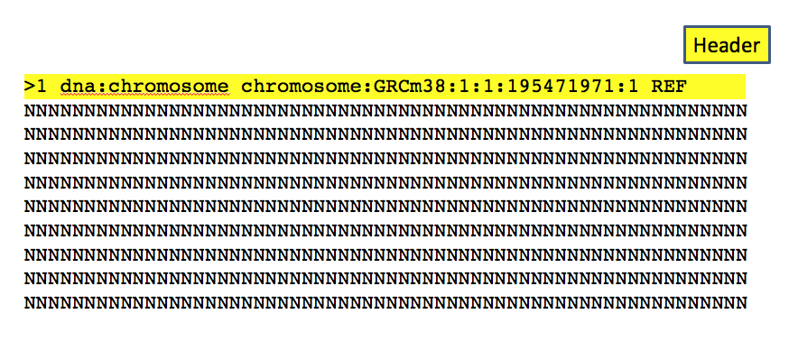

# Module 2

## Read alignment to reference transcriptome

|Mapping of short reads|
| :---:  |
||
|from Wikipedia|

Once we tested the quality of our input reads we can proceed with the alignment to the reference transcriptome. 
We can download an example of genome and annotation here:

```{bash}
wget https://public-docs.crg.es/biocore/projects/training/RNAseq_2019/annotations.tar
tar -xf annotations.tar
```

### Data formats

The genome is generally represented as a fasta file like the one described here:

|Fasta format|
| :---:  |
||

```{bash}
zcat annotations/Homo_sapiens.GRCh38.dna.chromosome.10.fa.gz| head -n 5
>chr10 dna:chromosome chromosome:GRCh38:10:1:133797422:1 REF
NNNNNNNNNNNNNNNNNNNNNNNNNNNNNNNNNNNNNNNNNNNNNNNNNNNNNNNNNNNN
NNNNNNNNNNNNNNNNNNNNNNNNNNNNNNNNNNNNNNNNNNNNNNNNNNNNNNNNNNNN
NNNNNNNNNNNNNNNNNNNNNNNNNNNNNNNNNNNNNNNNNNNNNNNNNNNNNNNNNNNN
NNNNNNNNNNNNNNNNNNNNNNNNNNNNNNNNNNNNNNNNNNNNNNNNNNNNNNNNNNNN
```

The size of the chromosome is already reported in the header, but if we want to check by ourself we can use a combination of linux commands:

```{bash}
zcat annotations/Homo_sapiens.GRCh38.dna.chromosome.10.fa.gz| grep -v ">"| tr -d '\n'|wc -m  
133797422
```

The annotation is stored in **G**eneral **T**ransfer **F**ormat (**GTF**) format: a tabular format with one line per feature, each one containing 9 columns of data. In general it has a header indicated by the first character **"#"** and one row per feature composed by 9 columns:

| Column number | Column name | Details |
| :----: | :----: | :----: |
| 1 | seqname | name of the chromosome or scaffold; chromosome names can be given with or without the 'chr' prefix. |
| 2 | source | name of the program that generated this feature, or the data source (database or project name) |
| 3 | feature | feature type name, e.g. Gene, Variation, Similarity |
| 4 | start | Start position of the feature, with sequence numbering starting at 1. |
| 5 | end | End position of the feature, with sequence numbering starting at 1. |
| 6 | score | A floating point value. |
| 7 | strand | defined as + (forward) or - (reverse). |
| 8 | frame | One of '0', '1' or '2'. '0' indicates that the first base of the feature is the first base of a codon, '1' that the second base is the first base of a codon, and so on.. |
| 9 | attribute | A semicolon-separated list of tag-value pairs, providing additional information about each feature. |


```{bash}
zcat annotations/gencode.v29.annotation_chr10.gtf.gz| head -n 10

##description: evidence-based annotation of the human genome (GRCh38), version 29 (Ensembl 94)
##provider: GENCODE
##contact: gencode-help@ebi.ac.uk
##format: gtf
chr10	HAVANA	gene	14061	16544	.	-	.	gene_id "ENSG00000260370.1"; gene_type "lincRNA"; gene_name "AC215217.1"; level 2; havana_gene "OTTHUMG00000174801.2";
chr10	HAVANA	transcript	14061	14604	.	-	.	gene_id "ENSG00000260370.1"; transcript_id "ENST00000562162.1"; gene_type "lincRNA"; gene_name "AC215217.1"; transcript_type "lincRNA"; transcript_name "AC215217.1-201"; level 2; transcript_support_level "3"; tag "basic"; havana_gene "OTTHUMG00000174801.2"; havana_transcript "OTTHUMT00000427447.1";
chr10	HAVANA	exon	14497	14604	.	-	.	gene_id "ENSG00000260370.1"; transcript_id "ENST00000562162.1"; gene_type "lincRNA"; gene_name "AC215217.1"; transcript_type "lincRNA"; transcript_name "AC215217.1-201"; exon_number 1; exon_id "ENSE00002606019.1"; level 2; transcript_support_level "3"; tag "basic"; havana_gene "OTTHUMG00000174801.2"; havana_transcript "OTTHUMT00000427447.1";
chr10	HAVANA	exon	14061	14299	.	-	.	gene_id "ENSG00000260370.1"; transcript_id "ENST00000562162.1"; gene_type "lincRNA"; gene_name "AC215217.1"; transcript_type "lincRNA"; transcript_name "AC215217.1-201"; exon_number 2; exon_id "ENSE00002584618.1"; level 2; transcript_support_level "3"; tag "basic"; havana_gene "OTTHUMG00000174801.2"; havana_transcript "OTTHUMT00000427447.1";
chr10	HAVANA	transcript	14138	16544	.	-	.	gene_id "ENSG00000260370.1"; transcript_id "ENST00000566940.1"; gene_type "lincRNA"; gene_name "AC215217.1"; transcript_type "lincRNA"; transcript_name "AC215217.1-202"; level 2; transcript_support_level "3"; havana_gene "OTTHUMG00000174801.2"; havana_transcript "OTTHUMT00000430636.1";
chr10	HAVANA	exon	16502	16544	.	-	.	gene_id "ENSG00000260370.1"; transcript_id "ENST00000566940.1"; gene_type "lincRNA"; gene_name "AC215217.1"; transcript_type "lincRNA"; transcript_name "AC215217.1-202"; exon_number 1; exon_id "ENSE00002578035.1"; level 2; transcript_support_level "3"; havana_gene "OTTHUMG00000174801.2"; havana_transcript "OTTHUMT00000430636.1";
```


We can check the number of genes within the annotation file:

```{bash}
zcat annotations/gencode.v29.annotation_chr10.gtf.gz| grep -v "#"| awk '$3=="gene"' | wc -l 
2240
```

And get a final counts of every feature:

```{bash}
zcat annotations/gencode.v29.annotation_chr10.gtf.gz| grep -v "#"| cut -f 3 | sort|uniq -c 

  29578 CDS
  46414 exon
   2240 gene
   2750 start_codon
   2693 stop_codon
   6894 transcript
   9274 UTR

```

### Aligners
In last 10 years several tools for mapping short reads to the reference have been developed. All of them requires to build an index of the reference genome / transcriptome using different algorithms. We can classify them in three groups:

#### Fast aligners
These tools can be used for aligning short reads to a trancriptome or genome reference, but in the latter case they cannot align in splicing junctions. They can be much faster than traditional aligners like [**Blast**](https://blast.ncbi.nlm.nih.gov/Blast.cgi) but less sensitive and have limitations due to the read size. 

1. [**Bowtie**](http://bowtie-bio.sourceforge.net/index.shtml) is an ultrafast, memory-efficient short read aligner geared toward quickly aligning large sets of short DNA sequences (reads) to large genomes. Bowtie indexes the genome with a Burrows-Wheeler index. 
2. [**Bowtie2**](http://bowtie-bio.sourceforge.net/bowtie2/index.shtml) is an ultrafast and memory-efficient tool for aligning sequencing reads to long reference sequences. It is particularly good at aligning reads of about 50 up to 100s or 1,000s of characters, and particularly good at aligning to relatively long (e.g. mammalian) genomes. Bowtie 2 indexes the genome with an FM Index. 
3. [**BWA**](http://bio-bwa.sourceforge.net/) is a software package for mapping low-divergent sequences against a large reference genome, such as the human genome. BWA indexes the genome with an FM Index.
4. [**GEM**](https://github.com/smarco/gem3-mapper) is a high-performance mapping tool for aligning sequenced reads against large reference genomes. In particular, it is designed to obtain best results when mapping sequences up to 1K bases long. GEM3 indexes the reference genome using a custom FM-Index design and performs an adaptive gapped search based on the characteristics of the input and the user settings. 

#### Splice-aware aligners 
These aligners are able to map to the splicing junctions described in the annotation and even to detect novel ones. Some of them can detect gene fusions and SNPs and RNA editing.

1. [**Tophat**](https://ccb.jhu.edu/software/tophat/index.shtml) is a fast splice junction mapper for RNA-Seq reads. It aligns RNA-Seq reads to mammalian-sized genomes using the ultra high-throughput short read aligner Bowtie, and then analyzes the mapping results to identify splice junctions between exons.
2. [**Hisat2**](http://ccb.jhu.edu/software/hisat2/index.shtml) is a fast and sensitive alignment program for mapping next-generation sequencing reads (both DNA and RNA) to a population of human genomes (as well as to a single reference genome). The reference transcriptome is indexed using a Hierarchical Graph FM index (HGFM). 
3. [**STAR**](https://github.com/alexdobin/STAR) is an ultrafast universal RNA-seq aligner. It uses sequential maximum mappable seed search in uncompressed suffix arrays followed by seed clustering and stitching procedure. It is also able to search for gene fusions.

#### Quasi-mapping aligners 
These tools are way faster than the previous ones because they don't need to report the resulting alignments but only  associate a read to a given transcript for quantification.  

1. [**Salmon**](https://salmon.readthedocs.io/en/latest/index.html) is a tool for wicked-fast transcript quantification from RNA-seq data. It requires a set of target transcripts to quantify and a K-mer parameter to make the index (i.e. minimum acceptable alignment). 
2. [**Kallisto**](https://pachterlab.github.io/kallisto/) is a program for quantifying abundances of transcripts from bulk and single-cell RNA-Seq data. It is based on the novel idea of pseudoalignment for rapidly determining the compatibility of reads with targets, without the need for alignment.


