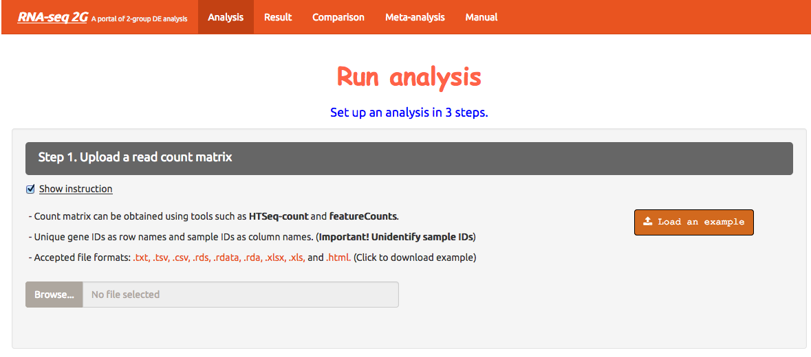

# Module 3

## Differential expression analysis


The goal of differential expression analysis is to perform statistical analysis to try and discover **changes in expression levels** of defined features (genes, transcripts, exons) between experimental groups with **replicated samples**.<br>

### Popular tools

Most popular tools for differential expression analysis are available as **R / Bioconductor** packages. <br>
Bioconductor is an R project and repository that provides a set of packages and methods for omics data analysis.<br>
The best performing tools tend to be:
* [DESeq2](https://bioconductor.org/packages/release/bioc/html/DESeq2.html)
* [edgeR](https://bioconductor.org/packages/release/bioc/html/edgeR.html)
* [limma (voom)](https://bioconductor.org/packages/release/bioc/html/limma.html)

See [Schurch et al, 2015; arXiv:1505.02017](https://arxiv.org/abs/1505.02017).
<br><br>
In this tutorial, we will give you an overview of the **DESeq2** pipeline to find differentially expressed **genes** between two conditions.

### DESeq2

[DESeq2](https://bioconductor.org/packages/release/bioc/html/DESeq2.html) is an R/Bioconductor implemented method to detect differentially expressed features.
<br>
It uses the negative binomial generalized linear models.
<br>
This DESeq2 tutorial is widely inspired from the [RNA-seq workflow](http://master.bioconductor.org/packages/release/workflows/vignettes/rnaseqGene/inst/doc/rnaseqGene.html) developped by the authors, and from the [differential gene expression course](https://hbctraining.github.io/DGE_workshop/lessons/04_DGE_DESeq2_analysis.html) from the [Harvard Chan Bioinformatics Core](http://bioinformatics.sph.harvard.edu/)
<br><br>
DESeq2 steps:
* Modeling raw counts for each gene:
** Estimate size factors
** Estimate gene-wise dispersions
** Fit curve to gene-wise dispersion estimates
** Shrink gene-wise dispersion estimates
** GLM (Generalized Linear Model) fit for each gene
* Shrinking of log2FoldChanges
* Testing for differential expression


### Raw count matrices

DESeq2 takes as an input raw (non normalized) counts, in various forms:

* **Option 1**: a <b>matrix of integer values</b> (the value at the i-th row and j-th column tells how many reads have been assigned to gene i in sample j), such as:

| gene | A549_0_1chr10 | A549_0_2chr10 | A549_0_3chr10 | A549_25_1chr10 | A549_25_2chr10 | A549_25_3chr10 |
| :--- | :---: | :---: | :---: | :---: | :---: | :---: |
| ENSG00000260370.1 | 0 | 0 | 1 | 0 | 1 | 1 |
| ENSG00000237297.1 | 10 | 8 | 10 | 12 | 5 | 2 |
| ENSG00000261456.5 | 210 | 320 | 291 | 300 | 267 | 222 |
| ENSG00000232420.2 | 3 | 2 | 0 | 1 | 2 | 6 |

Prepare the matrix for our 6 samples, from the **STAR** output.
<br>
The **ReadsPerGene.out.tab** output files of STAR (from option --quantMode GeneCounts) contain 4 columns that correspond to different counts / read overlap **according to the protocol's strandedness** (see Module 1):
* column 1: gene ID
* column 2: counts for unstranded RNA-seq.
* column 3: counts for the 1st read strand aligned with RNA (htseq-count option -s yes)
* column 4: counts for the 2nd read strand aligned with RNA (htseq-count option -s reverse): the most common protocol.

The protocol used to prepare the libraries for the A549 ENCODE samples is **reverse stranded**, so we need to extract the 4th column of each of the "ReadsPerGene" files, along with the column containing the <b>gene names</b>.


```{bash}
# retrieve the 1rst column, containing the gene IDs
cut -f 1 A549_0_1ReadsPerGene.out.tab | grep -v "_" > gene_column.txt

# retrieve the 4th column of each "ReadsPerGene.out.tab" file
paste A549_0_*ReadsPerGene.out.tab | grep -v "_" | awk '{for (i=4;i<=NF;i+=4) printf "%s\t", $i; printf "\n" }' > counts_4thcolumn.txt

# paste columns into a single file
paste gene_column.txt counts_4thcolumn.txt > raw_counts_A549_matrix.txt

# add header: "gene_name" + the name of each of the counts file
sed -i -e "1igene_name\t$(ls A549_0_*ReadsPerGene.out.tab | tr '\n' '\t' | sed 's/ReadsPerGene.out.tab//g')" raw_counts_A549_matrix.txt

```

* **Option 2**: one file per sample, each file containing the raw counts of all genes:

File **A549_0_1chr10_counts.txt**:

| ENSG00000260370.1 | 0 |
| ENSG00000237297.1 | 10 |
| ENSG00000261456.5 | 210 |

File **A549_0_2chr10_counts.txt**:

| ENSG00000260370.1 | 0 |
| ENSG00000237297.1 | 8 |
| ENSG00000261456.5 | 320 |

and so on...
<br>
**Exercise**
<br>
Prepare the 6 files needed for our analysis, from the STAR output, and save them in the <b>counts_star</b> directory.

<br>
Create directory

```{bash}
mkdir counts_star
```

Loop around the 6 **ReadsPerGene.out.tab** files and extract the correct counts (4th column) along with the gene ID column (1rst column).

```{bash}
for i in *ReadsPerGene.out.tab
do echo $i
# retrieve the first (gene name) and fourth column (raw reads)
cut -f1,4 $i | grep -v "_" > counts_star/`basename $i ReadsPerGene.out.tab`_counts.txt
done
```


* Prepare count data from Salmon (PENDING)


#### Sample sheet

Additionally, DESeq2 needs a <b>sample sheet</b> that describes the samples characteristics: treatment, knock-out / wild type, replicates, time points, etc. in the form:

| FileName | SampleName | Time | Dexamethasone |
| :---: | :---: | :---: | :---: |
| A549_0_1chr10_counts.txt | A549_0_1chr10 | t0 | 100nM |
| A549_0_2chr10_counts.txt | A549_0_2chr10 | t0 | 100nM |
| A549_0_3chr10_counts.txt | A549_0_3chr10 | t0 | 100nM |
| A549_25_1chr10_counts.txt | A549_25_1chr10 | t25 | 100nM |
| A549_25_2chr10_counts.txt | A549_25_2chr10 | t25 | 100nM |
| A549_25_3chr10_counts.txt | A549_25_3chr10 | t25 | 100nM |

<b>Exercise</b>
Prepare this file (tab-separated columns) in a text editor: save it as <b>sample_sheet_A549.txt</b>.


#### Analysis

The analysis is done in R ! <br>

Start an R interactive session:

```{bash}
# type R (capital letter) in the terminal
R
```

Read in the sample table that we have prepared:

```{r}
# the first row is the "header", i.e. it contains the column names.
# sep="\t" means that the columns/fields are separated with tabs.
sampletable <- read.table("sample_sheet_A549.txt", header=T, sep="\t")

# display the first 6 rows
head(sampletable)

# check the number of rows and the number of columns
nrow(sampletable)
ncolumn(sampletable)
```

* Load count data from STAR

```{r}
# Option that compiles one file per sample
se_star <- DESeqDataSetFromHTSeqCount(sampleTable = sampletable,
                        directory = "counts_star",
                        design = ~ Time)

# Option that reads in a matrix (we will not do it here)
countdata <- read.table("raw_counts_A549_matrix.txt", header=T, sep="\t", row.names=1)
se_star_matrix <- DESeqDataSetFromMatrix(countData = countdata,
                                  colData = coldata,
                                  design = ~ Time)
```

* Load count data from SALMON (PENDING)

```{r}
files <- file.path(dir,"salmon", samples$run, "quant.sf.gz")
names(files) <- samples$run

# a two-column data.frame linking transcript id (column 1) to gene id (column 2)
tx2gene <- read_csv(file.path(dir, "tx2gene.gencode.v27.csv"))

# tximport can import data from Salmon, Kallisto, Sailfish, RSEM, Stringtie
txi <- tximport(files, 
		type="salmon", 
		tx2gene=tx2gene)

sampleTable <- data.frame(condition = factor(rep(c("A", "B"), each = 3)))
rownames(sampleTable) <- colnames(txi$counts)

dds <- DESeqDataSetFromTximport(txi,
			sampleTable = sampletable, 
			design = ~ Time)

```

* Remove lowly expressed genes: keep only those genes that have more than 10 summed raw counts across the 6 samples

```{r}
se1 <- se[rowSums(counts(se)) > 10, ]
```


* Run model

```{r}
# 
se2 <- DESeq(se1)

```

* Transform raw counts to be able to visualize the data

```{r}
# Use the rlog transformation for visualization, as adviced by the DESeq2 author
rld <- rlog(se2)
```

* Samples correlation

Calculate the sample-to-sample distances:

```{r}
sampleDists <- dist(t(assay(rld)))

library("RColorBrewer")
sampleDistMatrix <- as.matrix(sampleDists)
rownames(sampleDistMatrix) <- paste(vsd$condition, vsd$type, sep="-")
colnames(sampleDistMatrix) <- NULL
colors <- colorRampPalette( rev(brewer.pal(9, "Blues")) )(255)
pheatmap(sampleDistMatrix,
         clustering_distance_rows=sampleDists,
         clustering_distance_cols=sampleDists,
         col=colors)

```

PENDING HERE IMAGE

* Principal Component Analysis

Reduction of dimensionality to be able to retrieve main differences between samples

```{r}
plotPCA(object = rld,
		intgroup = "Time")
```

PENDING HERE IMAGE

* Running the differential expression analysis

```{r}
# t25 vs t0 vs WT
comp_tmp <- results(object = se2, 
		contrast = c("Time", "t0", "t25"))
```

PENDING HERE FIRST ROWS

* DESeq2 output explained

To generate more accurate log2 foldchange estimates, DESeq2 allows for the **shrinkage of the LFC** estimates toward zero when the information for a gene is low, which could include:
* Low counts
* High dispersion values

* **log2 fold change** 
A positive fold change indicates an increase of expression while a negative fold change indicates a decrease in expression for a given comparison.<br>
This value is reported in a **logarithmic scale (base 2)**: for example, a log2 fold change of 1.5 in the "Ko vs Wt comparison" means that the expression of that gene is increased, in the Ko relative to the Wt, by a multiplicative factor of 2^1.5 ≈ 2.82.

* **pvalue**
Wald statisticial test p-value: Indicates whether the gene analysed is likely to be differentially expressed in that comparison. **The lower the more significant**.

* **padj**
Bonferroni-Hochberg adjusted p-values (FDR): **the lower the more significant**. More robust that the regular p-value because it controls for the occurrence of **false positives**.


* Running the R script from the command line

Rscript deseq2_star.R sampletable_star.txt
Rscript deseq2_salmon.R sampletable_salmon.txt


### Online tool

This [online tool](http://52.90.192.24:3838/rnaseq2g/) provides a way to process differential expression analysis using some of the popular tools in the field (among which DESeq2, edgeR, limma), starting from raw counts, via a user Interface.




* Prepare the matrix of raw counts

The first column contains, in our case, the gene names.<br>
The remaining columns contain the expression (raw counts) of each gene in each sample (one column per sample).<br>
We will use the previously prepared **raw_counts_A549_matrix.txt**.

* Prepare the sample sheet

Sample names must match column names in matrix.<br>
Add one column that corresponds to the experimental groups the samples belong to.<br>
We will use the previously prepared **sample_sheet_A549.txt**.


* Choose the control group name and the case group name

__In our case__<br>
Control: t0<br>
Case: t25<br>

* Choose which samples belong to which experimental group

__In our case__<br>
Control samples: A549_0_1chr10, A549_0_2chr10, A549_0_3chr10<br>
Case samples: A549_25_1chr10, A549_25_2chr10, A549_25_3chr10<br>

* Choose DE method(s):

Let's try to run the analysis using both **DESeq2** and **edgeR**.

* Submit DE analysis

* Go to "Results" tab


## Gene selection

* padj (p-value corrected for multiple testing)
* log2FC (log2 Fold Change)

* Write a file with genes differentially expression between t25 and t0 with padj < 0.01 and log2FC > 1

```{bash}
awk '$ < 0.01 && $ > 1 {print}' deseq2_results.txt > deseq2_results_padj0.05_log2fc1.txt
```


## Visualization of differential expression

### Volcano plots

```{r}
# code for volcano plot
```

Run the R script:<br>
Rscript volcano_plot.R


