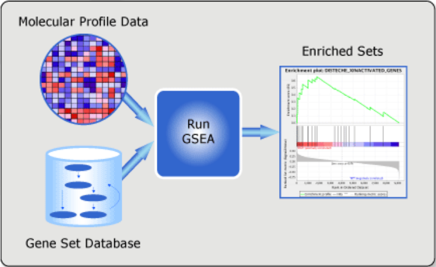
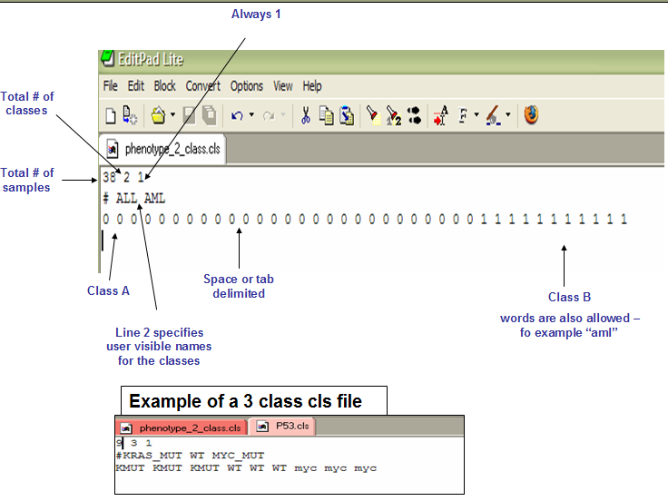

# Module 4

## Visualization in the genome browser

### Differences in chromosome nomenclature!

### Conversion to bigwig


## Functional analysis

https://hbctraining.github.io/DGE_workshop/lessons/09_functional_analysis.html


### Resources

#### Gene Ontology

http://geneontology.org/

#### KEGG pathways

https://www.genome.jp/kegg/

#### Molecular Signatures Database (MSigDB)

http://software.broadinstitute.org/gsea/msigdb/index.jsp


### Enrichment analysis based on gene selection

* Gene Universe: in our example: all genes present in our annotation, on chromosome 10
* List of genes selected from the universe: our selection of genes, give the criteria we defined: padj < 0.01, &#124;log2FoldChange&#124; >= 1

#### Hypergeometric test

Null hypothesis: the list of DEGs is randomly found in the GO.
<br>
Alternative hypothesis: the list of DEGs is over- or under- represented in the GO.
<br>Universe: all genes in experiment.<br>
Successes: DEGs genes in experiment.<br>
All GO: all genes in GO term.<br>
Successes in GO: DEGs genes in GO.<br>
<br>
Example:<br>
20,000 genes annotated in the organism. 60 of them are associated with the ontology "programmed cell death".
<br>300 genes in total in our DGE results selection. 20 of them are associated with the ontology "programmed cell death"<br>
What is the probability that their is an over-representation of the "programmed cell death" ontology in our experiment?
<br>
Universe: 20000<br>
Successes: 300<br>
All GO: 60<br>
Successes in GO: 20<br>
??
phyper(overlap -1, list1, popsize-list1, list2))
phyper(19, 300, 20000-300, 60)
???


#### clusterProfiler

https://hbctraining.github.io/DGE_workshop/lessons/09_functional_analysis.html


#### enrichR

http://amp.pharm.mssm.edu/Enrichr/


#### GOSeq

https://bioconductor.org/packages/release/bioc/vignettes/goseq/inst/doc/goseq.pdf

#### GOstats

https://www.bioconductor.org/packages/release/bioc/vignettes/GOstats/inst/doc/GOstatsHyperG.pdf

#### topGO

https://bioconductor.org/packages/release/bioc/vignettes/topGO/inst/doc/topGO.pdf

```{r}
library("topGO")
library("org.Hs.eg.db")

     ## GO to Symbol mappings (only the BP ontology is used)
     xx <- annFUN.org("BP", mapping = "org.Hs.eg.db", ID = "entrez") # or symbol, ensembl, ...

     allGenes <- unique(unlist(xx)) # retrieve all genes

     myInterestedGenes <- sample(allGenes, 500)

     geneList <- factor(as.integer(allGenes 

     names(geneList) <- allGenes
     
     GOdata <- new("topGOdata",
                   ontology = "BP",
                   allGenes = geneList,
                   nodeSize = 5,
                   annot = annFUN.org, 
                   mapping = "org.Hs.eg.db",
                   ID = "entrez") 
```

### Enrichment based on ranked lists of genes

#### GSEA (Gene Set Enrichment Analysis)

GSEA is a Java-based tool.



##### Algorithm

GSEA doesn't require a threshold: the whole set of genes is considered.


(A) An expression data set sorted by correlation with phenotype, the corresponding heat map, and the “gene tags,” i.e., location of genes from a set S within the sorted list. (B) Plot of the running sum for S in the data set, including the location of the maximum enrichment score (ES) and the leading-edge subset.


GSEA checks whether a particular gene set (for example, a gene ontology) is randomly distributed across a list of ranked genes.
<br>
The algorithm consists of 3 key elements:

1. **Calculation of the Enrichment Score**
The Enrichment Score (ES) reflects the degree to which a gene set is overrepresented at the extremes (top or bottom) of the entire ranked gene list.
2. **Estimation of Significance Level of ES** 
The statistical significant (nominal p-value) of the ES is estimated by using an empirical phenotype-based permutation test procedure.

3. **Adjustment for Multiple Hypothesis Testing**
When an entire database of gene sets is evaluated, we adjust the estimated significance level to account for multiple hypothesis testing. We first normalize the ES for each gene set to account for the size of the set, yielding a normalized enrichment score (NES). We then control the proportion of false positives by calculating the false discovery rate (FDR) (8, 9) corresponding to each NES. The FDR is the estimated probability that a set with a given NES represents a false positive finding; it is computed by comparing the tails of the observed and null distributions for the NES.


See the [GSEA Paper](https://www.ncbi.nlm.nih.gov/pubmed/16199517) for more details on the algorithm.

The main GSEA algorithm requires 3 inputs:
* Gene expression data
* Phenotype labels
* Gene sets 

##### Gene expression data in TXT format

The input should be normalized read counts filtered out for low counts (-> we have it from the previous GSEA analysis !).
<br>
The first column contains the gene ID (HUGO symbols for *Homo sapiens*).<br>
The second column contains any description or symbol, and will be ignoreed by the algorithm.<br>
The remaining columns contains normalized expressions: one column per sample.

| NAME | DESCRIPTION | A549_0_1chr10 | A549_0_2chr10 | A549_0_3chr10 | A549_25_1chr10 | A549_25_2chr10 | A549_25_3chr10 |
| DKK1 | NA| 0 | 0 | 0 | 0 | 0 | 0 |
| HGT | NA | 0 | 0 | 0 | 0 | 0 | 0 |


##### Phenotype labels in CLS format

A phenotype label file defines phenotype labels (experimental groups) and assigns those labels to the samples in the corresponding expression data file.



Let's create it for our experiment:

| 6 | 2 | 1 |  |  |  |
| # | t0 | t25 |  |  |  |
| t0 | t0 | t0 | t25 | t25 | t25 |

**NOTE**: the first label used is assigned to the first class named on the second line; the second unique label is assigned to the second class named; and so on. 
<br> 
So the phenotype file could also be:

| 6 | 2 | 1 |  |  |  |
| # | t0 | t25 |  |  |  |
| 0 | 0 | 0 | 1 | 1 | 1 |

The first label **t0** in the second line is associated to the first label **0** on the third line.


##### Gene sets

The Molecular Signatures Database (MSigDB) is a collection of annotated gene sets for use with GSEA software. 


As GSEA was created and optimized for microarray data, the authors make the [following suggestions](https://software.broadinstitute.org/cancer/software/gsea/wiki/index.php/RNA-Seq_Data_and_Ensembl_CHIP_files) for RNA-seq:

*"The GSEA algorithm ranks the features listed in a GCT file.* (normalized expression values) *It provides a number of alternative statistics that can be used for feature ranking. But in all cases (or at least in the cases where the dataset represents expression profiles for differing categorical phenotypes) the ranking statistics capture some measure of genes' differential expression between a pair of categorical phenotypes. The GSEA team has yet to determine whether these ranking statistics, originally selected for their effectiveness when used with expression data derived from DNA Microarray experiments, are appropriate for use with expression data derived from RNA-seq experiments. As an alternative to standard GSEA, analysis of data derived from RNA-seq experiments may also be conducted through the*  ***GSEAPreranked tool."***


**Enrichment score**

Reflects the degree to which a set is overrepresented at the extremes (top or bottom) of the entire ranked list.


