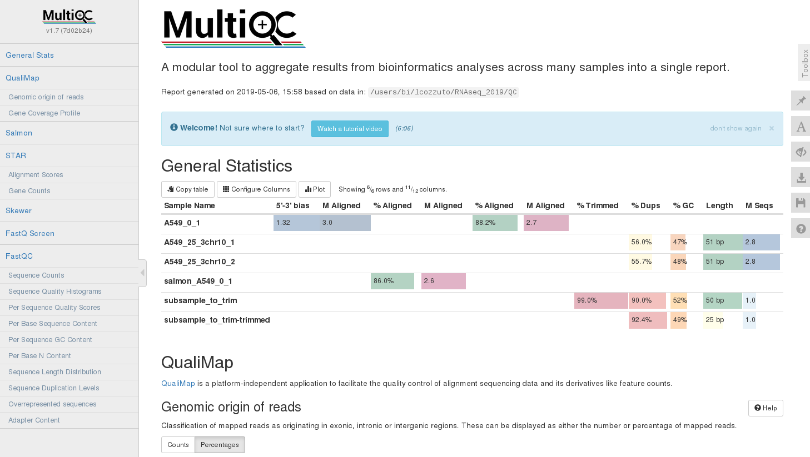

# Combining reports
At this point we can summarize the work done by using the tool [**multiqc**](https://multiqc.info/). First we link our mapping results to QC.

```{bash}
cd QC/
ln -s ../alignments/* .
```

Then we join the different analyses:

```{bash}
$RUN multiqc .
[INFO   ]         multiqc : This is MultiQC v1.7 (7d02b24)
[INFO   ]         multiqc : Template    : default
[INFO   ]         multiqc : Searching 'QC/'
Searching 70 files..  [####################################]  100% 
...

firefox multiqc_report.html
```

Here the result:



<br/>
