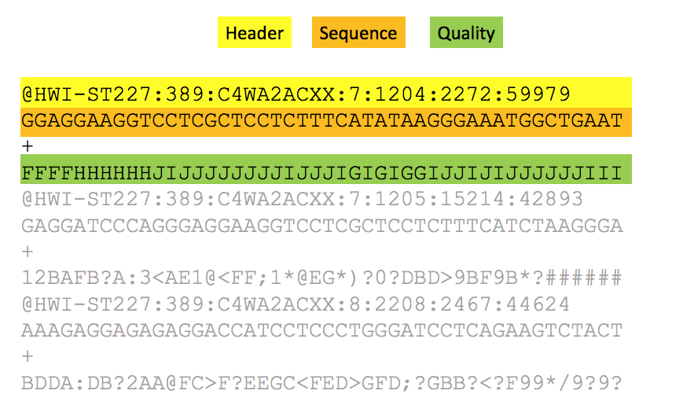

# mRNA-Seq data analysis workflow


<br/>

### FASTQ format for sequencing reads

Short (and long) sequencing reads coming from the sequencers are stored in **FASTQ** format.
This format contains the information about sequence and the quality of each base, which encodes the probability that the corresponding base call is incorrect.
<br/>



The format contains four rows per sequencing read:
* a header containing **@** as the first character
* the sequence content
* a **spacer**
* the quality encoded using ASCII characters.

<br/>


<br/>

* Score = 10 (symbol '+') => probability of incorrect base call = 0.1 => base call accuracy = 90%
* Score = 20 (symbol '5') => probability of incorrect base call = 0.01 => base call accuracy = 99%
* Score = 30 (symbol '?') => probability of incorrect base call = 0.001 => base call accuracy = 99.9% - This is a commonly acceptable threshold for trimming.
* Score = 40 (symbol 'I') => probability of incorrect base call = 0.0001 => base call accuracy = 99.99%

<br/>


### RNA-Seq data repositories


The major repositories for gene expression data:
* [**GEO**](https://www.ncbi.nlm.nih.gov/geo/) 
* [**Array-express**](https://www.ebi.ac.uk/arrayexpress/)
* [**ENCODE**](https://www.encodeproject.org/)

These repositoroes are linked to the repositories of NGS raw data (Fastq files):
* [**SRA**](https://www.ncbi.nlm.nih.gov/sra) (Sequence Read Archive) 
* [**ENA**](https://www.ebi.ac.uk/ena) (European Nucleotide Archive) 
* [**DDBJ-DRA**](https://www.ddbj.nig.ac.jp/dra/index-e.html) 

<br/>

**EXERCISE**
Let's explore [one of the GEO records](https://www.ncbi.nlm.nih.gov/geo/query/acc.cgi?acc=GSE126535)
* Which platform and protocol were used for sequencing?
* What type of RNA was sequenced?
* How many samples were sequenced?

<br/>

**NOTE: You will need to download data from SRA for an independent project after this week!**
To download raw data from **SRA**, it is possible to use **fastq-dump program** from [**SRA toolkit**](https://trace.ncbi.nlm.nih.gov/Traces/sra/sra.cgi?view=toolkit_doc) or to download files from the NCBI ftp website using wget (for detail, see [https://www.ncbi.nlm.nih.gov/books/NBK158899/#SRA_download.when_to_use_a_command_line](https://www.ncbi.nlm.nih.gov/books/NBK158899/#SRA_download.when_to_use_a_command_line).

To download data, use the SRA identifier specifying whether reads are single or paired-end, otherwise paired-end reads will be downloaded as a single interleaved file; for paired-end reads use the parameter **--split-files in fastq-dump**. Fastq-dump adds SRA ID to each read in the file, to avoid it, use the parameter **--origfmt**. The parameter **--gzip** compresses fastq files immediately after download. The command below will download fastq-file(s) for one sample only (for example, using SRR identifier SRR8571764 from the exercise above; it is slow - it might take up to 30-40 minutes):

```{bash}
fastq-dump --gzip --origfmt --split-files SRR-IDENTIFIER
```

To download all samples for a specific GEO experiment, use the SRA study identifier (e.g., for the GEO experiemnt considered above, it is SRP185848) and follow the steps:
* First, download a list of SRR identifiers for all samples in the study by going to [the NCBI SRA page for this study](https://www.ncbi.nlm.nih.gov/sra?LinkName=bioproject_sra_all&from_uid=522280) and clicking on the right top "Send" --> "File" --> "Accession List" --> "Save to file". That will give you the text file with all SRR identifiers for this study; save it for example to the file "sra_ids.txt". 
* Second, run the following command:

```{bash}

fastq-dump --gzip --origfmt --split-files $(<sra_ids.txt)

```
<br/>

Another source of high quality data on gene expression in human and mouse is [The Encyclopedia of DNA Elements (ENCODE)](https://www.encodeproject.org/). Using the ENCODE portal one can access data produced by the ENCODE Consortium.

For the purpose of this course, we downloaded the following ENCODE data:

1. [Homo sapiens A549 treated with 100 nM dexamethasone for 0 minutes](https://www.encodeproject.org/experiments/ENCSR937WIG/)
2. [Homo sapiens A549 treated with 100 nM dexamethasone for 25 minutes](https://www.encodeproject.org/experiments/ENCSR525HSH/)

|Encode website|
| :---:  |
||
||


To download all fastq-files for this experiemnt takes a lot of time; therefore, to restrict the computation time of the analysis, we selected reads that are mapped only to the chromosome 10. Please run the following commands to obtain these files: 

```{bash}
wget https://public-docs.crg.es/biocore/projects/training/RNAseq_2019/resources.tar

tar -vxf resources.tar 

resources/
resources/A549_0_3chr10_1.fastq.gz
resources/A549_25_3chr10_2.fastq.gz
resources/A549_25_1chr10_1.fastq.gz
resources/A549_25_3chr10_1.fastq.gz
resources/A549_0_3chr10_2.fastq.gz
resources/A549_0_1chr10_1.fastq.gz
resources/A549_0_1chr10_2.fastq.gz
resources/A549_25_2chr10_1.fastq.gz
resources/A549_25_1chr10_2.fastq.gz
resources/A549_0_2chr10_1.fastq.gz
resources/A549_0_2chr10_2.fastq.gz
resources/A549_25_2chr10_2.fastq.gz

```

Let's inspect these files, count the number of reads, and check the read length:

```{bash}
zcat resources/A549_25_3chr10_2.fastq.gz |more 

@D00137:455:HLFL3BCXY:1:1111:7527:60273/2
GACAAACCCACAGCCAATATCATACTGAATGGGCAAAAACTGGAAGCATTC
+
ADDDDIIFHHIIIIIIIIIIHHHHIIIIHIIHHGIIIGIIIHHIIHHGHHH
@D00137:455:HLFL3BCXY:1:1111:3751:48736/2
CTATGGTGACCTGAACCACCTGGTGTCTGCTACCATGAGTGGGGTCACCAC
+
DDDDDIIIIIIIHIIHIIIIIIIIIIIIIHIIIIIIIIIIIIIHIIIIIIG
@D00137:455:HLFL3BCXY:2:1214:18935:42305/2
CTATGGTGACCTGAACCACCTGGTGTCTGCTACCATGAGTGGGGTCACCAC
+
DDDDDIIIHIIIIIIIIIIIIIIIIIIIIIIHIIIIIGHIIHIIIIIIIII
...

zcat resources/A549_25_3chr10_2.fastq.gz | awk '{num++} END{print num/4}'

2808343
....

zcat resources/A549_25_3chr10_2.fastq.gz | head -n 4 | tail -n 1 | awk '{print length($0)}'

51
```

<br/>

**EXERCISE**
* Count the number of reads and check the read length for the Read 1 for the sample called A549_25_3chr10.
* Count the number of reads in all fastq files (use for-loop).


<br/>

